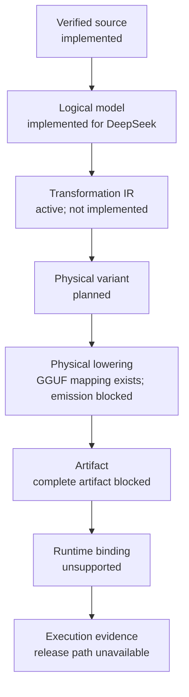
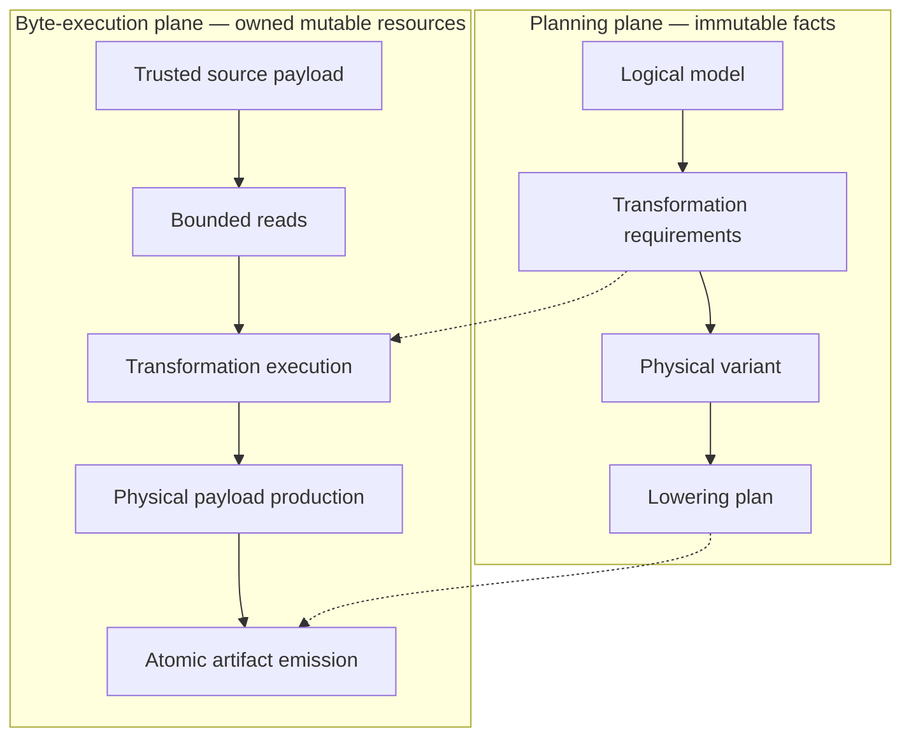

# YVEX

**YVEX is a native C model-compilation and execution system for local
open-weight models, with CUDA as its first accelerated backend.** Its
architecture treats a model as a verified logical structure that can be
compiled into explicit physical variants, lowered into concrete artifacts,
bound to hardware backends and accepted only through execution evidence.

YVEX does not identify a model with a GGUF file, and it is not yet a complete
text-generation runtime. GGUF is the v0.1.0 physical lowering target. The
release target is a complete YVEX-produced DeepSeek-V4-Flash GGUF executing real
autoregressive text generation on the 128 GB NVIDIA GB10 in DGX Spark. It is
**not release-ready or currently supported**.

The current implementation verifies the exact DeepSeek source, reconstructs
its logical architecture and tensor requirements, maps every source
contribution, and streams trusted payload ranges. Transformation execution,
quantization, complete artifact emission, full runtime binding and generation
remain unimplemented, blocked or unsupported as specified below.
[`PROJECT.md`](PROJECT.md) is the sole authority for current state, tracks,
milestones, dependencies, release gates and the Active Next milestone.

## What YVEX Builds

The system target preserves ownership and identity across a controlled model
lifecycle. Status labels in the diagram describe the current release path; an
arrow is an architectural dependency, not a claim that the whole chain runs.



### Verified source

The source boundary owns repository identity, pinned revision, provider
provenance, structured configuration, tokenizer facts, shard and tensor-header
inventory, payload identity, upstream payload trust and immutable source
references. A verified source is therefore more than a directory that happens
to contain files. The DeepSeek snapshot is admitted through one canonical
inventory and one trusted payload session; later consumers do not reopen
headers or invent paths and offsets.

### Logical model

The logical model reconstructs model meaning independently from any physical
container. It owns architecture topology, canonical tensor roles and shapes,
layer structure, attention and position behavior, MoE and residual structure,
tokenizer requirements, output semantics and execution requirements.

It does not own GGUF qtype IDs, offsets or alignment; artifact paths or file
descriptors; CUDA addresses; runtime buffers; or measured execution evidence.
Those facts belong to later identities and owners.

## Model Identity Is Not Artifact Identity

```text
logical_model_id != physical_variant_id != artifact_id
```

One logical model may admit several physical variants by changing role-specific
precision, storage representation, tensor layout, expert aggregation layout,
placement, hardware profile, workload profile or numeric acceptance bounds.
Conceptually:

```text
one logical model
  -> reference physical variant
  -> memory-constrained physical variant
  -> hardware-specific physical variant
```

These are architectural possibilities, not complete variants that YVEX emits
today. Changing a physical choice does not by itself change the logical model.

An artifact is the concrete serialized output of lowering and emission. Its
existence does not prove complete tensor coverage, runtime compatibility,
generation support, numerical correctness, backend correctness, evaluation or
benchmark readiness. YVEX therefore distinguishes:

- a **tensor proof artifact**, containing one tensor or a bounded subset;
- a **complete model artifact**, containing every tensor and metadata item
  required to execute one exact model;
- a **supported model artifact**, which additionally passes integrity,
  materialization, runtime, generation, evaluation, benchmark and release
  gates.

Runtime binding is a separate admission identity associating an artifact with
materialized tensor views, memory placement, backend operations, graph and
runtime descriptors, persistent state, ownership and cleanup. Execution
evidence is separate again: it records what actually ran, under which exact
source, variant, artifact, machine and workload. A plan cannot substitute for
an artifact; an artifact cannot substitute for runtime execution; and a
primitive test cannot substitute for transformer execution.

Execution evidence may include independent reference comparisons, numeric
bounds, typed failure and lifecycle behavior, backend parity, transformer and
prefill/decode correctness, throughput, memory use and evaluation results. Each
observation remains bound to the identities and inputs that produced it.

## Compilation Architecture

### Transformation IR

The Transformation IR is the active implementation boundary and is **not yet
implemented**. It will be the typed, artifact-neutral owner of transformations
between verified source representation and a selected physical variant.
Representative operation classes include `source reference`, `decode`, `cast`,
`reshape`, `transpose`, `concatenate`, `stack`, `aggregate`, `requantize` and
`validate`.

Each transformation must eventually record exact source dependencies, the
logical destination tensor, operation kind, input and output dtype and shape,
axis and layout semantics, precision policy, numeric acceptance requirements,
deterministic ordering and derivation identity. GGUF names, qtype IDs, offsets
and alignment remain outside this layer.

### Physical variant and physical lowering

A physical variant is one identified selection of precision by tensor role,
storage representation, tensor and expert layout, placement constraints,
hardware profile, workload profile and numeric bounds. Physical lowering then
projects an accepted variant into a concrete artifact-format contract.

For v0.1.0 that contract is:

```text
release model target: DeepSeek-V4-Flash
artifact format target: GGUF
hardware target: NVIDIA DGX Spark / CUDA
```

The GGUF lowering owns format-specific tensor names, qtype IDs, metadata keys,
directory order, byte geometry, alignment, encoded payload sizes and container
layout. Those facts do not flow backward into logical model identity. The
existing 69,187-to-1,360 DeepSeek map is concrete GGUF lowering evidence; it is
not the missing artifact-neutral Transformation IR and emits no payload bytes.

### Planning plane and byte-execution plane

Compilation separates metadata reasoning from movement of model bytes. The
planning plane decides what each output means and how it is derived. The
byte-execution plane later realizes that immutable plan through bounded source
reads, conversion, quantization and serialization.



Planning is deterministic, inspectable, hashable and independent from mutable
byte-processing state. Byte execution owns buffers, streaming, numeric
conversion, encoding, cancellation, cleanup and atomic publication. Planning
never reads tensor payload bytes; source readers never reinterpret family roles,
aggregation axes or scaling companions; and quantization must consume the
canonical transformation plan rather than rediscover semantics.

Only trusted source payload streaming is implemented in the byte-execution
plane today. It is a build-time compilation input, not transformation execution
and not inference-time SSD expert streaming.

### Compact model

```math
P = \operatorname{Plan}(M, C_p, C_h, C_w)
V = \operatorname{Transform}(S, P)
A_F = \operatorname{Emit}_F(V)
B_H = \operatorname{Bind}_H(A_F)
E = \operatorname{Observe}(\operatorname{Run}(B_H, X))
```

Here `S` is the verified source payload; `M` is the logical model; `C_p`,
`C_h` and `C_w` are precision, hardware and workload constraints; `P` is the
Transformation IR or transformation plan; `V` is the physical model variant;
`F` is the artifact format; `A_F` is the emitted artifact; `H` is the backend
target; `B_H` is the runtime binding; `X` is runtime input; and `E` is execution
evidence. These are ownership equations, not claims that each operation is
currently executable.

The derivation chain is explicit:

```text
logical_model_id
  -> transformation_ir_id
  -> physical_variant_id
  -> artifact_id
  -> runtime_binding_id
  -> execution_evidence_id
```

Changing precision, layout, placement or artifact format may change the plan,
variant and downstream identities without changing logical model identity.

Future selection may be expressed as a multi-objective problem:

```math
V^* \in \operatorname{Pareto}
\left\{
\varepsilon(V),
\operatorname{memory}(V),
\operatorname{latency}(V),
\operatorname{energy}(V)
\right\}
```

Constraint solving, measurement feedback, hardware/workload-aware selection,
Pareto-front selection and adaptive recompilation are future compilation lanes.
No optimizer, automatic selector or measured objective is implemented by the
current architecture contract.

Memory remains part of variant admission. Source storage, emitted artifacts,
host staging, unified or device residency, persistent KV and temporary scratch
have different owners and lifetimes. Checkpoint size alone is not a residency
plan, and a qtype with known byte geometry does not imply that a quantizer or
backend kernel exists.

## End-to-End Target and Current State

The complete architecture target is:

```text
verified source
  -> logical model
  -> Transformation IR
  -> physical variant
  -> GGUF lowering
  -> artifact
  -> materialization
  -> runtime descriptor
  -> transformer execution
  -> KV / prefill / decode
  -> logits / sampling / tokenizer
  -> text
```

The target chain does not currently execute. This public status surface is a
compact snapshot, not a second roadmap; [`PROJECT.md`](PROJECT.md) remains the
live authority.

| Boundary | Current state |
| --- | --- |
| Exact DeepSeek source identity | complete |
| 46-shard header and payload trust | complete |
| Typed DeepSeek architecture IR | complete |
| 69,187-tensor requirement coverage | complete |
| 69,187-to-1,360 logical GGUF mapping | complete |
| Bounded trusted payload streaming | complete |
| Model-compilation architecture | complete — contract defined |
| Transformation IR | active — not implemented |
| Quantization and reference dequantization | blocked |
| GGUF writer and complete artifact | blocked |
| Full materialization | unsupported |
| DeepSeek runtime descriptor and binding | unsupported |
| Full transformer execution | unsupported |
| Autoregressive text generation | unsupported |
| Evaluation | unavailable |
| Benchmark | not-measured; benchmark results are not measured |

## Current Release Target and Verified Evidence

The v0.1.0 target is:

```text
DeepSeek-V4-Flash
  -> complete YVEX-produced GGUF
  -> NVIDIA DGX Spark / CUDA
  -> real autoregressive text generation
```

[DeepSeek-V4-Flash](https://huggingface.co/deepseek-ai/DeepSeek-V4-Flash) is the
sole v0.1.0 release target, not a currently supported generation target and not
the architecture of the common engine. Qwen and Gemma remain engineering
evidence at their recorded source, profile, mapping or bounded-proof stages;
neither is a supported generation target. GLM remains planned with no canonical
implemented target contract.

The current exact DeepSeek evidence is:

| Fact | Verified value |
| --- | ---: |
| Pinned source revision | `60d8d70770c6776ff598c94bb586a859a38244f1` |
| Source shards admitted | 46 / 46 |
| Source tensors indexed | 69,187 |
| Upstream-verified shard bytes | 159,617,149,040 |
| Mapped source contributions | 69,187 |
| Logical GGUF descriptors | 1,360 |
| Pinned-standard descriptors | 1,328 |
| YVEX MTP extension descriptors | 32 |
| Complete payload passes | 1 |
| Short reads | 0 |
| Digest mismatches | 0 |
| Identity drift | 0 |

The shard-byte count is the payload covered by authoritative upstream Git LFS
SHA-256 values. It is not a local-directory footprint or a claim about emitted
artifact size. The payload pass executed the trusted source reader; it performed
no decoding, conversion, quantization or GGUF emission.

## Engineering Method

YVEX closes capabilities as owned, typed and consumed boundaries:

- every capability has one canonical owner and every completed milestone has a
  real downstream consumer;
- planning and byte execution remain separate, while stage identities and
  typed failure states are propagated rather than inferred;
- higher layers re-admit the exact facts they own; reports do not promote
  capabilities and a lower-layer success flag cannot stand in for them;
- fixtures and selected tensors prove only their named boundary; an artifact
  does not prove runtime support and a working kernel does not prove transformer
  execution;
- support requires end-to-end executable evidence, including failure and
  lifecycle behavior, while unsupported higher stages remain explicit.

This method keeps source truth, logical semantics, physical representation and
execution evidence independently reviewable. It also keeps family-specific
semantics behind typed adapters instead of target-name branches in common
owners.

## Build and Validation

The repository builds the native library, CLI and daemon. These commands are
current at this baseline:

```sh
make -j4
make check
make smoke
make check-docs
make check-cuda
```

`make check-cuda` requires a CUDA-capable host. It validates the bounded CUDA
capabilities that exist; it does not execute the DeepSeek transformer. Operator
procedures for implemented source, artifact and diagnostic boundaries live in
[`docs/operator-runbook.md`](docs/operator-runbook.md).

## Repository Orientation

| Area | Canonical owner | Responsibility |
| --- | --- | --- |
| Verified source | `src/source/` | Provenance, manifests, inventories, payload trust, immutable ranges and bounded delivery. |
| Logical model | `src/model/architecture/`, `src/model/target/` | Typed family architecture, exact tensor requirements and target-specific mapping evidence. |
| Compilation | Compilation track in [`PROJECT.md`](PROJECT.md) | Planned Transformation IR and physical-variant identity; executable owner code is not installed yet. |
| Physical lowering and artifacts | `src/gguf/`, `src/artifact/`, `src/model/artifacts/` | GGUF ABI and geometry, concrete lowering, read-only artifact admission and artifact lifecycle. |
| Materialization and runtime | `src/model/`, `src/runtime/`, `src/generation/` | Tensor ownership, runtime coordination and later model-backed state transitions. |
| Graph and backend | `src/graph/`, `src/backend/` | Graph facts, memory/execution plans, backend admission and bounded primitives. |
| Tests | `tests/` | Unit, fixture, CLI, live-source, refusal, lifecycle and guard evidence. |
| Documentation | `PROJECT.md`, `MODEL_ARTIFACTS.md`, `docs/` | Project control and non-overlapping technical contracts. |

[`docs/system-target.md`](docs/system-target.md) is the complete filesystem and
module ownership map.

## Project and Technical Documentation

| Document | Authority |
| --- | --- |
| [`PROJECT.md`](PROJECT.md) | Current state, tracks, milestones, dependencies, release gates and Active Next. |
| [`MODEL_ARTIFACTS.md`](MODEL_ARTIFACTS.md) | Artifact terminology, identity, admission and support boundaries. |
| [`docs/contract.md`](docs/contract.md) | Lifecycle, ownership, failure and implemented behavior contracts. |
| [`docs/api.md`](docs/api.md) | Public C APIs, typed results and lifetime boundaries. |
| [`docs/reference-architecture.md`](docs/reference-architecture.md) | Pinned external research, specifications, implementations and YVEX owner mapping. |
| [`docs/model-families.md`](docs/model-families.md) | Family integration and architecture semantics. |
| [`docs/operator-runbook.md`](docs/operator-runbook.md) | Executable procedures for currently implemented operator boundaries. |

External references inform implementation and independent comparison; they do
not confer compatibility, model support, backend support or performance claims.

## License

YVEX is licensed under the MIT license.
