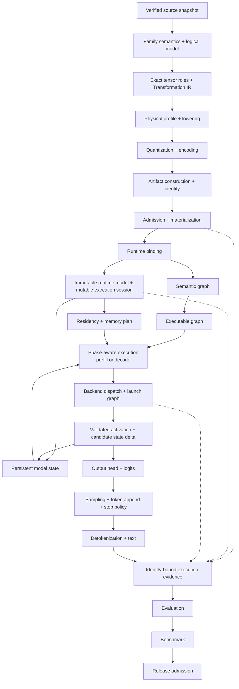

# YVEX

**YVEX is a native C/CUDA inference system that compiles pinned open-weight
model sources through admitted family profiles into identity-bound artifacts
and executes admitted graph boundaries over those artifacts through explicit
runtime contracts.**

Source trust, logical semantics, physical lowering, artifact admission, runtime
binding, residency, persistent state, backend execution, and evidence remain
separate boundaries. Each consumer receives the exact identity and capability
facts established by its predecessor.

Family profiles define model-specific topology, tensor roles, numerical policy,
and execution composition. Common owners provide reusable verification,
compilation, artifact, runtime, memory, graph, backend, operator, and evidence
mechanisms. A capability enters the supported surface only after its production
path, refusals, cleanup, operator command, and identity-bound evidence pass the
declared gate.

[System architecture](#system-architecture) ·
[Design invariants](#design-invariants) ·
[Release vertical](#release-vertical-deepseek-v4-flash-on-nvidia-gb10) ·
[Implementation snapshot](#verified-implementation-snapshot) ·
[Executable surfaces](#current-executable-surfaces) ·
[Project status](PROJECT.md)

## What YVEX owns

YVEX owns the transitions that make an identified model executable without
collapsing model meaning, byte representation, resource lifetime, device
behavior, or evidence into one authority.

| Boundary | Responsibility | Handoff |
| --- | --- | --- |
| Source trust | Verify pinned repositories, configuration, tokenizer assets, shard inventories, payload identities, and immutable tensor ranges | Verified source snapshot |
| Model and compilation | Represent family semantics, exact tensor roles, Transformation IR, derivation identity, physical profiles, and lowering policy | Complete physical plan |
| Artifacts | Encode tensors, construct GGUF, publish atomically, establish artifact identity, admit structure, and materialize typed bindings | Admitted artifact and runtime binding |
| Runtime and resources | Open an immutable runtime model, create isolated sessions, retain resident resources, plan memory, and enforce capability prerequisites | Prepared execution context |
| Execution and state | Lower semantic graphs, dispatch admitted backend operations, produce candidate state changes, and publish outputs transactionally | Output, state delta, and execution status |
| Evidence and admission | Bind identities, failures, numerical comparisons, timing, evaluation, and benchmark facts to the exact path that ran | Capability or typed refusal |

Capability terms are strict:

- **Implements** means the behavior exists in production code.
- **Executes** means a real production path traverses the behavior.
- **Admits** means the required identity, integrity, capability, and evidence
  gates pass.
- **Supports** means the complete declared capability gate has passed.
- **Targets** describes a release path the project intends to close.
- **Plans** describes behavior that remains future work.

## System architecture

This section defines the complete YVEX ownership chain, including boundaries
whose implementation gates remain open. The
[implementation snapshot](#verified-implementation-snapshot) reports which
parts are admitted.



### Verified model inputs

A source snapshot binds one upstream revision, structured model configuration,
tokenizer material, shard inventory, tensor directory, payload identities, and
drift policy. Source owners establish which bytes and semantic facts may enter
compilation. Runtime execution never reconstructs this trust boundary.

### Logical model and family semantics

The logical model records architecture, tensor roles, block composition,
sequence-mixer policy, position rules, persistent-state semantics, FFN or MoE
structure, tokenizer relationships, and output policy independently from
container format and backend.

A typed family profile supplies irreducible model policy. Common mechanisms
consume that policy through bounded interfaces rather than inferring a family
from filenames, target strings, or tensor-name conventions.

### Transformation and physical compilation

Transformation IR defines how verified source contributions become logical
terminal tensors through typed, deterministic operations. Planning establishes
meaning, shapes, axes, identities, and dependencies before payload execution.

A physical profile then selects dtypes, qtypes, layouts, alignment, encoding,
placement constraints, and numerical policy. Changing physical representation
does not redefine the logical model.

### Artifact construction and admission

Artifact construction executes the sealed physical plan, encodes payloads,
writes metadata and tensor directories, and publishes the result
transactionally. GGUF is the v0.1 release container; the logical model remains
independent from that serialization.

Admission validates the complete structure, byte ranges, identities, metadata,
qtypes, shapes, and compatibility facts required by the next consumer.
Materialization projects admitted artifact tensors into typed runtime bindings
without reopening model semantics.

### Runtime binding and residency

A content-addressed runtime binding carries immutable compilation truth into
execution. It identifies the artifact, family adapter, tensor bindings,
runtime-numeric policy, descriptors, graphs, capability requirements, and
invalidation rules.

The runtime model owns shareable immutable resources for one admitted binding.
Execution sessions own mutable workspace, cancellation, state views, graph
instances, and publication lifecycle. Residency owners decide where encoded
weights and reusable buffers live and account for every allocation, transfer,
reuse, and release.

### Execution graphs and backend dispatch

The semantic graph expresses model operations and state effects independently
from device scheduling. The executable graph resolves physical bindings,
buffer lifetimes, backend variants, execution phases, and dependency order.
A launch graph records device kernels, transfers, barriers, and stable
addresses.

Backends execute admitted operations. They receive model policy through typed
descriptors and refuse unavailable devices, kernels, qtypes, modes, shapes, or
resource budgets before dispatch.

### Persistent state and autoregressive execution

Persistent state carries semantically observable history across execution
units. Its owner exposes an immutable prior view and accepts a candidate delta
only after output, bounds, cancellation, numerical status, and device
completion have been validated.

Full prefill maps token identifiers through embeddings and the complete block
stack into persistent state. Decode consumes that state to produce the next
hidden boundary. Final normalization and the output head produce logits;
sampling selects a token under an explicit policy; append and stop rules
advance the sequence; detokenization publishes text.

### Evidence, evaluation, benchmark, and release

Execution evidence identifies the model, physical variant, artifact, runtime
binding, state transition, backend, device, mode, input, output, and completion
or refusal that occurred.

Numerical conformance, model evaluation, component performance, full-model
performance, and release admission are separate gates. Evidence reports facts;
it does not grant capability by itself.

## Design invariants

- **Identity-bound derivation.** Every downstream object consumes the exact
  source, plan, artifact, descriptor, runtime, or state identity for which it
  was constructed. Stale or incompatible identities refuse before execution.
- **Logical and physical separation.** Model meaning remains independent from
  qtype, layout, container, device, and placement decisions.
- **Planning before byte execution.** Immutable plans decide semantics and
  geometry; bounded executors own reads, buffers, conversion, publication, and
  cleanup.
- **Family policy through typed boundaries.** Families select topology,
  schedules, tensor roles, numerical policy, and operation composition.
  Common owners retain reusable mechanisms.
- **Fail-closed admission.** Missing integrity, capability, resource, kernel,
  mode, or identity prerequisites produce typed refusal without fallback.
- **Transactional publication.** Failed work publishes neither partial output
  nor persistent-state mutation.
- **Explicit resource ownership.** Artifacts, mappings, resident weights,
  workspace, persistent state, graph resources, and outputs have distinct
  lifetimes and cleanup rules.
- **Backend execution without model inference.** Backends execute typed
  operations and never reconstruct family topology or artifact meaning.
- **Evidence scoped to the executed boundary.** Primitive, attention,
  transformer, generation, evaluation, and benchmark evidence remain distinct.
- **Operator reachability.** Executable milestones expose production behavior
  through the main `yvex` CLI; Make targets, fixtures, and test binaries remain
  validation surfaces.

## Release vertical: DeepSeek-V4-Flash on NVIDIA GB10

[DeepSeek-V4-Flash](https://huggingface.co/deepseek-ai/DeepSeek-V4-Flash)
is the sole v0.1.0 release target. It pressures the common system with hybrid
SWA, CSA, and HCA attention, mHC residual structure, mixture-of-experts
topology, long-context state geometry, large tensor inventories, mixed physical
encodings, and explicit CPU/CUDA parity requirements.

The admitted vertical includes:

- 46 verified source shards and 69,187 exact source contributions;
- 1,360 emitted terminal tensors;
- a selected complete GGUF of approximately 102.4 GB;
- 43 main attention layers and 634 core attention bindings;
- complete attention core and envelope execution on CPU and the admitted
  NVIDIA GB10 CUDA path.

These results establish the current complete-artifact and attention execution
boundary. Persistent KV, tokenizer-backed prefill, FFN/MoE execution, complete
transformer composition, model decode, logits, sampling, text generation,
evaluation, full-model benchmark, and release admission retain separate gates.

Detailed family semantics live in
[`docs/model-families.md`](docs/model-families.md). Artifact terminology and
support boundaries live in [`MODEL_ARTIFACTS.md`](MODEL_ARTIFACTS.md). Exact
operator procedures live in
[`docs/runbooks/deepseek.md`](docs/runbooks/deepseek.md).

## Verified implementation snapshot

Snapshot: 23 July 2026.
[`PROJECT.md`](PROJECT.md) is the sole live authority for implementation state,
dependencies, capability gates, and release admission.

| Boundary | Verified evidence stage |
| --- | --- |
| Source repository, headers, and payload | Verified against the pinned DeepSeek snapshot |
| Logical model, tensor coverage, and Transformation IR | Complete for the release vertical |
| Physical profiles and complete artifacts | Source-faithful and selected GGUF artifacts emitted and admitted outside the repository |
| Artifact materialization | All 1,360 selected-artifact tensors materialized through bounded access |
| Runtime binding, model, and session | Implemented and consumed by the attention operator |
| Attention residency | Core and envelope weights prepared for reusable CPU and CUDA execution |
| Attention core and envelope | All 43 layers and 634 core bindings execute on CPU eager and admitted GB10 CUDA eager, piecewise, and full graph modes |
| Persistent KV | Unsupported |
| Tokenizer-backed model prefill and model decode | Unsupported |
| FFN/MoE and complete transformer composition | Unsupported |
| Logits, sampling, and text generation | Unsupported |
| Evaluation | Blocked |
| Benchmark | Attention-local measurement is executable; full-model benchmark is not measured |
| Release | Blocked |

A complete model artifact contains every required tensor and metadata item. A
supported model artifact must also pass the full runtime, generation,
evaluation, benchmark, and release gates described in
[`MODEL_ARTIFACTS.md`](MODEL_ARTIFACTS.md).

## Current executable surfaces

The admitted graph commands consume a canonical attention activation probe at
the exact model geometry. Prompt-backed prefill, model decode, and generation
remain outside this operator surface.

Discover the command hierarchy:

```sh
./yvex commands
./yvex graph attention --help
```

Set `MODELS_ROOT` and `ARTIFACT` to the external admitted model locations.
Create an empty external directory named by `BINDING_DIR`, then prepare the
content-addressed runtime binding:

```sh
./yvex graph attention prepare \
  --target deepseek4-v4-flash \
  --models-root "$MODELS_ROOT" \
  --artifact "$ARTIFACT" \
  --runtime-binding-dir "$BINDING_DIR" \
  --output json
```

Read `runtime_binding_path` from the structured result and assign it to
`BINDING`. Inspect the sealed runtime facts:

```sh
./yvex graph attention describe \
  --target deepseek4-v4-flash \
  --models-root "$MODELS_ROOT" \
  --artifact "$ARTIFACT" \
  --runtime-binding "$BINDING" \
  --output json
```

Execute representative SWA, CSA, and HCA layers on CPU:

```sh
./yvex graph attention execute \
  --target deepseek4-v4-flash \
  --models-root "$MODELS_ROOT" \
  --artifact "$ARTIFACT" \
  --runtime-binding "$BINDING" \
  --backend cpu \
  --phase prefill \
  --mode eager \
  --operation-scope envelope \
  --tokens 2 \
  --repeat 2 \
  --probe canonical \
  --scope quick \
  --output audit
```

Execute the full 43-layer attention set through the admitted CUDA full-graph
mode:

```sh
./yvex graph attention execute \
  --target deepseek4-v4-flash \
  --models-root "$MODELS_ROOT" \
  --artifact "$ARTIFACT" \
  --runtime-binding "$BINDING" \
  --backend cuda \
  --phase decode \
  --mode full \
  --operation-scope release-attention-set \
  --probe canonical \
  --scope full \
  --output audit
```

Compare CPU and CUDA production execution for one requested mode:

```sh
./yvex graph attention compare \
  --target deepseek4-v4-flash \
  --models-root "$MODELS_ROOT" \
  --artifact "$ARTIFACT" \
  --runtime-binding "$BINDING" \
  --phase decode \
  --mode full \
  --operation-scope release-attention-set \
  --probe canonical \
  --scope full \
  --output json
```

Measure the attention-local CUDA boundary:

```sh
./yvex graph attention benchmark \
  --target deepseek4-v4-flash \
  --models-root "$MODELS_ROOT" \
  --artifact "$ARTIFACT" \
  --runtime-binding "$BINDING" \
  --backend cuda \
  --phase decode \
  --mode full \
  --operation-scope release-attention-set \
  --probe canonical \
  --scope full \
  --warmup 3 \
  --repeat 20 \
  --progress off \
  --output json
```

The [DeepSeek runbook](docs/runbooks/deepseek.md) covers binding discovery,
CUDA prerequisites, refusal recovery, identity-bound benchmark baselines, CSV
output, and deterministic external SVG chart generation.

## Build products and validation

Build the native products:

```sh
make -j4
```

The build produces:

- `build/lib/libyvex.a`, the static C library;
- `./yvex`, the operator CLI and admitted attention execution surface;
- `./yvexd`, the bounded status/server shell.

Run the canonical repository validation:

```sh
make smoke
make test-core
make check
make check-cuda
```

`make check` covers CPU/unit tests, CLI smoke tests, documentation, ownership,
layout, architecture, ABI, project-ledger, and fail-closed no-`nvcc` guards.
`make check-cuda` requires an NVIDIA CUDA-capable host and validates the exact
CUDA operations admitted by the repository.

## Repository architecture

| Area | Canonical owners |
| --- | --- |
| Source identity and payload trust | `src/source/` |
| Family semantics and target facts | `src/model/families/`, `src/model/target/` |
| Transformation and physical compilation | `src/model/compilation/` |
| GGUF structure, qtypes, and writing | `src/gguf/` |
| Artifact admission and materialization | `src/artifact/`, `src/model/artifacts/` |
| Runtime binding, model, and session | `src/runtime/` |
| Graph semantics and execution protocols | `src/graph/` |
| CPU/CUDA backend execution | `src/backend/` |
| Tokenizer-owned facts and operations | `src/tokenizer/` |
| Operator, rendering, and I/O | `src/cli/` |
| Daemon and bounded server shell | `src/daemon/`, `src/server/` |
| Installed and internal C contracts | `include/yvex/` |
| Ownership and policy configuration | `config/` |
| Unit, integration, live, fault, and external evidence | `tests/` |

The directory is the namespace. Generic mechanisms and family recipes have
separate owners, and `config/source_owners.tsv` is the machine-readable
production ownership manifest.

## Documentation map

| Document | Authority |
| --- | --- |
| [`PROJECT.md`](PROJECT.md) | Product target, live project state, capability gates, dependencies, complete ledger, and release admission |
| [`AGENTS.md`](AGENTS.md) | Persistent implementation, ownership, validation, claim, and closure rules |
| [`MODEL_ARTIFACTS.md`](MODEL_ARTIFACTS.md) | Artifact terminology, admission, integrity, materialization, and support boundaries |
| [`docs/contract.md`](docs/contract.md) | Implemented runtime, lifecycle, failure, cleanup, CLI, and ownership contracts |
| [`docs/api.md`](docs/api.md) | Public and internal C APIs with lifetime facts |
| [`docs/model-families.md`](docs/model-families.md) | Normative family integration architecture and implemented family profiles |
| [`docs/operator-runbook.md`](docs/operator-runbook.md) | Operator workflow index and recovery routing |
| [`docs/runbooks/deepseek.md`](docs/runbooks/deepseek.md) | Exact DeepSeek artifact, attention, benchmark, and chart procedures |
| [`docs/runbooks/common.md`](docs/runbooks/common.md) | Common build, validation, cleanup, and artifact guards |
| [`docs/reference-architecture.md`](docs/reference-architecture.md) | Family-neutral inference architecture, conformance invariants, and external engineering references |
| [`docs/v010-release-doctrine.md`](docs/v010-release-doctrine.md) | v0.1 release gate meanings and explicit non-claims |
| [`docs/system-target.md`](docs/system-target.md) | Filesystem, subsystem, and semantic-owner topology |
| [`docs/cli-output-architecture.md`](docs/cli-output-architecture.md) | CLI grammar, renderer, and structured-output ownership |

## License

YVEX is licensed under the terms in [`LICENSE`](LICENSE). Attribution and
third-party notices are recorded in [`NOTICE.md`](NOTICE.md).
