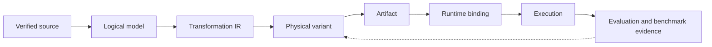
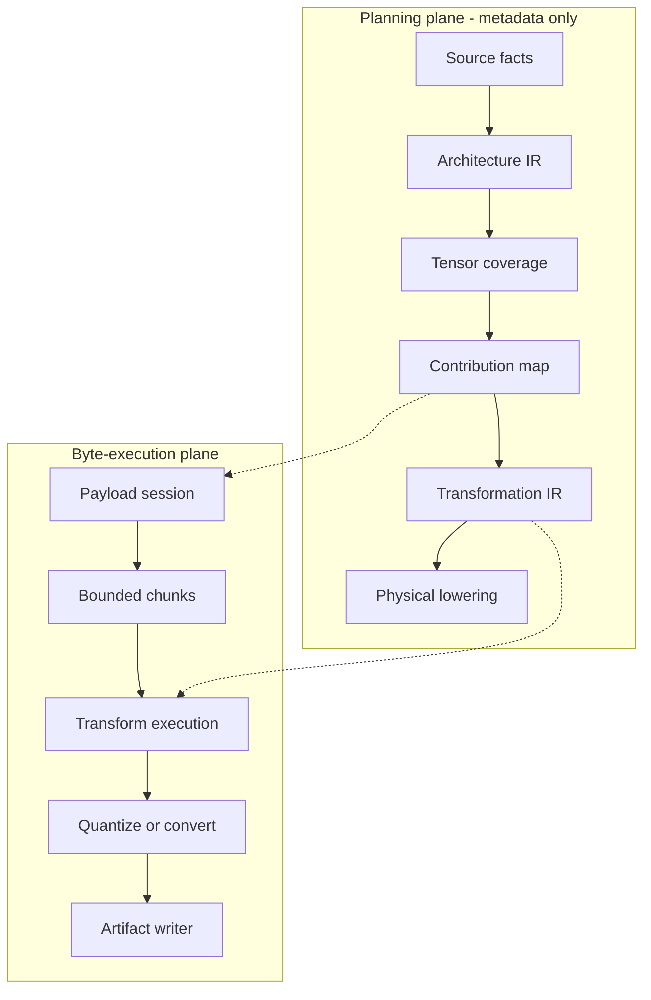

# YVEX

**YVEX is a native C model-compilation and execution system for local
open-weight models.** It begins with verified upstream weights and retains
ownership through logical model semantics, transformation planning, physical
variant construction, artifact encoding, runtime binding and identity-bound
execution evidence. A finalized GGUF is one possible compiler output, not the
point at which the system begins.

The v0.1.0 release direction is end-to-end
[DeepSeek-V4-Flash](https://huggingface.co/deepseek-ai/DeepSeek-V4-Flash)
generation on the 128 GB NVIDIA GB10 in DGX Spark from a complete GGUF produced
by YVEX. [`PROJECT.md`](PROJECT.md) is the sole authority for current
implementation state, dependency order and release gates.

YVEX is usable as a native library and operator tool. Its ownership boundaries
also make it suitable as an embeddable model-compilation and execution
substrate, without assuming that a parent packaging or orchestration system
already exists.

## The Controlled Model Lifecycle

A conventional artifact runner inherits the decisive choices made before the
artifact reached it: tensor interpretation, layout transforms, precision,
placement assumptions and the identity of the source bytes. YVEX makes those
choices explicit and carries their provenance into execution. The same logical
model may therefore admit different physical variants without conflating any
variant with the model itself.



The feedback edge is an architectural contract: measurements must remain bound
to the exact source, plan, variant, machine and workload that produced them.
It does not imply that an automatic selector or multi-variant compiler is
implemented today.

Each boundary has a distinct identity and failure domain:

| Boundary | Identity carried forward |
| --- | --- |
| Logical model | Verified source revision, family semantics, layer topology and canonical tensor requirements, independent of container and precision. |
| Transformation IR | Immutable operations that derive logical outputs from exact source contributions and payload ranges. |
| Physical variant | One lowering under explicit format, precision, hardware, memory, quality and workload constraints. |
| Artifact | A serialized representation of one physical variant; GGUF v3 is the v0.1.0 release format. |
| Runtime binding | The admitted association among artifact identity, residency, backend capabilities, execution descriptor and persistent state. |
| Execution evidence | Correctness, quality, memory, IO and performance observations bound to all preceding identities. |

These identities are deliberately non-equivalent. A valid container does not
establish tensor-role completeness; a complete artifact does not establish
backend capability; an isolated CUDA primitive does not establish a
family-correct transformer path.

## Planning Semantics and Byte Execution

Compilation separates metadata reasoning from movement of model bytes. The
planning plane decides what each output means and how it is derived. The
byte-execution plane later realizes that immutable plan through bounded source
reads, conversion, quantization and serialization.



Planning never reads tensor payload bytes. Source readers never reinterpret
family roles, aggregation axes or scaling companions. Quantization consumes the
transformation plan rather than rediscovering semantic mapping from filenames.
This separation keeps cancellation, resource limits and byte ownership in the
IO path while making transformation identity inspectable before a 160 GB source
is traversed.

## Variant Admission as a Constraint System

For a verified source `S`, hardware profile `H`, workload profile `W` and
candidate plan `p`, architectural admission requires the conjunction

```text
admit(S, H, W, p) =
    coverage(p)
  & payload_binding(S, p)
  & capability(H, p)
  & [memory_peak(p, H) <= memory_capacity(H)]
  & [quality_drift(p, W) <= epsilon(W)]
```

No term can be inferred from another. A qtype may have known byte geometry
without a quantizer or kernel; a plan may fit device memory while violating a
quality bound; a numerically accepted variant may still exceed host staging or
KV capacity under the target workload.

Variant choice is consequently a Pareto problem rather than a universal scalar
ranking:

```text
Pareto(S, H, W) = nondominated p in Admitted(S, H, W) over
  { TTFT, -prefill_tokens_per_second, -decode_tokens_per_second,
    host_peak, device_or_unified_peak, KV_peak, scratch_peak,
    artifact_bytes, SSD_bytes, SSD_stall_time, quality_drift, energy }
```

These equations define compiler objectives and evidence identity. No value in
the objective set is a measured result; predictions remain distinct from
measurements.

## Memory Is Part of the Lowering

Checkpoint size is not a residency model. A dense 70B checkpoint contains
about 140 GB of FP16 weights, while an ideal four-bit payload approaches 35 GB;
prefill and decode additionally require persistent KV state, transient
dequantization buffers, backend scratch and allocator headroom. The admissible
variant is constrained by peak live bytes and memory traffic, not by whether
the source files can be opened.

Sparse and hybrid models make this distinction sharper. Total parameter bytes,
active expert bytes per token, attention-state bytes and transformation scratch
follow different schedules. YVEX therefore treats SSD source storage, emitted
artifact storage, host staging, unified or device residency, persistent KV and
temporary scratch as separate tiers with separate lifetimes. Completed source
payload streaming is a build-time compilation capability; it is not
inference-time SSD expert streaming.

The accelerated release lane uses CUDA through the Driver API on GB10. Metal
unified memory and ROCm device memory remain independent backend programs
because allocator, placement and synchronization semantics cannot be inherited
from a generic backend label.

## Release Workload and Family Pressure

The pinned DeepSeek-V4-Flash source occupies **159,629,046,930 bytes** across
**46 safetensors shards** and contains **69,187 tensor records**. Its 43 main
layers and one MTP layer combine SWA, CSA and HCA attention with four-stream
manifold-constrained hyper-connections. The model declares **284B total
parameters**, activates **13B per token**, routes six of 256 experts alongside
one shared expert and supports a **1,048,576-token** context. Mixed FP4, FP8 and
BF16 source constraints make transformation, quality, memory and backend
capability inseparable compiler inputs.

DeepSeek-V4-Flash is the sole v0.1.0 release target, not the architecture of the
engine. Common owners also retain Qwen, Gemma, dense and MoE evidence so that
family semantics enter through typed adapters rather than target-name branches.

| Engineering pressure | What it forces the common system to represent | Current role |
| --- | --- | --- |
| Dense Qwen GQA | Grouped KV geometry, rotary subspaces, SwiGLU and output-head policy. | Source and tensor-profile evidence. |
| Gemma hybrid attention | Sliding/global attention schedules, distinct position rules and tied output embeddings. | Dense/common mapping evidence. |
| Qwen hybrid MoE | Recurrent linear-attention state beside conventional KV and routed expert state. | Header, naming and role-coverage evidence. |
| DeepSeek-V4-Flash | Compressed attention, mHC residual topology, hash and learned routing, MTP and low-precision source companions. | Sole v0.1.0 release workload. |

No row promotes Qwen or Gemma to release support. It prevents the common engine
from being reduced to a DeepSeek-specific implementation.

## Current Implementation Boundary

The architecture above is the system contract. The table below is a compact
snapshot, not a roadmap; [`PROJECT.md`](PROJECT.md) remains the live authority.

| Boundary | Implemented truth |
| --- | --- |
| Source | Exact DeepSeek repository/revision verification, tokenizer and index admission, 46/46 header reconciliation, manifest-bound payload digests and bounded trusted payload reads are implemented. |
| Logical model | The immutable DeepSeek architecture IR and complete 69,187-entry tensor coverage are implemented without a second source scan. |
| Concrete lowering | All source contributions map to 1,360 deterministic DeepSeek GGUF descriptors with identity-bound payload ranges. This is format-specific evidence, not the artifact-neutral Transformation IR. |
| Container foundation | Canonical qtype row geometry, a file-backed GGUF v3 reader and global ordered/padded layout admission are implemented. |
| Backend foundation | CUDA bundle and exact primitive admission fail closed; bounded GB10 variants are reference-compared, while full DeepSeek operation coverage is not established. |
| Compilation gap | The artifact-neutral Transformation IR, quantization execution, complete writer and complete DeepSeek GGUF are not implemented. |
| Execution gap | Complete materialization, runtime binding, transformer execution and autoregressive generation are unsupported. Evaluation is unavailable and benchmark results are not measured. |

Tensor proof artifacts and bounded fixtures remain regression evidence only. A
complete model artifact contains every tensor and metadata item required by one
logical model. A supported model artifact additionally passes materialization,
execution, generation, evaluation, benchmark and release admission. See
[`MODEL_ARTIFACTS.md`](MODEL_ARTIFACTS.md) for the complete contract.

## Build and Inspect the Implemented Boundaries

The repository builds the native library, CLI and daemon:

```sh
make
```

Structural GGUF and bounded primitive paths require no external model:

```sh
./yvex inspect tests/fixtures/gguf/valid-metadata-tensors.gguf
./yvex integrity check \
  --model tests/fixtures/gguf/valid-metadata-tensors.gguf
./yvex backend cpu
./yvex graph check --suite primitives --backend cpu
```

The pinned release source can be verified read-only when it is installed at the
canonical local path:

```sh
SOURCE="$HOME/lab/models/hf/deepseek/DeepSeek-V4-Flash"

./yvex source-manifest report \
  --family deepseek \
  --release v0.1.0 \
  --target deepseek4-v4-flash \
  --source "$SOURCE" \
  --strict \
  --include-config \
  --include-blockers

./yvex native-weights --source "$SOURCE" --limit 20
./yvex backend cuda
```

Strict verification binds the source to
`deepseek-ai/DeepSeek-V4-Flash@60d8d70770c6776ff598c94bb586a859a38244f1`.
The source and GGUF commands expose admitted metadata and bounded payload
capabilities; they do not execute the release model.

## Validation

```sh
make smoke
make check
make check-docs
make check-cuda
```

`make check-cuda` requires a CUDA-capable host and compiles the canonical
`cuda_kernels.cu` bundle before checking module admission, exact primitive
variants, reference parity and rollback. Validation rules and repository
ownership are defined in [`AGENTS.md`](AGENTS.md).

## Engineering References and Documentation

YVEX pins external specifications and implementations at the behavior being
studied. GGUF and qtype semantics are compared with pinned ggml/llama.cpp;
vLLM and SGLang inform model-runner, attention, KV and MoE decomposition;
TensorRT-LLM, CUTLASS, MLC, IREE and ExecuTorch provide independent compiler,
lowering and NVIDIA execution references. None of their process models,
formats, support matrices or performance claims is inherited. Exact revisions
and YVEX owners are recorded in
[`docs/reference-architecture.md`](docs/reference-architecture.md).

| Document | Authority |
| --- | --- |
| [`PROJECT.md`](PROJECT.md) | Current state, dependencies, release gates and complete ledger. |
| [`docs/system-target.md`](docs/system-target.md) | Filesystem and module ownership. |
| [`docs/model-families.md`](docs/model-families.md) | Family integration and architecture semantics. |
| [`docs/contract.md`](docs/contract.md) and [`docs/api.md`](docs/api.md) | Implemented behavior, lifetime and public C boundaries. |
| [`MODEL_ARTIFACTS.md`](MODEL_ARTIFACTS.md) | Artifact identity, admission and lifecycle. |
| [`docs/operator-runbook.md`](docs/operator-runbook.md) | Executable operator procedures. |

## License

YVEX is licensed under the MIT license.
