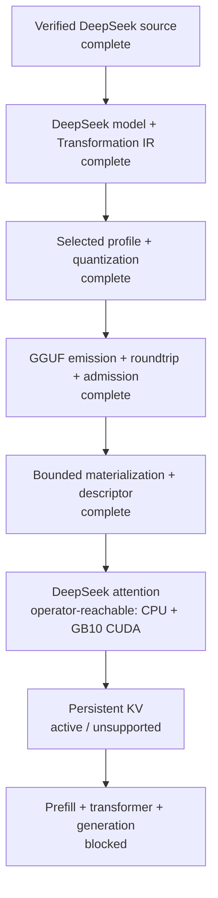

# YVEX

**YVEX is a native C/CUDA model-compilation system for verified open-weight
inference.** It turns pinned model sources into identity-bound physical
artifacts and admits each execution boundary only through executable evidence.

The DeepSeek-V4-Flash path is complete through source trust, Transformation
IR, quantization, GGUF emission, roundtrip admission, bounded materialization
and runtime-descriptor construction. Complete SWA/CSA/HCA attention is now
operator-reachable through the main `yvex` binary on CPU and the admitted GB10
CUDA path; persistent KV is the active frontier, and autoregressive generation
is not yet admitted.

[Architecture](#architecture) · [Verified at scale](#verified-at-scale) ·
[Run attention](#run-the-attention-boundary) · [Build](#build-and-validate) ·
[Project status](PROJECT.md)

## Verified at scale

| Proof | Verified result |
| --- | --- |
| Source trust | 46 / 46 shards and 159,617,149,040 payload bytes verified against pinned upstream Git LFS SHA-256 identities |
| Transformation plan | 69,187 exact source values become 1,360 terminal tensors through one immutable artifact-neutral IR |
| Selected physical artifact | Complete GGUF v3 file, 102,408,545,440 bytes, with all 1,360 tensors and exact tokenizer metadata |
| Bounded materialization | All 102,396,843,592 encoded tensor bytes walked with 16 MiB peak executor-owned staging |
| Numeric compute | Canonical codecs and direct CPU/CUDA compute evidence for every qtype selected by the release profile |
| Runtime frontier | Complete DeepSeek attention executes 43 layers and 634 real-weight bindings through the production API and main CLI on CPU and GB10 CUDA; persistent KV remains unsupported |

These are identity-bound implementation results, not projections from file
names, reports or fixture success. The selected artifact exists outside the
repository and is never tracked as source.

## Architecture

YVEX treats a model as verified structure that can be compiled, lowered and
bound—not as a filename that happens to end in `.gguf`.

| Boundary | What YVEX owns |
| --- | --- |
| Verified inputs | Exact repository revision, structured configuration, tokenizer facts, shard inventory, payload digests and immutable tensor ranges |
| Model compilation | Typed architecture, exact tensor roles, artifact-neutral transformations, deterministic derivation identities and physical-profile decisions |
| Physical artifacts | Numeric encoding, GGUF layout, metadata, tokenizer material, atomic publication, full-file identity and independent roundtrip admission |
| Execution admission | Bounded materialization, typed runtime descriptors, fail-closed backend capabilities and evidence attached to the exact identities that ran |

The identities remain distinct:

```text
logical model
  -> Transformation IR
  -> physical profile
  -> artifact
  -> materialization
  -> runtime descriptor
  -> execution evidence
```

Changing precision, layout or container representation does not redefine the
logical model. Producing a complete artifact does not establish runtime
support. A backend primitive does not establish transformer execution.



Four rules shape the implementation:

- **Identity before interpretation.** Consumers bind the exact source,
  payload, plan, profile, artifact and runtime facts they were built for.
- **Planning before byte execution.** Immutable plans decide meaning and
  geometry; bounded executors own reads, buffers, conversion and cleanup.
- **Transactional physical boundaries.** Partial tensors, partial artifacts
  and stale snapshots are failures, never degraded successes.
- **Generic mechanisms, explicit family policy.** Common owners implement
  reusable storage, numeric and lifecycle behavior; family owners select the
  topology and composition that are actually true for that model.

## DeepSeek-V4-Flash release target

[DeepSeek-V4-Flash](https://huggingface.co/deepseek-ai/DeepSeek-V4-Flash) is the
sole v0.1.0 release target. Its pinned source revision is
`60d8d70770c6776ff598c94bb586a859a38244f1`.

The v0.1.0 end target is real autoregressive execution on NVIDIA DGX Spark /
GB10 CUDA. Current CUDA evidence covers selected-qtype compute and the complete
attention-owned SWA/CSA/HCA composition. It does not establish full-model
residency, persistent KV, transformer composition or generation.

The admitted logical model records 43 main layers and one MTP layer, hybrid
SWA/CSA/HCA attention, mHC residual structure, position and KV requirements,
one shared plus 256 routed experts per main layer, top-6 routing, an untied
129,280-entry vocabulary and declared 1,048,576-token context geometry.
Long-context runtime execution remains blocked with the rest of the transformer.

The sealed Transformation IR accounts for every verified input exactly once:

| Operation | Terminals | Source contributions |
| --- | ---: | ---: |
| Identity transfer | 850 | 850 |
| Scale-paired decode | 375 | 750 |
| Checked I64 to I32 cast | 3 | 3 |
| Expert aggregation | 132 | 67,584 |
| **Total** | **1,360** | **69,187** |

The selected physical profile is
`deepseek-v4-flash-q8_0-q2_k-v1`:

| Encoding | Tensors | Encoded payload bytes |
| --- | ---: | ---: |
| F32 | 417 | 144,672,072 |
| BF16 | 433 | 2,830,518,528 |
| I32 | 3 | 9,308,160 |
| Q8_0 | 375 | 6,399,459,328 |
| Q2_K | 132 | 93,012,885,504 |
| **Total** | **1,360** | **102,396,843,592** |

YVEX has emitted and validated both canonical physical profiles:

- **Source-faithful:** 177,680,573,600 bytes.
- **Q8_0 + Q2_K selected profile:** 102,408,545,440 bytes.

```text
source-faithful SHA-256  f16e800c0d7383ee76cb2e2fa8bdd674bab29c017cba64eaba85c39016e257ca
selected SHA-256        01b2bed4f070d0a3fdb02e546764b3a49cb69886eebe17b4877d20294725682c
```

Each artifact contains 68 metadata entries, 129,280 tokenizer tokens, 127,741
merges and all 1,360 tensors. Both passed native full-byte verification and the
official GGUF reader pinned to ggml revision
`af97976c7810cdabb1863172f31c432dab767de7`; the selected artifact also passed
a complete deterministic second serialization.

The selected artifact then passed a complete bounded materialization walk:
1,360 tensor bindings, 33,792 expert subviews, every encoded payload byte and
zero missing bindings, using 16 MiB peak executor-owned staging. The runtime
descriptor projects those admitted tensors and the complete DeepSeek topology
without promoting graph execution.

## Current capability frontier

| Boundary | Current state |
| --- | --- |
| Exact source identity, headers and payload trust | complete |
| Typed architecture, tensor coverage and Transformation IR | complete |
| Physical profile, codecs and selected-qtype CPU/CUDA compute | complete |
| GGUF writer, complete emission, roundtrip and artifact admission | complete |
| Bounded materialization and DeepSeek runtime descriptor | complete |
| Complete DeepSeek SWA/CSA/HCA attention | complete on CPU and admitted GB10 CUDA |
| Operator attention probe | available through `yvex graph attention execute` |
| Persistent KV | active; unsupported |
| Model-backed prefill and transformer composition | blocked |
| Autoregressive text generation | unsupported |
| Evaluation | unavailable |
| Benchmark | not measured |
| Release | blocked |

This table is a public snapshot. [`PROJECT.md`](PROJECT.md) is the sole live
authority for milestone state, dependencies and the active boundary.

A **complete model artifact** contains all required tensors, metadata and
tokenizer material and has passed structural and physical verification. A
**supported model artifact** must additionally pass residency, full runtime,
generation, evaluation, benchmark and release gates. DeepSeek-V4-Flash is the
release target; it is not yet a supported generation target.

Qwen and Gemma remain bounded engineering evidence for common and family
contracts. GLM remains planned. None is presented as a supported generation
target.

## Run the attention boundary

The main binary can execute the admitted DeepSeek attention implementation over
the external selected GGUF. The input is a deterministic
`canonical_attention_probe` at exact model geometry, not a prompt, prefill,
decode, or generation request.

```sh
# Representative SWA, CSA, and HCA layers on CPU.
./yvex graph attention execute \
  --target deepseek4-v4-flash --backend cpu \
  --probe canonical --scope quick --output audit

# All 43 layers and 634 attention bindings on CPU.
./yvex graph attention execute \
  --target deepseek4-v4-flash --backend cpu \
  --probe canonical --scope full --output audit

# Representative and complete execution on the admitted GB10 CUDA path.
./yvex graph attention execute \
  --target deepseek4-v4-flash --backend cuda \
  --probe canonical --scope quick --output audit
./yvex graph attention execute \
  --target deepseek4-v4-flash --backend cuda \
  --probe canonical --scope full --output audit

# Independent production CPU and CUDA runs with structured comparison.
./yvex graph attention execute \
  --target deepseek4-v4-flash --compare-backends \
  --probe canonical --scope full --output json
```

By default the command resolves the canonical operator model root and admitted
artifact; `--models-root DIR --artifact FILE` selects explicit external paths.
Quick mode reports the three representative layers it ran. Full mode fails
unless all 2 SWA, 21 CSA, and 20 HCA descriptors and all 634 bindings execute.
The command calls the production API directly; it does not run a Make target,
test binary, or the test-only semantic oracle. Its output keeps
`runtime_generation_ready=false` and `end_user_generation_available=false`.

## Build and validate

YVEX builds a native library, CLI and daemon:

```sh
make -j4
make check
make check-cuda
```

The default build produces `build/lib/libyvex.a`, `./yvex` and `./yvexd`.
`make check` includes the CPU/unit, CLI smoke, documentation, topology and
fail-closed no-`nvcc` gates.

`make check-cuda` requires an NVIDIA CUDA-capable host. It verifies the exact
CUDA capabilities currently admitted by the repository; it does not claim
complete DeepSeek transformer execution.

## Repository map

| Area | Canonical owners |
| --- | --- |
| Verified source | `src/source/` |
| Logical model and compilation | `src/model/families/`, `src/model/compilation/` |
| Physical lowering and artifacts | `src/gguf/`, `src/artifact/` |
| Graph and backend execution | `src/graph/`, `src/backend/` |
| Public C interfaces | `include/yvex/` |
| Executable evidence and guards | `tests/` |

The directory is the namespace. Generic mechanisms and family recipes have
separate owners, private headers are bounded, and the build preserves
source-relative object paths. `config/source_owners.tsv` provides the
machine-readable ownership map enforced by repository guards.

## Technical documentation

| Document | Authority |
| --- | --- |
| [`PROJECT.md`](PROJECT.md) | Current state, complete ledger, dependencies, release gates and the single active boundary |
| [`MODEL_ARTIFACTS.md`](MODEL_ARTIFACTS.md) | Artifact terminology, physical identity, admission and support boundaries |
| [`docs/contract.md`](docs/contract.md) | Implemented lifecycle, ownership, failure and cleanup contracts |
| [`docs/api.md`](docs/api.md) | Public C APIs, typed results and lifetime rules |
| [`docs/reference-architecture.md`](docs/reference-architecture.md) | Pinned specifications, research and independent implementation references |
| [`docs/system-target.md`](docs/system-target.md) | Canonical filesystem and subsystem ownership |

## License

YVEX is licensed under the terms in [`LICENSE`](LICENSE). Attribution and
third-party notices are recorded in [`NOTICE.md`](NOTICE.md).
