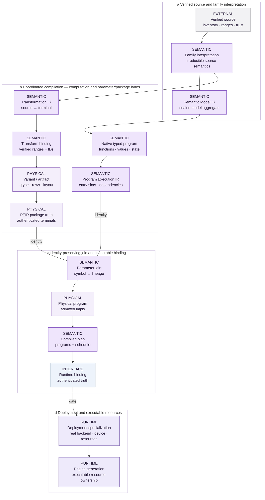

<!-- docs:metadata
title: YVEX
id: yvex
document: product
status: mixed
owner: yvex
audience: [engineer, agent, evaluator]
publication: {html: true, pdf: true, index: true}
-->

<p align="center">
  <picture>
    <source media="(prefers-color-scheme: dark)" srcset="docs/assets/brand/yvex-readme-stacked-dark.png">
    
  </picture>
</p>

<p align="center">
  <a href="#quick-start"></a>
  <a href="docs/architecture/backend-execution.md"></a>
  <a href="docs/project-control/STATUS.md"></a>
  <a href="https://github.com/yailabs/yvex/actions/workflows/qa.yml?query=branch%3Amain"></a>
  <a href="LICENSE"></a>
</p>

A native C/CUDA model compiler and stateful execution runtime. YVEX prepares
authenticated open-weight sources, compiles their meaning into admitted work,
and runs isolated sessions through a persistent local host.

## Why YVEX

A checkpoint that parses is not necessarily a model that can execute correctly.
YVEX treats support as a lifecycle with explicit identities, owners and evidence.

- **Verified execution:** source, artifact, deployment and behavior are distinct gates.
- **Compiler/runtime co-design:** serving consumes compiled facts instead of rediscovering model topology.
- **Representation independence:** the logical model is not its GGUF or quantization choice.
- **Native state:** attention, recurrent and speculative state keep their own geometry and transactional lifetime.
- **End-to-end efficiency:** preparation, load, memory and complete execution matter alongside kernel speed.

## Source to execution

<!-- docs:diagram physical_compilation -->

```mermaid
%% yvex-figure: physical_compilation
%%{init: {"themeVariables": {"background": "transparent"}}}%%
flowchart TB
  subgraph n_panel_0["a  Verified source and family interpretation"]
    direction TB
  n_source["EXTERNAL<br/>Verified source<br/>inventory · ranges · trust"]:::external
  n_family["SEMANTIC<br/>Family interpretation<br/>irreducible source semantics"]:::semantic
  n_semantic["SEMANTIC<br/>Semantic Model IR<br/>sealed model aggregate"]:::semantic
  end
  subgraph n_panel_1["b  Coordinated compilation — computation and parameter/package lanes"]
    direction TB
  n_typed["SEMANTIC<br/>Native typed program<br/>functions · values · state"]:::semantic
  n_execution["SEMANTIC<br/>Program Execution IR<br/>entry slots · dependencies"]:::semantic
  n_transform["SEMANTIC<br/>Transformation IR<br/>source → terminal"]:::semantic
  n_transform_binding["SEMANTIC<br/>Transform binding<br/>verified ranges + IDs"]:::semantic
  n_variant["PHYSICAL<br/>Variant / artifact<br/>qtype · rows · layout"]:::physical
  n_peir["PHYSICAL<br/>PEIR package truth<br/>authenticated terminals"]:::physical
  end
  subgraph n_panel_2["c  Identity-preserving join and immutable binding"]
    direction TB
  n_join["SEMANTIC<br/>Parameter join<br/>symbol ↔ lineage"]:::semantic
  n_physical_program["PHYSICAL<br/>Physical program<br/>admitted impls"]:::physical
  n_compiled["SEMANTIC<br/>Compiled plan<br/>programs + schedule"]:::semantic
  n_binding["INTERFACE<br/>Runtime binding<br/>authenticated truth"]:::interface
  end
  subgraph n_panel_3["d  Deployment and executable resources"]
    direction TB
  n_deployment["RUNTIME<br/>Deployment specialization<br/>real backend · device · resources"]:::runtime
  n_engine["RUNTIME<br/>Engine generation<br/>executable resource ownership"]:::runtime
  end
  n_source --> n_family
  n_family --> n_semantic
  n_semantic --> n_typed
  n_typed --> n_execution
  n_family --> n_transform
  n_transform --> n_transform_binding
  n_transform_binding --> n_variant
  n_variant --> n_peir
  n_execution ---|identity| n_join
  n_peir ---|identity| n_join
  n_join --> n_physical_program
  n_physical_program --> n_compiled
  n_compiled --> n_binding
  n_binding -->|gate| n_deployment
  n_deployment --> n_engine
  n_panel_0 ~~~ n_panel_1 ~~~ n_panel_2 ~~~ n_panel_3
  classDef semantic fill:#efe5fc,stroke:#7541ba,color:#261b38
  classDef physical fill:#f4effb,stroke:#8054b2,color:#261b38
  classDef runtime fill:#eeeafb,stroke:#6a4ca3,color:#261b38
  classDef mutable fill:#fff3db,stroke:#8e6920,color:#261b38
  classDef interface fill:#edf3fb,stroke:#456789,color:#261b38
  classDef external fill:#f2f2f4,stroke:#707078,color:#261b38
  classDef evidence fill:#eaf5ef,stroke:#3d7255,color:#261b38
  style n_panel_0 fill:transparent,stroke:#b8a5d0
  style n_panel_1 fill:transparent,stroke:#b8a5d0
  style n_panel_2 fill:transparent,stroke:#b8a5d0
  style n_panel_3 fill:transparent,stroke:#b8a5d0
```

[Static figure](docs/assets/diagrams/physical_compilation.svg) · [Editable source](docs/assets/diagrams/physical_compilation.json)
<!-- /docs:diagram -->

The compiler interprets family semantics and seals both computation and exact
parameter lineage. Deployment admits the implementation. An engine generation
owns executable resources; each session owns mutable state. CUDA executes the
admitted program below that boundary.

## Available execution

| Model boundary | Demonstrated path | Important limit |
| --- | --- | --- |
| [DeepSeek V4 Flash / DSpark](docs/model-families/deepseek-v4-flash.md) | Admitted text and target-verified speculative generation | No release behavior/performance claim |
| [Qwen3.8-27B text](docs/model-families/qwen3.8-text.md) | BF16 hybrid text CUDA execution and bounded readout | Not all upstream modalities or checkpoints |
| [MiniMax-H3 FL2VA](docs/model-families/minimax-h3.md) | Bounded component/composite media execution | Full-scale numerics and useful output remain unqualified |
| [Mamba-Codestral](docs/model-families/mamba2.md) | Exact 64-layer CPU artifact execution | Hosted conversation, CUDA SSM and whole-model oracle remain open |
| [Laya typed decisions](docs/model-families/laya.md) | Exact CPU finite model and bounded local text producer | No calibration, general head breadth or CUDA claim |

These are exact evidenced boundaries, not universal model-name support.
[Status](docs/project-control/STATUS.md) exposes the complete capability matrix.

## Product boundary

**YAI organizes semantic work. YVEX executes admitted computation.**
YAI owns Cases, workflow, memory and authority; Studio is its first-party
workbench. YVEX owns model/source interpretation, compiled representation and
computational state. Clients use qualified [integration contracts](docs/contracts/README.md).
Future native cognitive-state interoperation remains research.

## Quick start

```sh
make info
make -j4 all
./yvex help
./yvex model list
```

Acquire or select an admitted representation using the [quickstart](docs/guides/quickstart.md).
If no ready host exists, run `./yvex serve` in one terminal. In another:

```sh
./yvex model load MODEL
./yvex chat --model MODEL
```

`MODEL` is the catalog's logical model, not an arbitrary file path. Weights are
separate from the repository. See [published representations](docs/guides/model-lifecycle.md#published-representations)
for immutable release identities and bounded qualification.

## Evidence and current limits

Component proofs, runtime controls and real model observations are distinct.
[Evaluation](docs/evaluation/README.md) explains the evidence;
[benchmarks](docs/evaluation/benchmarks/README.md) retain exact context and limitations.
Whole-model release benchmark results are not measured. General continuous
batching, distributed execution and native cognitive state remain open/target.

## Documentation

[Vision](docs/product/VISION.md) · [System architecture](docs/architecture/README.md) ·
[Documentation home](docs/README.md) · [Tasks](docs/project-control/TASKS.md) ·
[Contributing](CONTRIBUTING.md)

Code is [MIT licensed](LICENSE). [NOTICE](NOTICE.md) explains ownership and
third-party/model boundaries; upstream model licenses remain separate.
