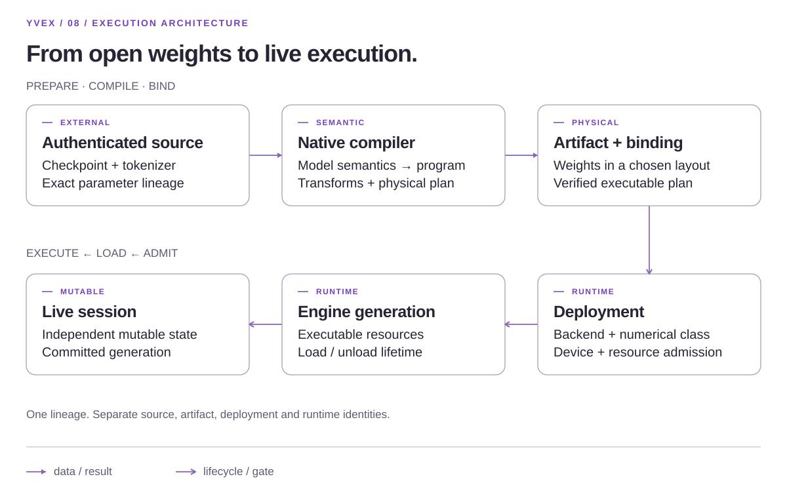
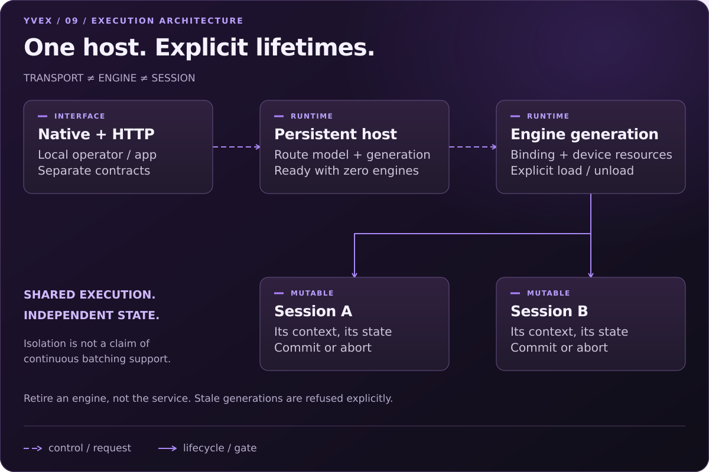

<!-- docs:metadata
title: YVEX
id: yvex
document: product
status: mixed
owner: yvex
audience: [engineer, agent, evaluator]
publication: {html: true, pdf: true, index: true}
-->

<p align="center">
  <picture>
    <source media="(prefers-color-scheme: dark)" srcset="docs/assets/brand/yvex-readme-stacked-dark.png">
    
  </picture>
</p>

<h1 align="center">Open weights. Native execution.</h1>

<p align="center">
  <strong>Compile the model. Own the execution. Know what ran.</strong><br>
  A native model compiler and stateful runtime.<br>
  Rust at the product boundary. C and hardware backends at the computational core.
</p>

<p align="center">
  <a href="#quick-start">Quick start</a> ·
  <a href="#source-to-execution">How it works</a> ·
  <a href="#available-execution">Models &amp; backends</a> ·
  <a href="#measured-performance">Benchmarks</a> ·
  <a href="#inside-the-computational-core">Under the hood</a> ·
  <a href="docs/README.md">Documentation</a>
</p>

<p align="center">
  <a href="docs/guides/build.md"></a>
  <a href="#platforms-and-backends"></a>
  <a href="docs/project-control/STATUS.md"></a>
  <a href="https://github.com/yailabs/yvex/actions/workflows/qa.yml?query=branch%3Amain"></a>
  <a href="LICENSE"></a>
</p>

YVEX is a native compiler and runtime for open-weight models. It turns exact
checkpoints into authenticated executable artifacts, admits them against real
hardware constraints, and runs isolated, stateful sessions through one host.

**Built for people who want control below the API.** Inspect what you acquired,
what you compiled, what is actually loaded, and what the evidence proves.

## Why YVEX

| Design choice | What it gives you |
| --- | --- |
| **Compile before execution** | Model semantics and parameter lineage become explicit programs and bindings, rather than topology rediscovered while serving. |
| **Separate model from representation** | A checkpoint, a quantization, an executable layout and a resident engine keep distinct identities. |
| **Make state a first-class resource** | Attention, recurrent and speculative state retain their own geometry, isolation and transactional lifetime. |
| **Keep the host alive** | Load and unload engine generations without replacing the transport. Inspect the service even with no model loaded. |
| **Measure the complete path** | Preparation, memory, prefill, committed decode and client-visible latency are separate evidence—not one unexplained speed number. |

## Source to execution



<p align="center">
  <a href="docs/architecture/compiler-ir.md">Compiler architecture</a> ·
  <a href="docs/architecture/representation-artifacts.md">Physical representations</a> ·
  <a href="docs/assets/diagrams/product_pipeline.json">Editable diagram source</a>
</p>

The compiler preserves **what the model means**. Deployment decides **which
implementation can run here**. The engine owns executable resources; a session
owns mutable state. Backends execute admitted operations and numerical classes.

## One host. Your models. Independent sessions.



<p align="center">
  <a href="docs/architecture/runtime-lifecycle.md">Runtime lifecycle</a> ·
  <a href="docs/architecture/computational-state.md">State ownership</a> ·
  <a href="docs/assets/diagrams/product_runtime.json">Editable diagram source</a>
</p>

| Connect through | Use it for | Contract |
| --- | --- | --- |
| **Native CLI / local protocol** | Local chat, model lifecycle and operator inspection | [Local protocol](docs/contracts/local-protocol.md) |
| **OpenAI-compatible HTTP** | Application inference through the bounded compatibility adapter | [Compatibility surface](docs/contracts/openai-compatibility.md) |
| **Public management + SDK** | Discover, enroll and manage a server through typed operations | [Authenticated management](docs/contracts/network-management.md) |
| **Native C API** | Embed the computational core without the Rust shell | [C API](docs/contracts/c-api.md) |

<a id="product-boundary"></a>

YVEX is usable independently. When connected to YAI, **YAI owns Cases, semantic
memory and authority; YVEX owns computation**. Graphical clients consume those
contracts rather than taking over either domain.

## Quick start

Prepare the [native toolchain](docs/guides/build.md), then build from the
repository root:

```sh
make info
make -j4 all
./yvex help
./yvex model list
```

Select a prepared model with admitted chat support from your catalog. If no
host is running, start it in one terminal:

```sh
./yvex serve
```

In another terminal, replace `MODEL` with its catalog identifier:

```sh
./yvex host status
./yvex model load MODEL
./yvex chat --model MODEL
```

For an optional terminal workspace, run `./yvex workbench`: conversation,
Models, Compile, Activity and exact runtime inspection share the same native
owners. [Workbench controls](docs/guides/operator-runbook.md#optional-terminal-workbench).

Weights are acquired separately; `model load` does not download them.
[Acquisition and preparation](docs/guides/quickstart.md)
· [Published representations](docs/guides/model-lifecycle.md#published-representations)

### See what is happening

```sh
./yvex model list
./yvex host status
./yvex host logs --follow
./yvex model qualification list
```

Runtime observation and published qualification answer different questions:
**what is running now** versus **what was tested under an exact configuration**.

## Available execution

These are evidenced paths—not a promise that every checkpoint, quantization or
backend works under the same model name.

| Model / family | Demonstrated execution | Scope to keep in mind |
| --- | --- | --- |
| [**DeepSeek V4 Flash / DSpark**](docs/model-families/deepseek-v4-flash.md) | Text generation and target-verified speculation on admitted variants | Checkpoint and representation gates remain separate; 0731 and performance work are active. |
| [**Qwen3.8-27B · text**](docs/model-families/qwen3.8-text.md) | BF16 hybrid text execution on CUDA | Bounded readout; not all upstream modalities or checkpoints. |
| [**Qwen3.5-0.8B · text**](docs/model-families/qwen3.8-text.md#exact-small-text-checkpoint) | Exact mixed BF16/F32 artifact on macOS CPU | Two bounded upstream continuation matches, not general quality or Metal model qualification. |
| [**MiniMax-H3 FL2VA**](docs/model-families/minimax-h3.md) | Bounded component and composite media execution | Useful output and full-scale numerics remain unqualified. |
| [**Mamba-Codestral**](docs/model-families/mamba2.md) | Exact 64-layer CPU artifact execution | Hosted conversation, CUDA SSM and whole-model oracle remain open. |
| [**Laya · typed decisions**](docs/model-families/laya.md) | Exact CPU finite model and bounded local text producer | No general calibration, head-breadth or CUDA claim. |

### Platforms and backends

| Platform | Backend | Current boundary |
| --- | --- | --- |
| **Linux · x86-64 / arm64** | CPU / NVIDIA CUDA | Native host and CLI; execution depends on the exact admitted model, artifact and device. GB10 evidence is target-specific. |
| **macOS · Apple Silicon** | CPU | Native host and CLI, terminal lifecycle and bounded Qwen 0.8B generation. |
| **macOS · Apple Silicon** | Metal · **early** | M5 Pro device/pipeline, shared buffers, copy/zero and F32 embedding primitives. **Not full-model GPU execution.** |

[Backend evidence](docs/architecture/backend-execution.md)
· [macOS integration](docs/evaluation/macos-main-integration.md)
· [Complete capability matrix](docs/project-control/STATUS.md)

<a id="evidence-and-current-limits"></a>

## Measured performance

The tables below are generated from immutable qualification receipts, not
manually maintained numbers. They expose the current engineering gap as well
as the demonstrated execution. **Characterization is not quality qualification.**

<!-- docs:benchmark showcase -->

**DeepSeek-V4-Flash-0731 · NVIDIA DGX Spark GB10 × 1 · CUDA.**

One retained publication checkpoint, not a hardware-independent speed claim.
Native protocol measurements use an isolated resident host, a separate warmup
and fresh sessions without prefix reuse; they do not describe whichever engine is installed today.
File-cache state was uncontrolled. Full build, artifact, binding and specialization identities are linked per row.

| Configuration | Exact measured scope |
| --- | --- |
| Checkpoint / build source | `7872f01b1d1f` / `b8130fd51f9b`; full identities in each receipt |
| Physical representation | goal-v1-mxfp4-routed-q2_k |
| Input / execution | chunk=512; width=1; concurrency 1; reasoning `none` |
| Sampling / transport | Temperature 0, deterministic; `product-native-v25` |
| Driver / toolkit | 580.159.03; CUDA 13.0; nvcc 13.0.88 |

| Workload / metric | Strategy · context | Input / output | Median (tok/s) | Min–max | N |
| --- | --- | ---: | ---: | ---: | ---: |
| [C hash table](docs/evaluation/benchmarks/generated/qualification-deepseek-0731-program-p-native-mxfp4-publication-coding-hash-table-20261010.md) · committed decode | target-only · 4096 | 31 / 256 | 9.66 | 9.64–9.66 | 3 |
| [C hash table](docs/evaluation/benchmarks/generated/qualification-deepseek-0731-program-p-native-mxfp4-publication-speculative-coding-hash-table-20261010.md) · committed decode | speculative · 4096 | 31 / 256 | 14.38 | 14.37–14.43 | 3 |
| [Long text · 2K](docs/evaluation/benchmarks/generated/qualification-deepseek-0731-program-p-native-mxfp4-publication-prefill-promessi-2048-20261010.md) · new prefill | target-only · 16384 | 2048 / 16 | 103.24 | 101.95–103.31 | 3 |
| [Long text · 8K](docs/evaluation/benchmarks/generated/qualification-deepseek-0731-program-p-native-mxfp4-publication-prefill-promessi-8192-20261010.md) · new prefill | target-only · 16384 | 8192 / 16 | 89.73 | 89.61–89.81 | 3 |

Decode excludes the first committed token and its latency. Input/output counts are server-authored;
prefill counts newly executed input positions, not reused context.
Different strategies and context bands remain separate rows, not an averaged score.

| Coding request | Server TTFT | First visible content | Complete client request |
| --- | ---: | ---: | ---: |
| [target-only](docs/evaluation/benchmarks/generated/qualification-deepseek-0731-program-p-native-mxfp4-publication-coding-hash-table-20261010.md) | 0.933 s | 1.461 s | 27.885 s |
| [speculative](docs/evaluation/benchmarks/generated/qualification-deepseek-0731-program-p-native-mxfp4-publication-speculative-coding-hash-table-20261010.md) | 1.231 s | 1.848 s | 19.574 s |

Performance: **CHARACTERIZED**. Independent representation quality: **BLOCKED**.
Latency cells are medians; their ranges, MAD, raw sample identities and memory/preparation
observations are in the linked receipts. No quality metric or confidence interval is invented.
These records do not establish high/maximum reasoning, other models, HTTP latency or release readiness.

<!-- /docs:benchmark -->

[All targets and experiments](docs/evaluation/benchmarks/generated/qualification-index.md)
· [Workload / reasoning matrix](docs/evaluation/benchmarks/generated/qualification-workloads.md)
· [Measurement definitions](docs/evaluation/benchmarks/methodology.md)

## Inside the computational core

**The hard part is the join between model meaning, physical weights and legal
execution.** YVEX makes that join explicit before the first request runs.

### Two compilation lanes. One authenticated binding.

| Boundary | What becomes explicit | Canonical owner |
| --- | --- | --- |
| **Computation** | Family semantics → typed programs → execution dependencies, state and effects | [Compiler IR](docs/architecture/compiler-ir.md) |
| **Parameters** | Source ranges → transformations → quantization/layout → authenticated package terminals | [Weight layouts](docs/architecture/representation-artifacts.md) |
| **Parameter join** | Symbolic operands resolve to exact terminal lineage; physical operations and the compiled plan enter the runtime binding | [Artifact admission](docs/architecture/artifacts-admission.md) |
| **Deployment** | Numerical implementation, backend compatibility, workspace and resource envelope are admitted for the target | [Specialization](docs/architecture/deployment-specialization.md) |

A storage format is not an execution algorithm. A qtype the artifact reader can
decode is not automatically legal for every fused kernel. Physical Execution IR
describes package terminals; the physical computational program describes work
over those terminals. Neither is a resident engine.

### State has geometry. Publication has a transaction.

Attention caches, recurrent state, speculative drafts, RNG and token ledgers do
not share one storage layout. They share coordinated **commit or abort**.
Each session owns its mutable state; engine generations fence stale references.
A captured prefix is tied to execution identity, not interchangeable memory.

The scheduler selects actual ready work. Execution batches and expert worklists
describe selected rows and routed populations; they do not invent useful batch
width. Backends own buffers, submission, synchronization and launch geometry.
DSpark output is counted only after target verification and committed publication.

[Computational state](docs/architecture/computational-state.md)
· [Scheduling](docs/architecture/scheduling-resources.md)
· [Generation](docs/architecture/generation-decode.md)
· [Speculation](docs/architecture/advanced-generation.md)

### Numerical behavior is part of the implementation contract

Quantized storage, decoded operands, reduction order, accumulation precision
and publication dtype are separate decisions. An optimization claiming the
same numerical class must preserve its obligations. A different arithmetic
realization needs explicit admission and independent evidence—not a looser test.

[Numerical ABI](docs/contracts/numerical-abi.md)
· [Backend execution](docs/architecture/backend-execution.md)
· [Independent references](docs/evaluation/benchmarks/generated/qualification-references.md)

### Active frontier: goal-driven physical compilation

**Program P is in progress.** `compile optimize` exposes bounded, deterministic
candidate planning through the native compiler. Goals constrain hardware,
workload, memory and quality; recipes must have an executable consumer.

| Established distinction | Still to earn |
| --- | --- |
| Static feasibility versus runtime admission | Complete resource and lifecycle qualification for each selected realization |
| Candidate ordering versus measured ranking | An independently qualified, workload-specific recommendation |
| Produced artifact versus installed engine | Explicit deployment and complete-model evidence, never automatic rollout |

This is the research and engineering surface: representation economics,
quantized operators, MoE execution, state lifetimes and reproducible evaluation.
The planner coordinates existing owners; it does not replace them.

[Current Program P implementation](docs/architecture/compiler-ir.md#goal-constrained-physical-search-partial-implementation)
· [Research target](docs/research/physical-model-compiler.md)
· [Selected delivery](docs/project-control/TASKS.md)

## Evidence you can inspect

**A model name is not a qualification. A tok/s number is not a benchmark.**

YVEX keeps family conformance, checkpoint references, representation quality,
backend execution, deployment performance and product behavior separate. A
result belongs to the exact build, model, representation, hardware,
configuration and workload that earned it.

| Question | Start here |
| --- | --- |
| What exact targets have records? | [Generated qualification catalog](docs/evaluation/benchmarks/generated/qualification-index.md) |
| How are results measured and compared? | [Benchmark methodology](docs/evaluation/benchmarks/methodology.md) |
| What do the independent evidence planes prove? | [Evaluation guide](docs/evaluation/README.md) |
| What remains unfinished? | [Current Status](docs/project-control/STATUS.md) and [selected Tasks](docs/project-control/TASKS.md) |

YVEX is under active development. A characterized result is not a release
guarantee. General continuous batching, distributed execution and native
cognitive-state interoperation remain open or research targets. Model licenses
and qualification boundaries stay attached to each source and variant.

<a id="documentation"></a>

## Go deeper

| Use YVEX | Build with YVEX | Work on YVEX |
| --- | --- | --- |
| [Quickstart](docs/guides/quickstart.md) | [Architecture](docs/architecture/README.md) | [Contributing](CONTRIBUTING.md) |
| [Model lifecycle](docs/guides/model-lifecycle.md) | [Public contracts](docs/contracts/README.md) | [Build guide](docs/guides/build.md) |
| [Operator reference](docs/reference/README.md) | [Product vision](docs/product/VISION.md) | [Roadmap](ROADMAP.md) |

<p align="center">
  <strong>Trace the source. Inspect the execution. Keep the evidence.</strong><br>
  <a href="docs/README.md">Explore the documentation →</a>
</p>

---

Code is [MIT licensed](LICENSE). [NOTICE](NOTICE.md) explains ownership and
third-party boundaries. Upstream model licenses remain separate.
