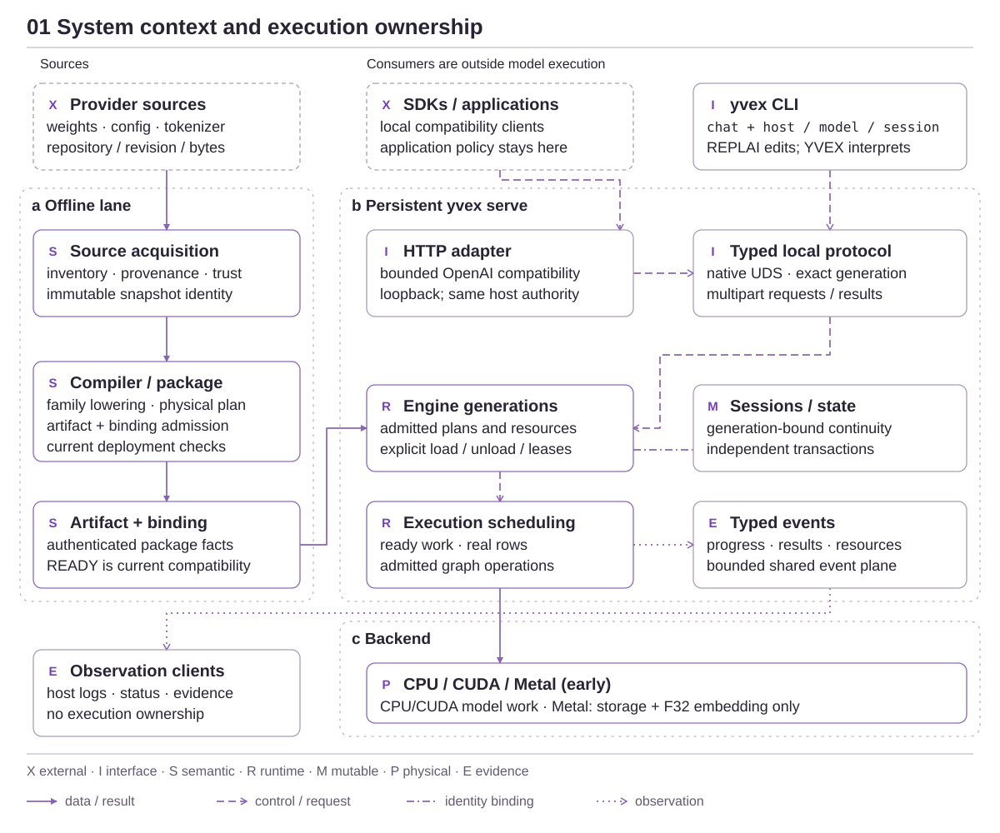

<!-- docs:metadata
title: YVEX System Architecture
id: yvex.architecture
document: architecture
status: mixed
owner: yvex
audience: [engineer, agent, evaluator]
publication: {html: true, pdf: true, index: true}
-->

# YVEX System Architecture

**Verified source, compiled meaning and isolated computational execution.**

[Documentation](../README.md)

YVEX turns exact upstream model sources into admitted computational execution.
Its compiler seals meaning and physical work; its runtime owns engine/session
lifetimes; its backends execute admitted operations. Evidence observes these
boundaries without becoming an execution owner.

The single Rust product shell calls the native computational library through
typed FFI. CPU and CUDA realize admitted model execution; Metal is integrated
in main as an early Apple Silicon backend for owned shared storage and exact
F32 embedding row selection. Native Mac CPU model evidence and Metal primitive
evidence have separate admission gates. The [backend plane](backend-execution.md)
owns their mechanisms and current model-runtime limits.

## System context

<!-- docs:diagram system_overview -->

[Full-size diagram](../assets/diagrams/system_overview.svg) · [Editable source](../assets/diagrams/system_overview.json)
<!-- /docs:diagram -->

Operators, C consumers and application providers enter through typed interfaces.
YAI owns semantic work outside this boundary. Hardware executes the admitted
computation; a transport adapter does not confer additional model capability.

## Source to verified execution

The [compiler dossier](compiler-ir.md) contains the complete
[fork-and-join diagram](../assets/diagrams/physical_compilation.svg).

The signature lifecycle is a **fork and join**, not a linear IR-to-GGUF conversion:

| Step | Boundary that must remain intact |
| --- | --- |
| Interpret | Source authentication precedes family-specific model meaning. |
| Fork | Computation seals legal operations; parameter derivation chooses transformations and exact representation. |
| Join | Symbolic operands resolve to authenticated package terminals. |
| Admit | Deployment verifies the numerical implementation and resource envelope. |
| Execute | Engine generations own executable resources; sessions own mutable state; scheduler/backend execute real ready work. |
| Publish | Result publication obeys identity and lifetime checks; evidence observes it. |

## Logical planes

### Interpret and compile

- [Source and Provenance](source-provenance.md) — Authenticate the exact source before interpreting or executing it.
- [Model Semantics and Admission](model-semantics.md) — A family interprets a model; shared machinery owns its execution lifetimes.
- [IR and Compilation](compiler-ir.md) — Seal computation and parameter lineage before runtime allocation.
- [Representation, Quantization and Artifacts](representation-artifacts.md) — A logical model can have several exact physical representations.
- [Artifact and Package Admission](artifacts-admission.md) — Authenticate a complete package before publishing a usable mapping.

### Admit and execute

- [Deployment and Specialization](deployment-specialization.md) — Admit an implementation and resource envelope without changing artifact identity.
- [Engine and Session Runtime](runtime-lifecycle.md) — A host retains engines; each session owns independent mutable execution.
- [Computational State](computational-state.md) — Sessions isolate state; transactions coordinate publication across distinct geometries.
- [Scheduling and Resources](scheduling-resources.md) — Schedule real ready work and account for resources without inventing physical width.
- [Backend and Device Execution](backend-execution.md) — Execute admitted work; do not rediscover model semantics in kernels.

### Produce and integrate

- [Generation and Decoding](generation-decode.md) — Generate tokens through compiled model work and transactional publication.
- [Speculation and Finite Execution](advanced-generation.md) — Shared runtime machinery supports distinct result semantics.
- [Interfaces and Protocols](interfaces-protocols.md) — Clients project typed system behavior without acquiring execution ownership.

## State and lifetime view

| Object | Owns | Survives / expires with |
| --- | --- | --- |
| Source snapshot | Exact provenance and tensor basis | Immutable source identity |
| Logical model/program | Interpreted computation and legal effects | Compiled identity |
| Representation/artifact | Exact encoded parameters and package facts | Authenticated stored bytes |
| Deployment specialization | Admitted implementation and resource choices | Compatible hardware/workload envelope |
| Engine generation | Executable resources and stale-reference boundary | Load/unload/drain |
| Session | Mutable attention/recurrent/component state | Session lifecycle and its parent generation |
| Transaction/result borrow | Candidate publication and transient value validity | Atomic commit/abort or producer reuse |

Captured prefixes are identity-bound snapshots, not generic semantic memory.
Persistent cognitive state E and unfinished deliberation L remain
[research](../research/native-computational-state.md). A client disappearing
does not transfer or destroy host authority; cancellation and retirement follow
the [runtime contract](../contracts/runtime.md).

## Execution and generation view

The scheduler chooses ready progress. An execution batch records actual selected
rows; an expert worklist groups their routed populations. Each backend owns
buffers, submission, synchronization and equivalent launch geometry for its
admitted operations. It does not infer topology from a family name or tensor
dimensions. Current model-runtime admission remains CPU/CUDA; the Metal
foundation exercises the common backend boundary without constructing a model
engine. Its numerical and resource frontier is explicit in the
[Metal foundation](backend-execution.md#apple-silicon-metal-foundation).

Ordinary generation runs tokenizer/admission → prefill → decode/logits →
sampling → transactional publication. Speculation adds target verification;
finite readout supplies candidate tokens instead of sampling; native finite
models compute typed results directly. Media composition uses admitted component
programs, not a second generic runtime.

## Trust and support view

“Supported model” means a bounded combination of source, representation,
deployment, execution and evidence. Family recognition, a complete artifact,
component numerics, model behavior and release qualification are separate gates.
Missing semantics, stale generations and unsupported exact requests fail closed.

See [Invariants](INVARIANTS.md), [Contracts](../contracts/README.md),
[family evidence](../model-families/README.md) and [current Status](../project-control/STATUS.md).

## Source ownership and dependency direction

Core/public ABI → source/artifact/model/tokenizer → compiler/graph →
materialization/runtime → backend → generation → evaluation.
Domain facts flow through typed reports to renderers and CLI I/O.

## Authority boundaries

| Boundary | Current owner |
| --- | --- |
| Source provenance, inventory, payload trust | `src/source/` |
| Remote provider discovery and remote representation records | `src/accounts/`, `src/model/remote.c`, `include/yvex/catalog.h` |
| Local acquired-source and admitted-package catalogs | `src/model/catalog.c`, `src/model/artifacts/`, `include/yvex/catalog.h` |
| Family source facts, coverage and logical lowering | `src/model/families/` |
| Authenticated finite-frontier text/token construction | `src/tokenizer/finite_input.c` and source-owned recipes under `src/tokenizer/families/` |
| Artifact-neutral parameter transformation, transform binding and representation policy | `src/model/compilation/`, model compilation owners |
| GGUF container, qtypes, writer, layout | `src/gguf/` |
| Artifact snapshot, integrity, admission, bounded ranges, and package mapping/materialization session | `src/artifact/`, `include/yvex/internal/artifact.h` |
| Backend/model executable weight materialization | `src/model/materialization.c`, `include/yvex/materialization.h` |
| Semantic Model IR, native typed programs, execution lowering, physical programs and state protocols | `src/model/compilation/`, `src/ir/`, `src/graph/` |
| Runtime binding, model engines, specialization, sessions, residency, scheduler | `src/runtime/` |
| Device capability, memory, kernels, launch graphs | `src/backend/` |
| Autoregressive composition | `src/runtime/generation.c` and typed generation owners |
| Persistent host, live engine observation, routing, protocol, telemetry | `src/server/` |
| OpenAI-compatible projection | `src/server/openai/` and `src/provider/` |
| Command metadata and projections | `config/operator/registry.json`, generated descriptors, `src/cli/` |

Family source interpretation and graph recipes occupy separate compilation
levels, described by [family integration](../model-families/integration.md).
Generic runtime and backend owners consume typed plans, not family-name
switches. Pure-SSM execution now has the exact CPU boundary documented by the [Mamba2 record](../model-families/mamba2.md); this does not imply hosted conversation or CUDA SSM support.

The exact source-file ownership manifest is
[`config/source_owners.tsv`](../../config/source_owners.tsv). It is also the
sole handwritten production build-membership list; a checked deterministic
projection supplies Make product classes. Contributor-facing layout and build
ownership rules are in
[Source and Module Ownership](../guides/source-ownership.md).

## Next reads

[Invariants](INVARIANTS.md) · [Contract map](../contracts/README.md) · [Evaluation](../evaluation/README.md) · [Tasks](../project-control/TASKS.md)
