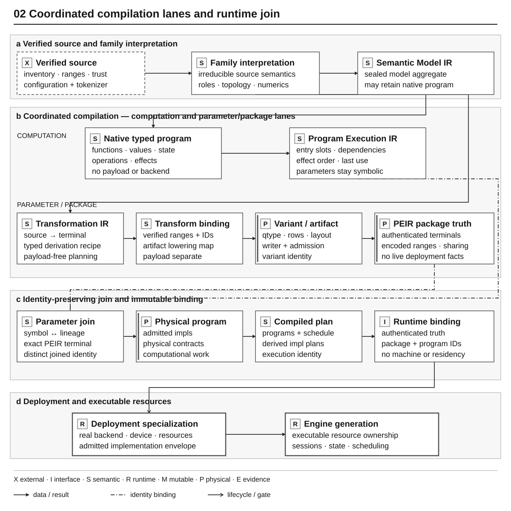

# Compilation and Artifact Architecture

Status: current implemented architecture

This document owns the explanation of how YVEX turns an identified source
snapshot into an admitted physical artifact and runtime binding. Normative
artifact requirements are in the [Artifact and Admission Contract](../contracts/artifacts.md).

## Pipeline



*Figure 2 — Source-to-engine promotion. Source, artifact, binding, deployment
and engine are distinct identities/lifetimes. READY is current compatibility;
load revalidates resources and seals specialization for a real device. Missing
semantics or resources refuse at their owner, never imply the next stage.*
[Editable source](../diagrams/physical_compilation.json).

## Source intake and trust

Source intake records repository/revision, configuration, tokenizer sidecars,
shards, tensor names, shapes, dtypes, and byte ranges. Structural inventory and
payload trust are separate. A source can be inventoried without having every
payload digest authenticated.

The retained source snapshot is immutable and indexed. Downstream owners
consume typed facts and exact bounded ranges; they do not rescan source headers
or infer semantics from filenames.

Payload admission has an explicit bootstrap boundary. `source verify`
promotes verified metadata/header provenance to source-manifest v3 only after
reading every shard and matching its authoritative provider SHA-256. The v3
manifest lives outside the source snapshot, binds the ordered aggregate payload
identity, and can be reopened without a second full payload pass. Transformation
planning still consumes zero payload bytes; execution admits ranges only from
that trusted identity.

## Logical projection and transformation

Family owners interpret exact source facts into model topology and canonical
roles. The transformation plan then binds every terminal output tensor to its
ordered source contributions and typed operations. Plan construction is
artifact-neutral and payload-free.

Each family projects immutable source and terminal recipes through the bounded
compiler sink. The generic compilation owner alone allocates mutable builder
state, assigns canonical value and node ordinals, validates expected source and
terminal populations, seals the IR, and releases failed construction. Family
code cannot manipulate or persist the mutable builder representation.

The family projection seals source-authored context, MoE, output, DSpark and
persistent-state geometry into one pointer-free model-execution descriptor. It
also projects every main and draft attention layer, together with the numeric
contract required to interpret it, into compiler-owned Semantic Model IR
storage. Common planning consumes those identity-bound facts instead of
branching on a target name, retaining process-local family payload, or
repeating family constants. Synthetic descriptor tests vary the principal
dimensions and mutate the source projection after sealing to prove that the
common path remains model-derived and immutable.

The compiler-facing family adapter supplies one bounded graph compiler and the
family's operator-composition callback. Family projectors are consumed only
while sealing Semantic Model IR. Generic graph lowering reads the sealed
attention topology and converts it into graph-owned physical plan records;
generic graph code does not enumerate a process-global family registry or
choose a transformer-shaped composition. Family projection callbacks are
absent from runtime model-open and execution.

Transformation execution reads only the ranges named by the sealed plan. It
may select, concatenate, permute, aggregate, scale, convert, or quantize as
declared. It may not rediscover axes, expert ordering, companion scales, or
qtype policy from source names.

## Physical policy

A physical variant resolves storage dtype/qtype, row geometry, layout,
alignment, aggregation, and placement constraints for every terminal tensor.
The policy is part of the variant identity. Quantization codecs and qtype
geometry are canonical owners, while selection of a qtype for one tensor is a
physical-policy decision.

Writer and runtime owners consume the resolved variant. They do not pick a
different representation for convenience.

The physical variant owns canonical encoded representation. Physical Execution
IR schema v5 is the package projection for each terminal tensor: canonical role,
scope, coordinates, qtype, row geometry, encoded range, alignment, consumer,
stable layout, sharing, and terminal identity. It deliberately contains no
backend, device, activation, kernel-family, width-crossover, evidence, fallback,
or live-resource policy.

At model-engine open, the runtime combines these authenticated package decisions
with one real backend/device and seals an engine specialization. That
specialization owns the admitted implementation class, activation
representation, legal real widths, fallback-equivalence class, and any
hardware crossover. Actual compatible rows and routed populations still belong
to executable batches and expert worklists. CUDA may select an equivalent
microkernel inside the admitted class, but it cannot infer semantic
compatibility, manufacture width, or select a numerically different class.

Package identities therefore change with model/storage meaning. Specialization
identity changes with deployment-significant implementation facts. Equivalent
warp, tile, grid, stream, and launch geometry stays backend-local and does not
rebuild the package or binding.

## Artifact emission and admission

The GGUF writer plans exact metadata, tensor directory order, alignment,
padding, ranges, and payload bytes before transactional publication. Native
reader and global-layout owners independently validate the emitted container.

Complete-artifact admission additionally binds model metadata, tokenizer
facts, every required tensor role, qtype support, source/derivation/variant
identities, and exact file identity. Structural GGUF validity is necessary but
not sufficient.

Materialization consumes terminal roles and package decisions to produce checked
file-backed, host-canonical, CUDA-addressable-host, device, or staged resources.
It does not import a concrete model family, choose a deployment implementation,
infer consumers from tensor names, execute a graph, or establish support for a
model. A derived representation remains a typed engine resource unless its
bytes are intentionally published as a separately authenticated package asset.

## Runtime binding

The runtime binding is a separate content-addressed package object. It bridges
the admitted artifact and package physical decisions to runtime descriptors,
physical tensor locations, compiled model/operator plans, tokenizer policy,
numerical identities, and compatibility constraints. It does not serialize a
selected machine, resident population, kernel cache, request shape, or backend
microkernel. The warm runtime reopens and authenticates these admitted package
facts rather than rebuilding compiler plans.

Context has two authorities at this boundary. The Semantic Model IR owns the
source-authored maximum. The immutable compiled model plan projects that fact
through target and optional draft transformer plans as a typed context
envelope. A selected startup or request capacity is instead a workload fact:
runtime may admit it only inside the compiled envelope, then the generic
capacity planner evaluates state geometry, artifact bytes, hardware facts and
resource reserve. The current 4096-token DeepSeek profile is one such selected
workload, not the model's semantic limit.

Runtime binding v15 persists the canonical operator graph identity, Physical
Execution IR v5 package records, and pointer-free compiled tokenizer,
conversation, and model/operator plans. Source-owned syntax and exact tokenizer
component identities enter through the family compiler adapter; tokenizer,
runtime, and server consume the authenticated record without enumerating a
concrete family.

The v15 reader also authenticates accepted v14 bindings. It imports a v14
physical record only when the legacy record names canonical package storage and
does not require its retired derived-layout/runtime-policy fields; the importer
then normalizes that package truth to PEIR v5 before engine specialization.
Unsupported legacy derived assets fail closed. Bindings v7 through v13 remain
explicit rebuild boundaries because they predate the canonical operator graph.
Old bytes are never reinterpreted as v15.

The non-persisted runtime execution profile binds an exact engine generation
and specialization to workload, kernel bundle, generation mode, evidence class,
and typed operation resolutions. It is built inside the opened engine/session
lifetime. It is not a second permanent execution plan.

Artifact drift, binding drift, unsupported qtypes, missing roles, resource
overflow, or incompatible runtime requirements refuse before model execution.

## Executable composition oracle

The CPU-only tiny vertical is the fast composition oracle for this pipeline. Its focused test
owner deterministically generates an untracked GGUF, admits it through the production artifact
contract, compiles the semantic model, operator graph, Physical Execution IR and runtime binding,
then launches the real foreground host with zero engines, loads the fixture,
serves it, unloads it without stopping the host, reloads it as a new generation,
and admits two fitting engines concurrently. The production `host status`,
`engine list`, `engine load`, native generation, `engine unload`, `host logs`, and
`host stop` paths must return the expected context, text, identities, typed
completion event, routing refusals, and clean lifecycle. A second build must
reproduce artifact and binding identities, while a corrupted artifact must
refuse without terminating the host.

The fixture adds no production model family and does not establish support, quality, CUDA or
performance for a real model. Its generated artifact and binding remain temporary build evidence,
never repository authority.

## Current family lowering

Exact source inventories, role counts, and physical-policy limitations belong
to the [family records](../model-families/integration.md#current-family-boundaries).
Shared compilation preserves source derivation and shared operands instead of
duplicating bytes for multiple plans.

The typed architecture is not yet a complete decoder for every sequence
mixer. Mamba2 has source and recurrent-component evidence but no admitted
SSM-only artifact/decoder binding. Mandatory FFN or rotary/KV assumptions may
not be satisfied with fictitious roles to manufacture READY.

## Typed computational programs

The native program-language foundation is owned by
[`include/yvex/internal/ir.h`](../../include/yvex/internal/ir.h) and
[`src/ir/module.c`](../../src/ir/module.c). It is **not yet the complete serving-runtime cutover**:
DeepSeek and MiniMax still consume their existing compiled execution records;
Qwen's decoder now consumes lowered tensor work for its FFN, but its mixer and
layer orchestration remain transitional. The operator graph and decoder plans
above have not been retired.
Refoundation .1 remains active until those consumers and lowering boundaries
are migrated and qualified.

### Cutover acceptance boundary

The adopted end-to-end target is **not yet the implemented serving pipeline**:

```text
verified source -> import -> Semantic Model IR -> Program / Execution IR
                                                    |
                     Transformation IR + target machine
                                                    |
                                                    v
                     Physical IR -> Target / Schedule IR
                                                    |
                                                    v
                     executable binding -> runtime
                                              |
                                   state providers + backends
                                              |
                                    typed results + evidence
```

| Boundary | Required unique authority | Current cutover evidence |
| --- | --- | --- |
| Verified source / import | Source identity, configuration, tokenizer, parameter roles and component relationships | Mamba2 source inspection and Qwen text compilation project typed programs |
| Semantic Model IR | Modules/functions/blocks, operations/values/types, shapes/attributes/effects and explicit state dependencies | Native IR construction and verification exist; executable families are not migrated |
| Program / Execution IR | Legalized components, entrypoints, dependencies and state flow | Direct-call legalization and straight-line dependencies are implemented; executable regions remain pending |
| Transformation IR + machine | Parameter derivation and target feasibility, without changing model meaning | Exact source constants join through sealed identity transforms; general transform legalization and target matching remain pending |
| Physical IR | Dtype/qtype, layout, packing, alignment and sharing | Parameter joins and pure BF16 tensor legalization exist; general activation/state representation lowering remains pending |
| Target / Schedule IR | Admitted physical work, dependencies, populations and placement | Bounded tensor instructions bind backend implementations once and prepare exact row populations; general schedule cutover pending |
| Executable binding / runtime | Authenticate immutable execution truth; own engines/runners/sessions/scheduling/lifetimes | Compiled model-plan v5 carries lowered FFN work; runtime does not interpret Semantic IR; full binding migration remains pending |
| State providers / backends / evidence | Physical state mechanisms and CPU/CUDA execution publish typed results and observations | Existing owners and producer-owned transient-result lifetimes preserved |

A second graph serialized alongside decoder plans is not the accepted end state.
Each migrated consumer must use the new lowered authority, and superseded
internal semantic owners must be removed. Generation repetition remains runner
policy above model forward computation. Native Cognitive State remains OPEN:
typed computational state does not introduce semantic-state ingress or YAI
authority into this compiler.

### Representation and ownership

A module owns dimensions, interned logical types, functions, blocks, operations
and uniquely defined values. Construction copies requests; sealing verifies and
freezes the module. IDs are module-local handles. Construction may relocate a
view, whereas sealed views last until module close. Neither kind of handle is
a runtime device-result publication generation, engine lease or checkpoint.

| Computational form | Implemented meaning | Persistence / consumers |
| --- | --- | --- |
| Imported program | Family/source interpretation as typed operations, parameter references and explicit state dependencies | Mamba2 source inspection and Qwen text projection; Mamba2 source obligations remain unresolved |
| Canonical program | Same module infrastructure after verified alias and dead-pure-value passes | Immutable compiler object, canonical diagnostic text and semantic identity |
| Straight-line execution form | Entry-local value slots, producer dependencies, serial effect order and last-use boundaries | Qwen binding compilation consumes this verified lowering; backend/region schedule cutover is not claimed |
| IR binary v1 | Explicit-field encoding reopened through constructors, static dialect resolution and the verifier | Internal serialization contract tested by roundtrip/truncation; not embedded in current v15 runtime bindings |
| Existing Transformation IR | Parameter derivation, ordered source contributions and provenance | Existing source-to-package authority; not replaced by program operations |
| Parameter physical projection | Source-bound program constants joined to transformation terminals and physical package decisions | Compiler-owned terminal handles and a distinct identity; no payload access or target schedule |
| Tensor program v1 | Verified pure rank-2 BF16 instructions, operand/result slots and admissible row populations | Persisted in compiled model-plan v5 for the migrated FFN consumer; independent from package PEIR v5 |
| Existing package physical / target forms | Representation, admitted package storage and deployment implementation selection | PEIR/binding/specialization retained; universal operation/state schedule lowering remains pending |

Semantic tensors contain scalar type and logical shape, not GGUF qtypes, CUDA
layouts or alignment. Types include scalars, tensors, semantic-domain state,
tuples and program signatures. Program signature types may describe state-bearing
argument/result lists. Actual SSA values cannot pack state into an aggregate:
state remains a direct, independently verified input/result until an aggregate
ownership contract exists. A program handle describes a signature, not captured
mutable state.

Shapes use static extents or shared named dimension symbols with positive
minimum/maximum/multiple constraints. Verification rejects undefined symbols,
simultaneously static/symbolic extents and overflowing element bounds. Neural
operation verifiers check contraction and preserved dimensions. This is not a
general shape-expression solver or qualified dynamic-shape runtime.

### Operations, regions and effects

Static dialect tables bind a qualified operation name and semantic version to
arity, attribute schema, effects, region count and a typed verifier. An imported
program cannot redefine an operation or supply code pointers. Unknown operations,
unknown/duplicate attributes, non-finite numerical attributes and invalid types
fail before seal. Logical parameter references carry an exact source identity and
symbol; payload bytes remain outside the program.

`core.call` resolves a function symbol and checks its complete signature.
`core.loop` carries explicit values through an index-controlled region;
`core.if` has two typed regions. Return/yield terminators are verified against
their owner. Implicit call recursion is refused. Neural definitions include
embedding, linear contraction, normalization, activations and elementwise
operations; registration and verification do not establish backend execution.

Effects distinguish state read/write, RNG, publication and ordered computation.
Functions declare an effect envelope and calls inherit the callee's envelope.
Operations cannot read values that do not dominate them. A consumed state
version cannot be read, updated or returned again; regions receive state as
explicit block arguments instead of capturing an outer mutable owner. State
versions describe semantic dependencies, **not physical copies**. No KV, paging,
residency or Native Cognitive State implementation is introduced by this IR.

The compiler lowers canonical straight-line entries through
[`program_execution.c`](../../src/graph/program_execution.c). Parameters remain
symbolic; operands/results become compact entry-local slots. Each work item
names its producer dependencies, and each value records its last use within
the entry. Returned values still require the separate consumer/publication
lifetime; last use is not permission to retire a published result.

The initial lowering preserves one serial chain of declared effects, including
state reads before subsequent writes and effect completion before return. It
does not claim parallel state scheduling or infer that a new semantic state
version needs a new allocation. Pure data dependencies are separately explicit.
Calls must first be legalized; unlowered regions fail closed rather than being
silently flattened into a DAG. Region representation in Semantic IR therefore
does not imply an executable region backend.

The execution identity/dump uses sorted entry symbols and entry-local slots,
bound to the semantic identity. Construction-local module IDs are inspection
links, not serialized identity. This form still has no backend selection,
placement, physical activation layout or production binding serialization.

### Passes, identity and refusal

| Ordered pass | Transformation | Verification / evidence |
| --- | --- | --- |
| `legalize.direct_calls.v1` | Expand acyclic direct calls into explicit operand/result and state dependencies | Repeated stateful calls retain successor versions; expansion/nesting budgets fail closed; Qwen uses this for 64 FFN calls |
| `canonical.value_aliases.v1` | Replace `core.identity` results with their input values | Typed input/output verification; no state alias escape |
| `canonical.dead_pure_values.v1` | Remove unreachable pure computations | Preserve effects, terminators, state transfers, region parents and dependencies |

Each pass reads an immutable module and publishes a distinct verified module.
Failure publishes neither a partial module nor partial pipeline receipts. The
receipt binds pass name/version, input/output identities and operation counts.
The tested canonical pipeline is deterministic and idempotent. These are real
rewrites, not physical/backend legalization passes; the latter remain migration
work.

The canonical text sorts function symbols and attributes and renumbers SSA
values by traversal. Scalar floating attributes use exact hexadecimal IEEE bits,
avoiding locale-dependent decimal formatting. Semantic identity hashes this
field-defined projection with source lineage, never C memory, padding, pointers,
paths or timestamps. Removing a representational alias changes the imported-form
identity; equivalent alias-free forms converge after canonicalization. Physical
model bytes are not part of this logical program encoding.

Only sealed modules may be retained by another compiler owner. The module owns
its storage once; an atomic lifetime reference keeps immutable views alive after
the source projector closes. Retention is not another semantic identity, a
session-state copy or a transient device-publication generation.

The Qwen text projector emits `forward` and `output` entrypoints and a reusable
`dense_ffn` computational function with explicit input/weight arguments. The
ordered pass pipeline expands its 64 calls before execution-record projection;
the function remains inspectable, not a new runtime architecture. BF16 logical
publications remain distinct from F32 recurrent/convolution state and F32 logits.
Linear projection, normalization, residual addition and the SiLU product are
explicit operations. The SiLU product rounds the activation to its logical type
before multiplication and rounds the product again; physical fusion must retain
both rounding points. Stateful attention and gated-delta
operations consume projected values, exact parameter references and state
versions; they do not allocate state or encode a family/layer enum in IR core.
The neural BF16 linear contract accumulates in F32 and rounds once to its declared
result type; a BF16-to-F32 output head does not insert a BF16 publication.
The gated attention contract retains interleaved query/gate splitting, one-plus
Q/K RMSNorm, half-split partial RoPE and BF16/F32/RNE causal attention followed by
sigmoid gating. The gated-delta contract retains F32 recurrence and one BF16
output publication. These describe current internal numerical classes, not
upstream conformance.

Qwen's current attention/decoder compilation records are now projected from that
verified program, which the compiler retains and binds into its identity. They
remain transitional consumers: the runtime still executes the specialized mixer
plans, but calls the lowered `dense_ffn` program for its feed-forward work. This
removes the decoder's separate FFN operation sequence, three activation buffers
and two linear-specialization owners. The tensor-program execution owner binds
the admitted instructions, prepares row populations and owns their intermediate
storage; the caller retains input/output ownership. This is a partial consumer
migration, **not** completion of the executable schedule/backend cutover.
The Qwen source fixture proves 48 recurrent operations,
16 attention operations, 112 distinct state inputs and all 851 text parameters;
it does not execute the full model.

### Physical tensor execution and schema import

[`program_tensor.c`](../../src/graph/program_tensor.c) legalizes a bounded pure
tensor subset: BF16 linear with F32 accumulation, the two-rounding-point SiLU
product, and BF16 residual addition. Physical values distinguish encoded BF16
parameters from F32 activation storage carrying BF16 publications. Instructions
name admitted numerical implementations rather than a family or decoder kind.
Semantic identity, execution identity and physical-program identity remain
separate. Unsupported types, effects, operations, shapes or duplicate output
bindings refuse during compilation/import.

Compiled model-plan **v5** persists that tensor projection with explicit lengths
and field encoding inside runtime binding v15. It does not persist the complete
Semantic IR module, and its version is independent from package PEIR v5. The
v3/v4 decoder importer translates authenticated legacy FFN geometry once into
the same lowered form; it does not reinterpret old bytes as v5. Re-encoding a
v4 container retains its original bytes. Native v5 admission validates both
the physical program and its exact input/output/context compatibility with the
remaining transitional decoder consumer. This import boundary disappears only
when those durable legacy containers no longer require support.

[`tensor_program.c`](../../src/runtime/tensor_program.c) resolves instruction
implementations at open, owns intermediate storage and prepares exact row
populations before execution. Inputs, parameters and result destinations remain
caller-owned. No compiler operation-name lookup or topology reconstruction runs
per FFN invocation. Failed preparation publishes no runnable population; failed
execution marks the result unwritten. Borrowed device-result validity still
belongs to the enclosing producer publication generation, not an IR value ID.

The independent CUDA fixture compares 256 scalar BF16 results at widths 1 and 3
with zero error/tolerance. It exercises allocation budgets, failed preparation,
failed execution/retry, alias/shape/representation refusal and return to baseline
allocated bytes after cleanup. These are bounded operator/lifetime proofs, not
full Qwen execution, upstream conformance or an architecture performance claim.

[`src/graph/program.c`](../../src/graph/program.c) owns the parameter join between
this program, Transformation IR and PEIR. Each constant binds an exact source
symbol through one identity-preserving transform to a physical terminal handle.
Missing/ambiguous realizations, wrong source, logical dtype/shape, tensor role,
row geometry, encoded storage or inadmissible physical class fail compilation.
Equal element count is not sufficient; a transpose is not silently treated as
an alias. Broader transformation legalization remains explicit future work.
The projection has a distinct identity bound to all three compiler inputs and
retains the immutable module without retaining source payloads. Two admitted
physical recipes may share semantic identity while having different physical
projection identities. [`tests/unit/program.c`](../../tests/unit/program.c)
checks that distinction, negative joins and lifetime after input closure.

[`tests/unit/ir.c`](../../tests/unit/ir.c) owns the construction, dominance,
state/effect, signature, region, identity, pass and binary refusal evidence.
The source-owned Mamba2 projection additionally checks real audited mixer
geometry and parameter roles. Its imported `forward` has logits plus separate
convolution/SSM state results. Explicit tokenizer/normalization obligations
survive canonicalization, and its source-to-deployment gate still returns
UNSUPPORTED. This is representability, not complete model numerics or A01
execution. The program's sequence-symbol bound is an inspection envelope, not
a qualified context capacity.

## Repository boundary

Model weights, source payloads, complete artifacts, runtime bindings,
registries, transformation outputs, and raw evidence stay outside the
repository. Tiny test fixtures are admitted only by their focused test owner.
