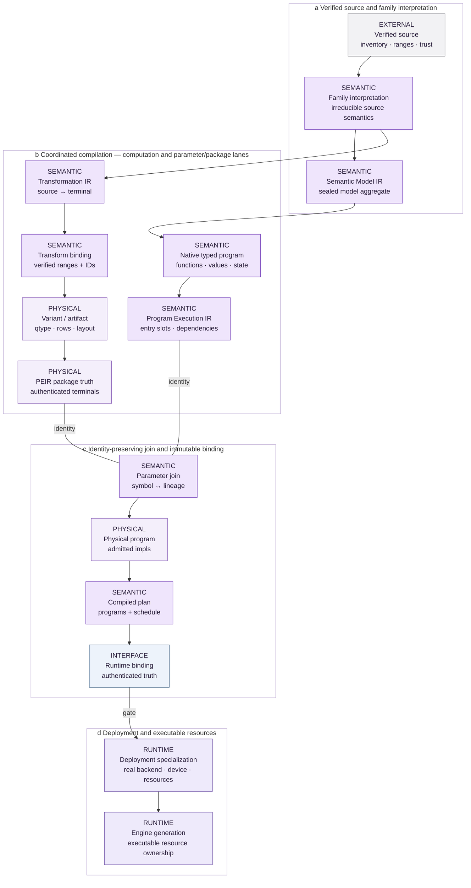

<!-- docs:metadata
title: IR and Compilation
id: yvex.architecture.compiler-ir
document: architecture-plane
status: mixed
owner: compiler
audience: [engineer, agent, evaluator]
publication: {html: true, pdf: true, index: true}
plane: compiler-ir
related: [yvex.architecture.representation-artifacts, yvex.architecture.deployment-specialization]
-->

# IR and Compilation

**Seal computation and parameter lineage before runtime allocation.**

[Up](README.md)

Compilation has two coordinated lanes, with an explicit parameter join.
The computation lane defines legal operations and effects. The package lane
derives exact physical parameters. Runtime receives their authenticated result.

## Read this dossier

- **Mental model:** pipeline and logical projection below.
- **Executing consumers:** current cutover and its acceptance boundary.
- **Exact language:** [program contracts](../contracts/computational-programs.md),
  [components](../contracts/component-programs.md), [computed indices](../contracts/index-programs.md).

The Physical Execution IR (PEIR) describes package terminal truth. It is distinct
from the physical computational program that executes operations over those
terminals. A runtime binding joins these facts; a deployment then admits an
implementation and resource envelope.

## Pipeline

<!-- docs:diagram physical_compilation -->


[Static figure](../assets/diagrams/physical_compilation.svg) · [Editable source](../assets/diagrams/physical_compilation.json)
<!-- /docs:diagram -->

*Figure 2 — Coordinated compilation lanes and source-to-engine promotion.
Computation meaning and parameter/package derivation remain distinct until the
identity-preserving parameter join. Package truth, runtime binding, deployment
specialization and engine resources are also distinct identities/lifetimes.
Missing semantics or resources refuse at their owner, never imply the next
stage.*
[Editable source](../assets/diagrams/physical_compilation.json).


## Logical projection and transformation

Each family publishes a bounded catalog of exact targets. Generated membership
enumerates family-owned catalogs; consumers flatten their target records rather
than assuming one target per family. Adapter identity alone refuses ambiguous
resolution. Exact target identity, or an exact embedded source repository and
revision, disambiguates tokenizer ownership. No target is inferred from shape.

Source-class lowering rules may select a verified source dtype. An unspecified
dtype preserves the existing wildcard behavior; overlapping rules refuse. The
small Qwen source-faithful recipe keeps its BF16 matrices and F32 recurrent
vectors as distinct direct transformations, without converting source precision.

Family owners interpret exact source facts into model topology and canonical
roles. The transformation plan then binds every terminal output tensor to its
ordered source contributions and typed operations. Plan construction is
artifact-neutral and payload-free.

Current compilation has two coordinated concerns. The **computation lane**
projects family semantics into a sealed Semantic Model IR, may retain a native
typed `yvex_ir_module`, lowers legal entrypoints to `yvex_program_execution`,
then joins exact package parameters before selecting admitted implementations
in `yvex_program_physical`. The **parameter/package lane** projects verified
source through Transformation IR,
transform binding, artifact lowering, representation/quant decisions, writer,
admission and artifact materialization into PEIR package terminal truth. The
lanes join when each symbolic computational parameter resolves through its
Transformation IR lineage to one exact PEIR/package realization. They do not
form an undifferentiated IR-to-GGUF pipeline, and family coverage is not
identical.

Each family projects immutable source and terminal recipes through the bounded
compiler sink. The generic compilation owner alone allocates mutable builder
state, assigns canonical value and node ordinals, validates expected source and
terminal populations, seals the IR, and releases failed construction. Family
code cannot manipulate or persist the mutable builder representation.

The family projection seals source-authored context, MoE, output, DSpark and
persistent-state geometry into one pointer-free model-execution descriptor. It
also projects every main and draft attention layer, together with the numeric
contract required to interpret it, into compiler-owned Semantic Model IR
storage. Common planning consumes those identity-bound facts instead of
branching on a target name, retaining process-local family payload, or
repeating family constants. Synthetic descriptor tests vary the principal
dimensions and mutate the source projection after sealing to prove that the
common path remains model-derived and immutable.

`yvex_semantic_model_ir` and `yvex_ir_module` are not synonyms. The former is
the sealed model-semantic aggregate: it carries family adapter identity,
execution descriptor, numeric contract, attention/decoder/composite facts,
references and semantic identities. The latter is the native typed
computational-language object with dimensions, types, functions, blocks,
operations, values, effects and explicit state; a Semantic Model IR may retain
one as its `program`. Qwen and MiniMax use native typed programs for their
admitted computational paths, DeepSeek retains a canonical operator schedule
alongside sealed semantic and derived implementation records, and Mamba2
lowers an exact pure-SSM source program to the common portable CPU
physical-program boundary. Its exact artifact and binding now execute all 64
layers plus the LM head through that program; hosted conversation and
independent whole-model conformance remain unadmitted.

The compiler-facing family adapter supplies one bounded graph compiler and the
family's operator-composition callback. Family projectors are consumed only
while sealing Semantic Model IR. Generic graph lowering reads the sealed
attention topology and converts it into derived attention, MoE and transformer
implementation-plan records;
generic graph code does not enumerate a process-global family registry or
choose a transformer-shaped composition. Family projection callbacks are
absent from runtime model-open and execution.

Transformation execution reads only the ranges named by the sealed plan. It
may select, concatenate, permute, aggregate, scale, convert, or quantize as
declared. It may not rediscover axes, expert ordering, companion scales, or
qtype policy from source names.


## Typed computational programs

The native program-language foundation is owned by
[`include/yvex/internal/ir.h`](../../include/yvex/internal/ir.h) and
[`src/ir/module.c`](../../src/ir/module.c). The current admitted serving paths
now have one compiler-owned computational lineage. Qwen token-forward and
output execution consume physical SSA. DeepSeek target/draft execution consumes
the canonical operator schedule retained by model-plan v8 while its attention,
MoE and transformer plans remain derived physical implementation records.
MiniMax neural components consume typed physical programs; media and product I/O
remain outside neural IR. Attention/state providers and runner/result records
remain derived lifecycle views and do not reconstruct topology. Refoundation
.1 completed this current-consumer authority cutover; `.1.QUALIFICATION.0` owns
the broader replay and independent evidence campaign.


## Current consumer cutover

| Consumer | Compiler/runtime authority after refoundation .1 | Remaining evidence or later breadth |
| --- | --- | --- |
| Qwen 3.5 | Forward/output entries share compiler lineage; the slot runner executes physical SSA and legacy decoder bytes normalize only at cold admission. Attention providers and reports are one-way derived views. | Whole-model before/after preservation and authoritative upstream conformance. |
| DeepSeek V4 / DSpark | Canonical operator graph owns embedding, heterogeneous attention/MoE pairs, target/draft data and state dependencies, final/output and draft projections. Binding v17/model-plan v8 retains it; runtime schedules from it and uses separately authenticated physical implementation plans. | Independent upstream conformance and performance qualification. The later bounded decoded-forensic CPU/CUDA repair is recorded in Evaluation. |
| MiniMax H3 | Text, multimodal text, vision, visual dense/prefix, audio signal and joint prepare/step/forward compile to physical SSA; common component owners execute admitted work; old procedural neural executors are removed. | Asset-dependent trajectory/full-scale qualification; bounded component preservation is not full-model or upstream conformance. |
| Mamba2 | Exact pure-SSM forward/output program, artifact and binding execute common CPU physical SSA and transactional state without attention/KV/RoPE/dense FFN | Independent all-layer/whole-model numerics and hosted conversation remain open; A01 stays PARTIAL |

<details>
<summary>Exact owner map for each architecture consumer</summary>

| Family | Source identity | Architecture importer | Semantic / execution owner | Physical / target owner | Runtime consumer | Historical computational authority | Qualification depth |
| --- | --- | --- | --- | --- | --- | --- | --- |
| DeepSeek V4 / DSpark | Source/catalog revision, selector, representation and target/draft relation | `model/families/deepseek_v4.c` interprets source schema; `graph/families/deepseek_v4.c` projects canonical semantics | Semantic Model IR plus retained operator graph own target/draft topology, dataflow, state and ordering | Transformation IR, PEIR and typed attention/MoE/transformer programs and plans | Generic transformer/generation owners resolve the retained graph and invoke admitted work | Family containers retain import and irreducible operation policy only; no warm family topology owner | Real target/draft, generation and transport controls; exact execution-class comparisons remain scoped by [Evaluation](../evaluation/retained-observations.md#deepseek-numerical-classes) |
| Qwen 3.5 | Source/catalog revision, selector and representation | Qwen model/graph importers project source topology | Native typed forward/output module and physical SSA own current text computation | Parameter projection, physical program and exact recurrent/attention state bindings | Slot-based program runner and generic state providers | Legacy decoder schemas are cold-import compatibility only; procedural forward loop removed | Recurrent/hybrid numerical lanes and bounded exact-artifact generation; upstream conformance not executed |
| MiniMax H3 | Source/catalog component and representation identities | MiniMax model/graph importers project neural component interfaces | Typed text, vision, audio and joint component programs | Physical component programs and admitted backend operations | Common component executor and runtime lifecycle | Family code retains import and irreducible fused-operation meaning; old neural procedural loops removed | Bounded component preservation; full asset-dependent trajectory and upstream evidence remain open |
| Mamba2 | Exact source/catalog snapshot and durable manifest | Mamba2 source/graph importer resolves source/token/numerical policy | Typed forward/output module and explicit convolution/recurrent state dependencies | Common physical-program lowering selects portable CPU selective SSD; artifact/binding authenticate 579 parameters and 64 state bindings | Common physical SSA and sequence-state transactions execute all 64 layers and LM head | No Transformer-shaped dependency or family runtime introduced | Exact artifact/runtime determinism plus independent first-layer component scope; whole-model conformance and hosted conversation remain open |


</details>

## Cutover acceptance boundary

The [signal compiler](../../src/graph/signal_program.c) projects source-declared
channel-first convolutions, normalized/transposed convolutions, alias-free
Snake activations, residual branches, ordered means and output clamping into
typed operations. Static channel/sample geometry and a bounded batch symbol
determine operand/result storage. Source parameter names are resolved at cold
binding only; the backend receives admitted operations and encoded weights,
not decoder stages or tensor-name templates. One bounded scratch allocation is
reused across signal operations. The prior CPU and CUDA complete alias-decoder
interfaces and procedural loops are removed.

The current audio recipe projects seven upsampling stages and 914 parameters.
An exact-artifact, one-frame before/after replay preserves all 800 F32 samples
bitwise on each backend. This establishes bounded migration preservation, not
upstream conformance, arbitrary-duration audio qualification or a speedup.

The following is the implemented ownership pipeline at the currently admitted
scope. Individual model architectures and operations still require their own
qualification; the pipeline does not claim universal family support.

```text
verified source -> family interpretation
                        |                 |
                        v                 v
             sealed Semantic Model IR    Transformation IR
                        |                 -> transform binding / artifact lowering
             retained native typed       -> representation plan / writer
             program when present        -> artifact admission / materialization
                        |                 -> PEIR package terminal truth
             execution lowering                    |
                        +------------+--------------+
                                     v
                      exact program-parameter join
                                     |
                      physical computational program
                                     |
                          compiled model plan
                                     |
                            runtime binding
                                     |
                 deployment specialization / engine
                                     |
                      state providers + backends
                                     |
                       typed results + evidence
```

| Boundary | Required unique authority | Current cutover evidence |
| --- | --- | --- |
| Verified source / import | Source identity, configuration, tokenizer, parameter roles and component relationships | Mamba2 exact source policy and Qwen text compilation project typed programs |
| Semantic Model IR | Sealed family/model aggregate, semantic identities, numeric obligations and optional retained native program | Qwen, MiniMax and Mamba2 retain typed programs; DeepSeek retains semantic topology plus its operator schedule. |
| Native typed program | Functions/blocks, operations/values/types, shapes/attributes/effects and explicit state dependencies, without payload or backend ownership | Current Qwen and MiniMax computational paths plus Mamba2 pure-SSM forward/output use `yvex_ir_module`; not every family exposes the same native-program breadth. |
| Program Execution IR | Legalized entrypoints, compact value slots, producer dependencies, serial effect ordering and last-use boundaries while parameters remain symbolic | Qwen and MiniMax binding compilation plus bounded Mamba2 physical-program qualification consume this verified lowering. Calls require legalization and general executable regions/parallel scheduling remain later breadth. |
| Transformation IR / binding / artifact lowering | Source-to-terminal parameter derivation and identity-bound source ranges, without model computation or payload reads during planning | Exact source constants retain sealed derivation; generic transform legalization remains bounded. |
| Parameter representation plan | Dtype/qtype, row geometry, packing, alignment and package layout decisions | Current quant plan/physical variant is an implemented representation recipe, not a complete automatic Program P result. |
| PEIR package terminal truth | Authenticated terminal roles, identities, qtypes, row geometry, encoded ranges, layout and sharing | Built from admitted artifact materialization and runtime-descriptor facts; no backend/device/activation/kernel/residency decision. |
| Program-parameter join | One identity-preserving package realization for each used computational parameter | Transformation terminal lineage and PEIR decisions resolve symbolic constants before invocation; payload lookup is not deferred to execution. |
| Physical computational program / target choice | Admitted operation implementations, dependencies, exact populations and physical value contracts after exact parameter join | Serial physical SSA owns Qwen/MiniMax program work; DeepSeek runtime resolves scheduled attention/MoE work from the retained canonical graph and separately authenticated implementation plans. |
| Executable binding / runtime | Authenticate immutable execution truth; own engines/runners/sessions/scheduling/lifetimes | Runtime binding v17 and model-plan v8 carry canonical schedules plus physical programs/plans; v17 also records explicit attention absence. Historical forms import only at the schema boundary; warm execution does not invoke family importers. |
| State providers / backends / evidence | Physical state mechanisms and CPU/CUDA execution publish typed results and observations | Existing owners and producer-owned transient-result lifetimes preserved |

The retained canonical graph, PEIR and physical computational programs answer
different questions: the graph owns executable topology, dependencies and state
flow; PEIR owns authenticated package terminal truth; physical programs and
derived implementation plans own admitted computational work and numerical
contracts. The runtime cross-checks rather than reconstructs these facts. Generation repetition
remains runner policy above model forward computation. Native Cognitive State
remains OPEN: typed computational state does not introduce semantic-state
ingress or YAI authority into this compiler.


## Repository boundary

Model weights, source payloads, complete artifacts, runtime bindings,
registries, transformation outputs, and raw evidence stay outside the
repository. Tiny test fixtures are admitted only by their focused test owner.

## Implementation and evidence

[src/ir](../../src/ir) · [src/model/compilation](../../src/model/compilation) · [src/graph](../../src/graph) · [include/yvex/internal/ir.h](../../include/yvex/internal/ir.h) · [include/yvex/internal/compilation.h](../../include/yvex/internal/compilation.h)

[QA selection](../evaluation/qa.md) · [Current state](../project-control/STATUS.md)

## Continue

[Representation, Quantization and Artifacts](representation-artifacts.md) · [Deployment and Specialization](deployment-specialization.md)
