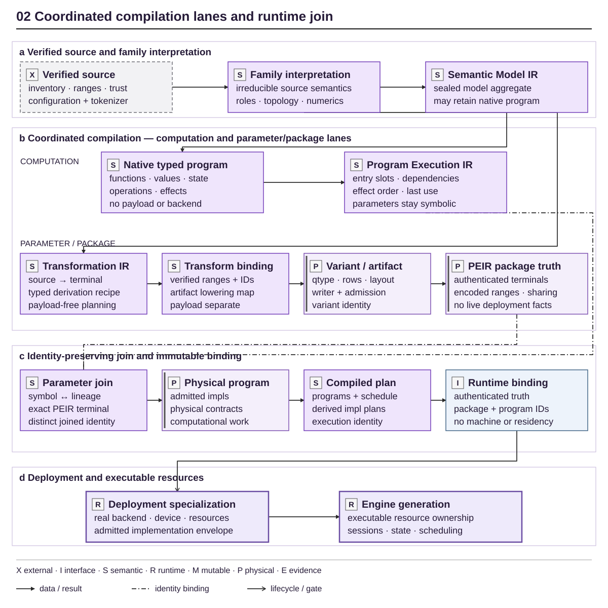
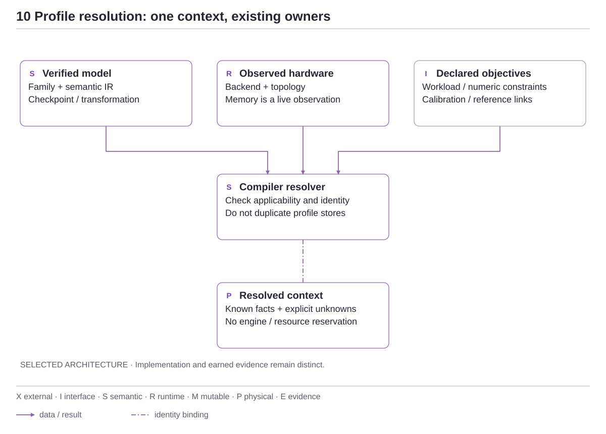
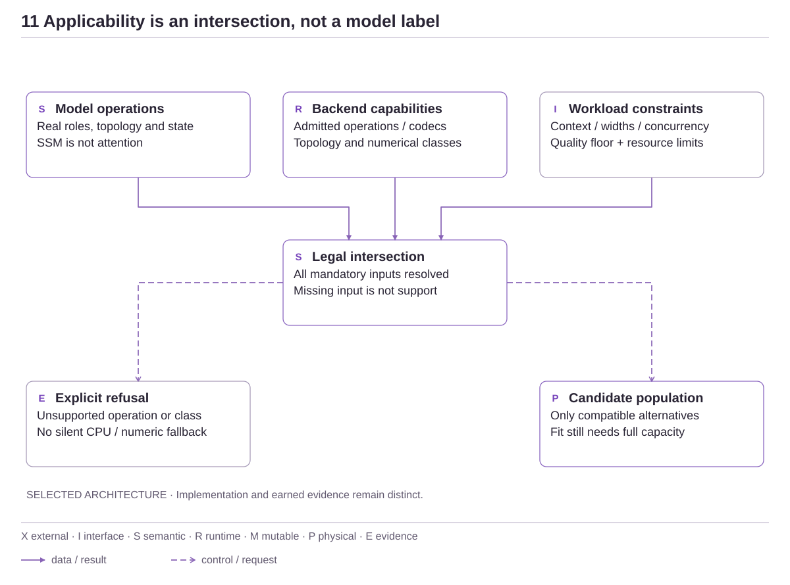
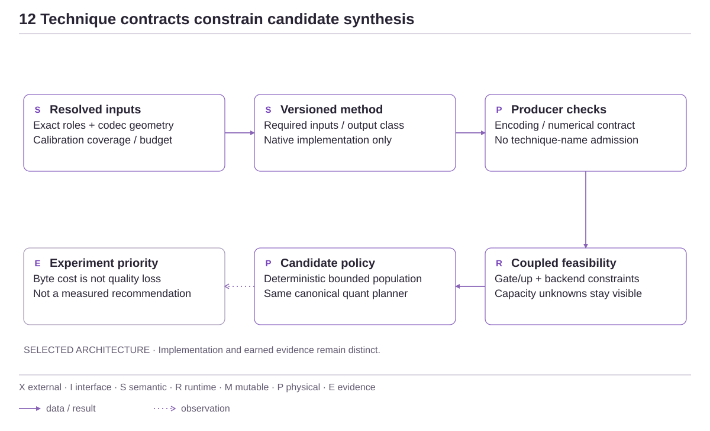
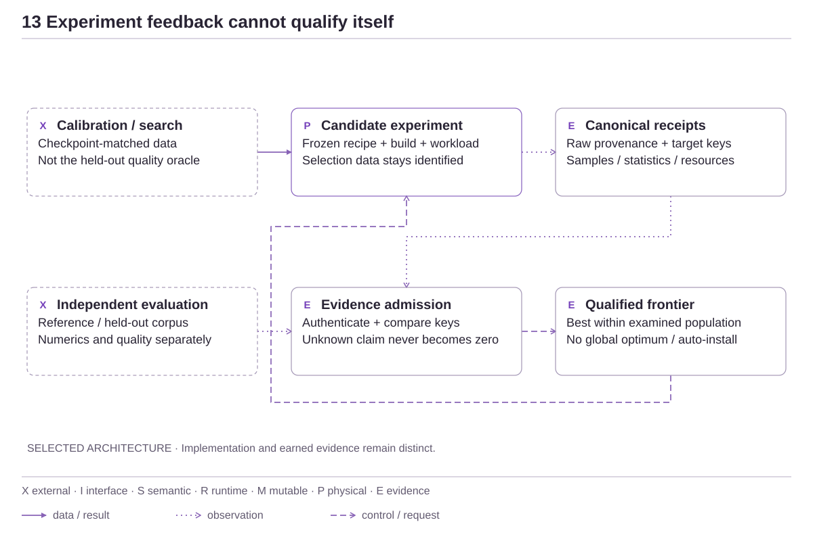
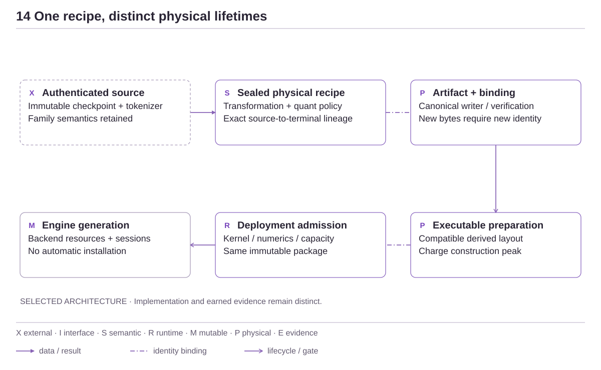

<!-- docs:metadata
title: IR and Compilation
id: yvex.architecture.compiler-ir
document: architecture-plane
status: mixed
owner: compiler
audience: [engineer, agent, evaluator]
publication: {html: true, pdf: true, index: true}
plane: compiler-ir
related: [yvex.architecture.representation-artifacts, yvex.architecture.deployment-specialization]
-->

# IR and Compilation

**Seal computation and parameter lineage before runtime allocation.**

[Up](README.md)

Compilation has two coordinated lanes, with an explicit parameter join.
The computation lane defines legal operations and effects. The package lane
derives exact physical parameters. Runtime receives their authenticated result.

## Read this dossier

- **Mental model:** pipeline and logical projection below.
- **Executing consumers:** current cutover and its acceptance boundary.
- **Exact language:** [program contracts](../contracts/computational-programs.md),
  [components](../contracts/component-programs.md), [computed indices](../contracts/index-programs.md).

The Physical Execution IR (PEIR) describes package terminal truth. It is distinct
from the physical computational program that executes operations over those
terminals. A runtime binding joins these facts; a deployment then admits an
implementation and resource envelope.

## Pipeline

<!-- docs:diagram physical_compilation -->



[Full-size diagram](../assets/diagrams/physical_compilation.svg) · [Editable source](../assets/diagrams/physical_compilation.json)
<!-- /docs:diagram -->

*Figure 2 — Coordinated compilation lanes and source-to-engine promotion.
Computation meaning and parameter/package derivation remain distinct until the
identity-preserving parameter join. Package truth, runtime binding, deployment
specialization and engine resources are also distinct identities/lifetimes.
Missing semantics or resources refuse at their owner, never imply the next
stage.*
[Editable source](../assets/diagrams/physical_compilation.json).

### Goal-constrained physical search (partial implementation)

`compile optimize` is the native Program P entrypoint. Its C owner is
`src/graph/optimization.c`; the Rust shell only parses the registered
request and projects typed results. The search borrows the exact target's
compiler adapter, synthesizes a bounded population of physical policies and
uses the existing transformation/quantization/writer plans. It does not recreate
family topology or encode tensors in the shell.

The initial population includes exact-target presets and source/Q8_0/Q2_K/MXFP4
policies for family-admitted quantizable terminals, plus a coupled MXFP4 policy
with Q2_K routed gate/up/down. The latter separates expert storage cost from
other quantizable roles; it does not infer quality or matrix compatibility.
A routed-matrix candidate
uses deployment-owned operand requirements and refuses absent checkpoint-matched
calibration. Policy names describe requested rules, not necessarily every final
tensor: family preservation obligations still decide which rules apply.

The selected policy is exported by exact candidate identity for the existing
`compile quant plan` / `compile quant emit` pipeline. The internal physical
variant adapter is version 2 to admit a borrowed policy, cloned before ownership
crosses the source session; its unchanged summary remains version 1.
The family compiler adapter is version 3: a family may expose its existing
static artifact catalog as a borrowed constraint. The planner compares physical,
source, transformation, writer and file identities before emission; it never
bypasses artifact authentication. Mamba2 projects its unchanged catalog this way.
Absent constraints remain unknown rather than an affirmative admission.
An out-of-catalog candidate using the generic binding compiler explicitly
requires complete production proof; it is not automatically unsupported or
admitted. A catalog-only consumer still refuses an incompatible recipe.
The current DeepSeek family still admits exact verified files through its
catalog. A synthesized policy is therefore not automatic admission of every
artifact it could produce. Program P's first Q2 experiment has a separate
catalog row backed by native emission, roundtrip and independent reader facts;
general receipt-driven admission remains an unfinished part of the optimizer.

`compile quant emit --json` projects the typed
[physical production result](../contracts/artifacts.md#physical-production-result)
without converting emission into admission or qualification evidence.

An internal binding-preparation request can now borrow a complete production
proof from the existing artifact owner instead of consulting a static catalog.
That path still requires the writer, published emission, native full roundtrip
and pinned independent-reader facts for the same file snapshot. The compiler
checks authenticated source/payload lineage, re-verifies artifact bytes and
compares its reconstructed writer/physical plan before binding publication.
It cannot be combined with rebinding from an older source realization. The
default remains catalog admission. The real Mamba source-preserving production
control publishes a new binding through this path and refuses missing-reader
evidence. The Rust product now composes the same path with
`compile quant emit --binding-directory <existing-directory>`: the pinned
independent reader examines the temporary native-roundtripped artifact before
file publication, then the generic compiler authenticates and publishes the
binding. No caller-supplied accepted flag or reusable admission receipt is
imported. Binding refusal after artifact publication preserves the file and
returns a nonzero exit with both outcomes explicitly projected. Component-only
emission cannot request a complete-model binding. This does not create an engine
or establish hardware fit, generation or model quality. See the
[independent-reader decision](../decisions/0014-independent-artifact-reader.md).

Goals select a deterministic **experiment order**, not a measured winner.
Eligible rows precede static refusals. Memory prioritizes the smaller initial
byte lower bound; quality prioritizes source preservation without treating a
count of approximated tensors as quality loss; throughput prioritizes compatible
routed-matrix operands without predicting a speedup. Balanced retains canonical
recipe order rather than inventing a scalar quality/speed score. Ties are stable;
policy ownership travels with each identity-bearing candidate. JSON exposes the
`static-feasibility-hints-v1` basis and explicitly marks measured ranking absent.

The native selection primitive separately computes a bounded measured Pareto
frontier from evaluation-supplied observations. It requires the same explicit
comparison and independent-quality-reference identities, applies quality, memory,
rate, TTFT and sample-count constraints, and compares prefill/decode, TTFT,
preparation, quality loss and peak working bytes without a hidden weighted score.
Incomplete and undersampled rows cannot dominate known eligible rows. Equal
rows remain tied; mixed keys, duplicate candidates and nonfinite facts refuse
without partial output. This is a calculation over admitted projections, not a
receipt authenticator or a source of quality evidence. The caller must obtain
those projections from the existing qualification authority; process RSS alone
does not supply complete execution working bytes.
An unavailable independent quality reference is nullable only with explicit
missing-quality evidence. It cannot win selection or mask disagreement between
other candidates' known reference identities.

`compile optimize --evidence <receipt.json>` reads one canonical qualification
envelope or a bounded array of at most 32 envelopes (4 MiB total). The existing
qualification validator checks target identities, statistics and independent
claim planes. Physical-policy and Transformation IR identities identify related
compiled candidates, not an exact recipe match: a different calibration can
produce a different physical variant under those same two identities. The
projection keeps `exact_recipe_match` unknown and does not infer calibration or
artifact equivalence. Unrelated, duplicate or malformed records
refuse. Full targets, origins, limitations and measurement definitions remain
in the JSON projection; measurements from different deployments are not merged.
Exact whole-record equality against the build's embedded canonical publication
now distinguishes `embedded-publication-match` from `untrusted-inspection-only`.
Only matched records enter automatic metric comparability checks; changed
physical representation is an explicit axis, while source, workload, hardware,
build and sampling must still match. Incompatible pairs expose their first
refusal, not an average. These are authenticated *characterizations*, not a
measured quality/performance recommendation. This inspection neither authenticates
external raw payloads nor transfers a published/local claim to the current
machine, executable or recipe. Selection
eligibility stays false. Inspecting evidence and exporting a policy are separate
invocations, so refused evidence cannot leave a newly exported policy behind.

For a produced artifact, `compile optimize --runtime-binding FILE` additionally
uses the existing runtime capacity preflight. The binding must match a compiled
physical variant and Transformation IR, including the calibration-dependent
variant identity. The native owner supplies model, prepared layout, workspace,
state, candidate reserve, scheduler/graph and system-reserve accounting, together
with the transient-inclusive startup peak and observed available memory.
`--execution-strategy target-only|speculative` selects that inspection's mode;
sampling is explicitly greedy. Context, chunk and concurrency are unchanged.
This opens a backend context but neither maps model weights into execution nor
creates a resident engine. Passing does not reserve resources or authenticate
current artifact bytes; actual load still performs integrity and live admission.
Unknown/incompatible bindings refuse. A sealed resource plan remains visible on
a memory refusal, without turning that refusal into successful admission.
Custom `--reserve` is rejected for this inspection rather than silently ignored;
the canonical runtime reserve and optional memory ceiling apply.

Combining this inspection with `--evidence` can establish an exact recipe
association: the qualification receipt's artifact and binding identities must
match the native binding whose sealed physical variant and transformation
matched the compiler candidate. A policy-only association remains explicitly
weaker. This identity join does not authenticate supplied qualification claims,
erase a capacity refusal or inherit performance/quality across configurations;
`selection_eligible` remains false until the measured-selection gate is earned.

**Not implemented by this first search boundary:** automatic admission of receipt
measurements into selection, an independently qualified Pareto recommendation,
full workspace/state planning before an executable binding exists,
automatic finalist execution or new executable-layout preparation. Goals guide
bounded exploration, not measured claims of optimality. Program P remains
IN PROGRESS. No candidate becomes a resident engine through this command.

### Profile-driven compilation context

**Selected extension; qualification follows implementation.** Program P resolves
an optimization context, not nine independent profile databases. A profile is a
view over an existing authority or a bounded request. It cannot make an absent
kernel, reference or resource budget available. The current six recipes remain
reproduction controls, not the definition of the search language.

| Profile | Authority and lifetime | Identity / resolution rule |
| --- | --- | --- |
| Model | Verified family source, Semantic Model IR and transformation terminals | Reuse checkpoint, semantic and transformation identities. Resolve real roles and geometry; no Transformer-shaped default for SSM/composite programs. |
| Hardware | Backend capability report and deployment implementation catalog; live device observation | Bind backend, instruction class and topology in experiment context. Distinguish theoretical support from measured rates; free memory is not artifact identity. |
| Workload | Request and existing execution workload/capacity profiles | Context, prompt/verification widths, concurrency, strategy and output bounds are constraints, not mutable model properties. |
| Calibration | Existing source-bound imatrix and calibration producer | Retain exact checkpoint, dataset, producer/version, coverage and payload digest. A path or another checkpoint's statistics do not establish applicability. |
| Numerical / quality | Family numerical contract, request restrictions and qualification references | Exact versus approximate representation is not a quality score. Preserve ordered arithmetic classes; held-out degradation requires a named independent reference and metric. |
| Technique | Versioned native algorithm descriptor and its producer/consumer requirements | Executable methods only in the implementation registry. Research names belong to the [method taxonomy](../research/physical-model-compiler.md#technique-taxonomy), not an advertised capability list. |
| Optimization | Request-scoped goal, hard limits, technique selection and deterministic search budget | Resolve expert restrictions through the same physical-policy owner. Identity includes legal search inputs, not paths, timestamps or current free memory. |
| Execution | Compiled physical program, binding and deployment specialization | Reuse the existing execution profile; a codec alone does not admit a fused operator. Workspace/state accounting belongs to runtime capacity. |
| Qualification | Existing exact targets, immutable suites and evaluation receipts | Validate provenance, exact recipe association, comparison keys and independent evidence planes before measured selection. No second benchmark store. |

<!-- docs:diagram optimization_profiles -->



[Full-size diagram](../assets/diagrams/optimization_profiles.svg) · [Editable source](../assets/diagrams/optimization_profiles.json)
<!-- /docs:diagram -->

Resolution has three different failure boundaries. Malformed or contradictory
inputs refuse the request. A legal candidate with an unavailable producer,
consumer or mandatory calibration receives an explicit applicability refusal.
Missing model-quality or performance evidence leaves a physically feasible
candidate unqualified; it does not become a zero-error or infinitely fast row.
An unavailable hardware observation is unknown, never an affirmative capability.

Model-derived population and context checks happen before candidate synthesis.
Terminal role grouping is not an operator graph: coupled gate/up operands still
need the deployment compatibility check, and an SSM state operator still needs
its own admitted backend. No role count proves full-model execution. CPU, CUDA
and Metal retain separate implementation claims. Multiple devices do not create
distributed execution merely because their memory sums to a sufficient number.

<!-- docs:diagram optimization_intersection -->



[Full-size diagram](../assets/diagrams/optimization_intersection.svg) · [Editable source](../assets/diagrams/optimization_intersection.json)
<!-- /docs:diagram -->

### Technique composition and bounded allocation

The compiler coordinates methods with distinct inputs and outputs:

| Method boundary | Consumes | Produces | Proof still required |
| --- | --- | --- | --- |
| Calibration / sensitivity | Exact source, named corpus, activation/routing observations | Authenticated statistics with coverage | Dataset separation and representativeness; no final quality claim |
| Allocation / search | Legal per-group alternatives, constraints, costs and explicit search budget | Deterministic candidate policies and exclusion reasons | Full compilation, resource admission and experimental comparison |
| Quantization / reconstruction | Source values, sealed policy, mandatory calibration | Encoded tensor bytes through canonical codecs | Independent decoding/numerics and checkpoint-matched held-out quality |
| Layout transformation | Authenticated terminal geometry and admitted numerical class | Kernel-consumable derived layout | Compatibility, construction peak, release, equivalent numerical publication |
| Backend realization | Physical program, operands, admitted implementation class | Actual execution | Correctness, cancellation/state semantics and complete-model performance |
| Experimental selection | Authenticated comparable qualification receipts | Nondominated qualified population and reasons | No extrapolation beyond tested workload, hardware, representation or sample population |

The implemented first extension is **model-derived role allocation**, not a new
quantizer: compare legal high/low encodings for roles actually present in the
sealed physical plan; couple routed gate/up choices; enumerate a bounded,
deterministic population under explicit byte constraints; then reconstruct each
policy through the unchanged quant planner. Estimates never bypass the final
writer or resource owner. No sensitivity score is fabricated from role names,
tensor size, nominal bit width or a source-preserving tensor count.
The allocator uses exact dominance pruning over independent binary group choices,
with canonical tie breaking and checked arithmetic. It refuses state/output
budget exhaustion instead of truncating the frontier. Qualification compares the
algorithm with independent exhaustive enumeration, then checks every synthesized
policy's compiled encoded-byte total against the allocated cost. This is an exact
frontier only within the admitted groups/options and declared weight budget,
not a universal recipe optimum or a measured hardware frontier.

<!-- docs:diagram optimization_techniques -->



[Full-size diagram](../assets/diagrams/optimization_techniques.svg) · [Editable source](../assets/diagrams/optimization_techniques.json)
<!-- /docs:diagram -->

A method descriptor identifies algorithm/version, input obligations, applicable
operations, output kind and resource/proof requirements. Registration without an
implementation is forbidden. A codec producer, a layout producer and a kernel
consumer are not interchangeable methods. Calibration and reconstruction that
need differentiable execution remain unavailable until an admitted producer
exists; a familiar paper title does not authorize a Python training side path.

### Experimental selection and production

Canonical evaluation owns evidence admission. A digest computed over arbitrary
caller JSON proves content identity, not measurement authenticity. Imported
results must resolve to a trusted retained record or independently verified raw
capture through the existing qualification owner, match artifact/binding and
recipe lineage, and pass metric-specific comparison keys. A locally supplied
`QUALIFIED` string cannot upgrade a claim. Local receipts and published records
remain distinguishable even after successful integrity checks.

Calibration measurements may guide experiment order but cannot also be the
independent held-out quality evidence authorizing recommendation. Missing
reference logits, quality metrics, lifecycle, workspace or state evidence must
remain visible. Performance across 2K and 8K, native and HTTP, target-only and
DSpark remains separate; no mixed-configuration average enters a frontier.

<!-- docs:diagram optimization_feedback -->



[Full-size diagram](../assets/diagrams/optimization_feedback.svg) · [Editable source](../assets/diagrams/optimization_feedback.json)
<!-- /docs:diagram -->

| State | What has been established | What has not |
| --- | --- | --- |
| Statically screened | Known codec, coupling and initial constraints | Full resource fit, artifact bytes or execution |
| Emitted / structurally verified | Deterministic artifact and independent structural reading | Model quality or speed |
| Executable / admitted | Binding, exact consumer and capacity accepted | Independent numerical/quality qualification |
| Numerically qualified | Declared computation under its specific oracle | A different quantization's quality |
| Quality-qualified | Exact checkpoint and held-out reference gate | Performance on another machine |
| Performance-characterized | Exact target/workload/sample measurements | All required quality and lifecycle gates |
| Recommendation-eligible | Required independent gates and comparable admitted evidence | Global optimality or automatic installation |

Recommendation means best qualified within the examined population and declared
constraints. Pareto ties remain ties; goal priorities do not justify a hidden
scalar quality/speed exchange. Production exports the selected identity-bound
policy to the existing quant plan/emit/binding pipeline. A changed immutable
encoding needs a new artifact; an equivalent kernel or engine-local layout
reuses the existing artifact and qualifies a distinct execution realization.

<!-- docs:diagram optimization_production -->



[Full-size diagram](../assets/diagrams/optimization_production.svg) · [Editable source](../assets/diagrams/optimization_production.json)
<!-- /docs:diagram -->

The CLI projects these native decisions through the operator registry. Guided
and file requests share one parser and native compiler. Cancellation, uncertain
publication and partial artifact/binding results retain the existing operation
owners; compilation never installs an engine. Produced-binding capacity inspection
is authoritative for complete geometry. Before a binding exists, omitted
workspace or session-state costs make fit **incomplete**, not admissible. The
Q8/Q2 0731 pre-residency refusal remains a regression for this distinction.

### Reproducible engineering workflow

The same request may be retained in a bounded (64 KiB), strict
`yvex.optimization.request.v2` JSON file (v1 remains accepted without the new
technique fields) and invoked as
`./yvex compile optimize --request goals.json --json`. Required fields are
`schema`, `target`, `source`, `models_root` and `source_manifest`. Optional
fields map to the same registered inputs: `backend`, `goal`, `policy`,
`imatrix_manifest`, `context`, `prefill`, `concurrency`, `memory_limit`,
`reserve`, `max_candidates`, `allow_approximation` and `require_routed_matrix`.
V2 adds `technique`, `weight_budget` and `search_states`. `source-retention`
requires an explicit encoded-weight byte ceiling and approximation permission;
the default exact-frontier state limit is 4096. Exhaustion refuses rather than
claiming optimality after discarding candidates. `presets` accepts neither
allocation budget. `--list-techniques` projects only the native implemented
registry, with inputs, objective and remaining proof obligations.
Memory fields are bytes; omitted values use the existing command defaults.
Relative paths resolve from the invocation directory, not the JSON directory.
Unknown/duplicate fields, stale schemas, ambiguous values and mixed individual
planning flags refuse before compilation. Inspection/export flags (`--json`,
`--evidence`, `--runtime-binding`, `--execution-strategy`, `--select`,
`--out-policy`) remain explicit command controls. The file cannot enable
automatic execution, alter a quality claim or bypass native feasibility.
It projects through the operator registry and the same C planner; it is not
another recipe interpreter. Equivalent explicit flags remain available:

```text
./yvex compile optimize --target <target> --source <source> --models-root <root> --source-manifest <manifest> --backend cuda --goal memory --allow-approximation --json
./yvex compile optimize <same request> --select <candidate_identity> --out-policy <policy.json>
./yvex compile quant plan --target <target> --source <source> --models-root <root> --source-manifest <manifest> --policy <policy.json> --out-plan <plan.json>
./yvex compile quant emit --target <target> --source <source> --models-root <root> --source-manifest <manifest> --policy <policy.json> --plan <plan.json> --out <candidate.gguf>
./yvex compile quant emit <same source/policy/plan inputs> --out <new-candidate.gguf> --binding-directory <existing-directory> --json
```

Use the same checkpoint-matched `--imatrix-manifest` at every applicable stage.
Policy/plan output paths are explicit writer destinations; use new paths to
preserve prior candidates. Changing the request invalidates its candidate
selection; changing a sealed policy invalidates the corresponding physical plan.
`./yvex compile optimize --guided --out-request goals.json` selects a catalog
source through the existing native preparation owner, backend, goal, workload
and approximation permission. It can instead start from `--request` when expert
source selection is necessary. Ambiguous/missing acquired sources refuse; the
guide never silently chooses another checkpoint. It requires a real terminal,
allows cancellation without compilation, and refuses overwriting a saved request.
Saved intent is not a successful compilation receipt. Replay with
`./yvex compile optimize --request goals.json --json` uses the identical parser
and native planner. Source discovery does not load an engine or replace a service.
Measured goal-specific ranking and independent qualified recommendation remain
open; source retention alone cannot establish either.

Consumer handoff: the native optimization schema is version 1, with public types
in `<yvex/optimization.h>`; the Rust operator projection is
`yvex.optimization.search.v2`. Opt-in complete production returns
`yvex.physical-production.result.v2`, preserving emission-only v1. These are
offline source/policy/variant/artifact/binding operations, not Host/Engine/Session
admission and not a new remote management endpoint. No independent SDK or Studio
consumer is updated or qualified by this delivery. A future consumer uses the
typed native contract, not parsed human CLI output, and retains missing quality
and unmeasured performance. After a partial production result, inspect the
artifact and binding outcomes separately; a lost acknowledgement or absent
binding does not authorize blind re-emission or overwrite. Installed clients
must advertise the operation/schema before it is offered as available.


## Logical projection and transformation

Each family publishes a bounded catalog of exact targets. Generated membership
enumerates family-owned catalogs; consumers flatten their target records rather
than assuming one target per family. Adapter identity alone refuses ambiguous
resolution. Exact target identity, or an exact embedded source repository and
revision, disambiguates tokenizer ownership. No target is inferred from shape.

Source-class lowering rules may select a verified source dtype. An unspecified
dtype preserves the existing wildcard behavior; overlapping rules refuse. The
small Qwen source-faithful recipe keeps its BF16 matrices and F32 recurrent
vectors as distinct direct transformations, without converting source precision.

Family owners interpret exact source facts into model topology and canonical
roles. The transformation plan then binds every terminal output tensor to its
ordered source contributions and typed operations. Plan construction is
artifact-neutral and payload-free.

Current compilation has two coordinated concerns. The **computation lane**
projects family semantics into a sealed Semantic Model IR, may retain a native
typed `yvex_ir_module`, lowers legal entrypoints to `yvex_program_execution`,
then joins exact package parameters before selecting admitted implementations
in `yvex_program_physical`. The **parameter/package lane** projects verified
source through Transformation IR,
transform binding, artifact lowering, representation/quant decisions, writer,
admission and artifact materialization into PEIR package terminal truth. The
lanes join when each symbolic computational parameter resolves through its
Transformation IR lineage to one exact PEIR/package realization. They do not
form an undifferentiated IR-to-GGUF pipeline, and family coverage is not
identical.

Each family projects immutable source and terminal recipes through the bounded
compiler sink. The generic compilation owner alone allocates mutable builder
state, assigns canonical value and node ordinals, validates expected source and
terminal populations, seals the IR, and releases failed construction. Family
code cannot manipulate or persist the mutable builder representation.

The family projection seals source-authored context, MoE, output, DSpark and
persistent-state geometry into one pointer-free model-execution descriptor. It
also projects every main and draft attention layer, together with the numeric
contract required to interpret it, into compiler-owned Semantic Model IR
storage. Common planning consumes those identity-bound facts instead of
branching on a target name, retaining process-local family payload, or
repeating family constants. Synthetic descriptor tests vary the principal
dimensions and mutate the source projection after sealing to prove that the
common path remains model-derived and immutable.

`yvex_semantic_model_ir` and `yvex_ir_module` are not synonyms. The former is
the sealed model-semantic aggregate: it carries family adapter identity,
execution descriptor, numeric contract, attention/decoder/composite facts,
references and semantic identities. The latter is the native typed
computational-language object with dimensions, types, functions, blocks,
operations, values, effects and explicit state; a Semantic Model IR may retain
one as its `program`. Qwen and MiniMax use native typed programs for their
admitted computational paths, DeepSeek retains a canonical operator schedule
alongside sealed semantic and derived implementation records, and Mamba2
lowers an exact pure-SSM source program to the common portable CPU
physical-program boundary. Its exact artifact and binding now execute all 64
layers plus the LM head through that program; hosted conversation and
independent whole-model conformance remain unadmitted.

The compiler-facing family adapter supplies one bounded graph compiler and the
family's operator-composition callback. Family projectors are consumed only
while sealing Semantic Model IR. Generic graph lowering reads the sealed
attention topology and converts it into derived attention, MoE and transformer
implementation-plan records;
generic graph code does not enumerate a process-global family registry or
choose a transformer-shaped composition. Family projection callbacks are
absent from runtime model-open and execution.

Transformation execution reads only the ranges named by the sealed plan. It
may select, concatenate, permute, aggregate, scale, convert, or quantize as
declared. It may not rediscover axes, expert ordering, companion scales, or
qtype policy from source names.


## Typed computational programs

The native program-language foundation is owned by
[`include/yvex/internal/ir.h`](../../include/yvex/internal/ir.h) and
[`src/ir/module.c`](../../src/ir/module.c). The current admitted serving paths
now have one compiler-owned computational lineage. Qwen token-forward and
output execution consume physical SSA. DeepSeek target/draft execution consumes
the canonical operator schedule retained by model-plan v8 while its attention,
MoE and transformer plans remain derived physical implementation records.
MiniMax neural components consume typed physical programs; media and product I/O
remain outside neural IR. Attention/state providers and runner/result records
remain derived lifecycle views and do not reconstruct topology. Refoundation
.1 completed this current-consumer authority cutover; `.1.QUALIFICATION.0` owns
the broader replay and independent evidence campaign.


## Current consumer cutover

| Consumer | Compiler/runtime authority after refoundation .1 | Remaining evidence or later breadth |
| --- | --- | --- |
| Qwen 3.5 | Forward/output entries share compiler lineage; the slot runner executes physical SSA and legacy decoder bytes normalize only at cold admission. Attention providers and reports are one-way derived views. | Whole-model before/after preservation and authoritative upstream conformance. |
| DeepSeek V4 / DSpark | Canonical operator graph owns embedding, heterogeneous attention/MoE pairs, target/draft data and state dependencies, final/output and draft projections. Binding v17/model-plan v8 retains it; runtime schedules from it and uses separately authenticated physical implementation plans. | Independent upstream conformance and performance qualification. The later bounded decoded-forensic CPU/CUDA repair is recorded in Evaluation. |
| MiniMax H3 | Text, multimodal text, vision, visual dense/prefix, audio signal and joint prepare/step/forward compile to physical SSA; common component owners execute admitted work; old procedural neural executors are removed. | Asset-dependent trajectory/full-scale qualification; bounded component preservation is not full-model or upstream conformance. |
| Mamba2 | Exact pure-SSM forward/output program, artifact and binding execute common CPU physical SSA and transactional state without attention/KV/RoPE/dense FFN | Independent all-layer/whole-model numerics and hosted conversation remain open; A01 stays PARTIAL |

<details>
<summary>Exact owner map for each architecture consumer</summary>

| Family | Source identity | Architecture importer | Semantic / execution owner | Physical / target owner | Runtime consumer | Historical computational authority | Qualification depth |
| --- | --- | --- | --- | --- | --- | --- | --- |
| DeepSeek V4 / DSpark | Source/catalog revision, selector, representation and target/draft relation | `model/families/deepseek_v4.c` interprets source schema; `graph/families/deepseek_v4.c` projects canonical semantics | Semantic Model IR plus retained operator graph own target/draft topology, dataflow, state and ordering | Transformation IR, PEIR and typed attention/MoE/transformer programs and plans | Generic transformer/generation owners resolve the retained graph and invoke admitted work | Family containers retain import and irreducible operation policy only; no warm family topology owner | Real target/draft, generation and transport controls; exact execution-class comparisons remain scoped by [Evaluation](../evaluation/retained-observations.md#deepseek-numerical-classes) |
| Qwen 3.5 | Source/catalog revision, selector and representation | Qwen model/graph importers project source topology | Native typed forward/output module and physical SSA own current text computation | Parameter projection, physical program and exact recurrent/attention state bindings | Slot-based program runner and generic state providers | Legacy decoder schemas are cold-import compatibility only; procedural forward loop removed | Recurrent/hybrid numerical lanes and bounded exact-artifact generation; upstream conformance not executed |
| MiniMax H3 | Source/catalog component and representation identities | MiniMax model/graph importers project neural component interfaces | Typed text, vision, audio and joint component programs | Physical component programs and admitted backend operations | Common component executor and runtime lifecycle | Family code retains import and irreducible fused-operation meaning; old neural procedural loops removed | Bounded component preservation; full asset-dependent trajectory and upstream evidence remain open |
| Mamba2 | Exact source/catalog snapshot and durable manifest | Mamba2 source/graph importer resolves source/token/numerical policy | Typed forward/output module and explicit convolution/recurrent state dependencies | Common physical-program lowering selects portable CPU selective SSD; artifact/binding authenticate 579 parameters and 64 state bindings | Common physical SSA and sequence-state transactions execute all 64 layers and LM head | No Transformer-shaped dependency or family runtime introduced | Exact artifact/runtime determinism plus independent first-layer component scope; whole-model conformance and hosted conversation remain open |


</details>

## Cutover acceptance boundary

The [signal compiler](../../src/graph/signal_program.c) projects source-declared
channel-first convolutions, normalized/transposed convolutions, alias-free
Snake activations, residual branches, ordered means and output clamping into
typed operations. Static channel/sample geometry and a bounded batch symbol
determine operand/result storage. Source parameter names are resolved at cold
binding only; the backend receives admitted operations and encoded weights,
not decoder stages or tensor-name templates. One bounded scratch allocation is
reused across signal operations. The prior CPU and CUDA complete alias-decoder
interfaces and procedural loops are removed.

The current audio recipe projects seven upsampling stages and 914 parameters.
An exact-artifact, one-frame before/after replay preserves all 800 F32 samples
bitwise on each backend. This establishes bounded migration preservation, not
upstream conformance, arbitrary-duration audio qualification or a speedup.

The following is the implemented ownership pipeline at the currently admitted
scope. Individual model architectures and operations still require their own
qualification; the pipeline does not claim universal family support.

The [pipeline diagram](#pipeline) shows the fork and join. The table below
maps each boundary to its current implementation and evidence; it is not a
second, flattened compiler pipeline.

| Boundary | Required unique authority | Current cutover evidence |
| --- | --- | --- |
| Verified source / import | Source identity, configuration, tokenizer, parameter roles and component relationships | Mamba2 exact source policy and Qwen text compilation project typed programs |
| Semantic Model IR | Sealed family/model aggregate, semantic identities, numeric obligations and optional retained native program | Qwen, MiniMax and Mamba2 retain typed programs; DeepSeek retains semantic topology plus its operator schedule. |
| Native typed program | Functions/blocks, operations/values/types, shapes/attributes/effects and explicit state dependencies, without payload or backend ownership | Current Qwen and MiniMax computational paths plus Mamba2 pure-SSM forward/output use `yvex_ir_module`; not every family exposes the same native-program breadth. |
| Program Execution IR | Legalized entrypoints, compact value slots, producer dependencies, serial effect ordering and last-use boundaries while parameters remain symbolic | Qwen and MiniMax binding compilation plus bounded Mamba2 physical-program qualification consume this verified lowering. Calls require legalization and general executable regions/parallel scheduling remain later breadth. |
| Transformation IR / binding / artifact lowering | Source-to-terminal parameter derivation and identity-bound source ranges, without model computation or payload reads during planning | Exact source constants retain sealed derivation; generic transform legalization remains bounded. |
| Parameter representation plan | Dtype/qtype, row geometry, packing, alignment and package layout decisions | Current quant plan/physical variant is an implemented representation recipe, not a complete automatic Program P result. |
| PEIR package terminal truth | Authenticated terminal roles, identities, qtypes, row geometry, encoded ranges, layout and sharing | Built from admitted artifact materialization and runtime-descriptor facts; no backend/device/activation/kernel/residency decision. |
| Program-parameter join | One identity-preserving package realization for each used computational parameter | Transformation terminal lineage and PEIR decisions resolve symbolic constants before invocation; payload lookup is not deferred to execution. |
| Physical computational program / target choice | Admitted operation implementations, dependencies, exact populations and physical value contracts after exact parameter join | Serial physical SSA owns Qwen/MiniMax program work; DeepSeek runtime resolves scheduled attention/MoE work from the retained canonical graph and separately authenticated implementation plans. |
| Executable binding / runtime | Authenticate immutable execution truth; own engines/runners/sessions/scheduling/lifetimes | Runtime binding v17 and model-plan v8 carry canonical schedules plus physical programs/plans; v17 also records explicit attention absence. Historical forms import only at the schema boundary; warm execution does not invoke family importers. |
| State providers / backends / evidence | Physical state mechanisms and CPU/CUDA execution publish typed results and observations | Existing owners and producer-owned transient-result lifetimes preserved |

The retained canonical graph, PEIR and physical computational programs answer
different questions: the graph owns executable topology, dependencies and state
flow; PEIR owns authenticated package terminal truth; physical programs and
derived implementation plans own admitted computational work and numerical
contracts. The runtime cross-checks rather than reconstructs these facts. Generation repetition
remains runner policy above model forward computation. Native Cognitive State
remains OPEN: typed computational state does not introduce semantic-state
ingress or YAI authority into this compiler.


## Native adaptation horizon

Future native adaptation extends this compiler boundary rather than introducing
a separate trainer architecture. Its trainable-role manifest, forward/backward
plan and trained candidate lineage remain **TARGET**, not implemented IR or
optimizer ABI. The [adaptation research owner](../research/model-adaptation.md#native-computational-execution-target)
defines the adopted computational horizon and independent qualification; current
inference compilation does not establish training capability.

## Repository boundary

Model weights, source payloads, complete artifacts, runtime bindings,
registries, transformation outputs, and raw evidence stay outside the
repository. Tiny test fixtures are admitted only by their focused test owner.

## Implementation and evidence

[src/ir](../../src/ir) · [src/model/compilation](../../src/model/compilation) · [src/graph](../../src/graph) · [include/yvex/internal/ir.h](../../include/yvex/internal/ir.h) · [include/yvex/internal/compilation.h](../../include/yvex/internal/compilation.h)

[QA selection](../evaluation/qa.md) · [Current state](../project-control/STATUS.md)

## Continue

[Representation, Quantization and Artifacts](representation-artifacts.md) · [Deployment and Specialization](deployment-specialization.md)
