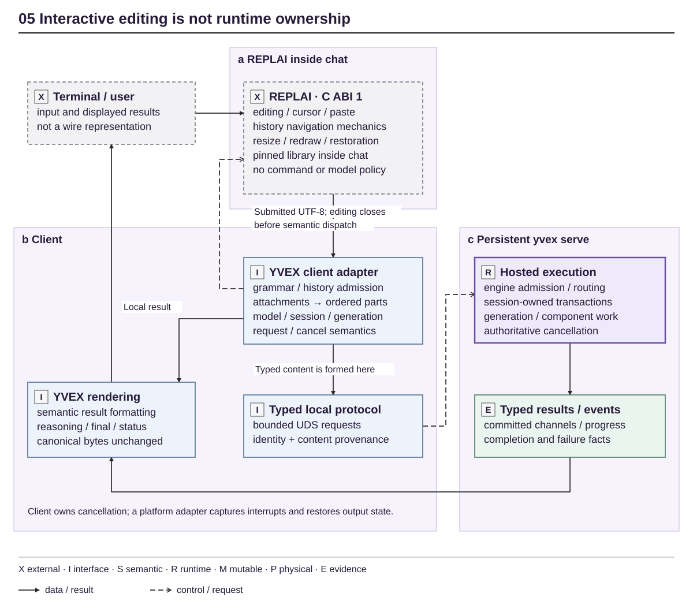

<!-- docs:metadata
title: Interfaces and Protocols
id: yvex.architecture.interfaces-protocols
document: architecture-plane
status: mixed
owner: interfaces
audience: [engineer, agent, evaluator]
publication: {html: true, pdf: true, index: true}
plane: interfaces-protocols
related: [yvex.architecture.runtime-lifecycle, yvex.architecture.advanced-generation]
-->

# Interfaces and Protocols

**Clients project typed system behavior without acquiring execution ownership.**

[Up](README.md)

One `yvex` executable exposes the operator product. The C surface, private local
protocol, OpenAI compatibility adapter and restricted remote-management bootstrap
have different trust and compatibility boundaries.

The canonical product shell is Rust; [ADR 0009](../decisions/0009-rust-product-shell.md)
owns that split. Generated registry metadata drives parsing/help/discovery and
completion. Private compiler-derived FFI adapts C-owned typed operations;
runtime clients consume the existing C transport, never a second wire parser.
The native computational library remains independently buildable: C owns the
common core, CUDA and Metal retain their backend implementations. The same
Rust shell projects their typed availability and refusals on Linux and macOS;
the [Metal foundation](backend-execution.md#apple-silicon-metal-foundation)
does not grant model admission or new public management operations.

## Integration map

| Consumer | Supported seam | Boundary |
| --- | --- | --- |
| Local operator | CLI and generated operation registry | Human output is not a machine API |
| Embedded integrator | [C API](../contracts/c-api.md) | Installed vs internal ABI tiers remain explicit |
| Same-user client | [Local protocol](../contracts/local-protocol.md) | Exact version and generation checks |
| Application provider | [OpenAI adapter](../contracts/openai-compatibility.md) | Bounded compatibility, not universal API parity |
| Product operator | [Network management](../contracts/network-management.md) | Same-user local socket or authenticated HTTPS, explicit pairing/revocation; 36 typed lifecycle operations |
| Advanced SSH operator | [Remote management](../contracts/remote-management.md) | Separate read, product-management and finite grants |
| Remote finite compute consumer | [Finite producer v1](../contracts/finite-decision-remote.md) | Explicit compute enrollment, separate JSON schemas, exact generation/population/model lineage |

YVEX owns its independent public client in `sdk/rust` (`yvex-sdk` 0.2) and
`sdk/typescript` (`@yvex/sdk`). The Rust crate is an independent workspace: importing
management requires neither the YVEX compiler nor YAI. The historical yai-sdk
package is a compatibility reexport of the exact published YVEX client.
[ADR 0011](../decisions/0011-independent-platform-client.md) owns this dependency direction.

The 36 management operations consume Source/model/build/package, Host/Engine/Session,
Jobs and observation truth. Capability discovery is explicit; neither runtime brand
nor version spelling is capability evidence. CLI and independent SDK clients consume
the same domain owners. Direct computational generation remains separate from a
YAI Case. The SDK also owns read freshness: absent data, an observed empty collection,
and stale retained evidence are different states.

The standalone native service provides a private same-user Unix socket for
local automatic discovery and authenticated HTTPS for explicit remote enrollment.
Optional mDNS advertises discovery hints, never trust. TLS identity and local
OS-peer identity are separate from computational Host nonce, inference address
and YAI authority. The same bounded operation dispatcher and peer-scoped durable
receipt owner serve every authorized transport. Existing restricted SSH grants
retain their meaning; they are not required by the ordinary Studio connection UI.
Producer and consumer evidence remain separately qualified.

## Native operator facts

Operator projections consume the native identity-verification result and typed
materialization outcome, not human output or failure-injection environment
variables. A private diagnostic boundary retains failed-work phase, byte counts
and observed backend-accounting cleanup after resource retirement. It does not
change the installed C API, promote weights-only materialization into execution,
or transfer artifact/backend admission semantics to a renderer.

The Rust shell shares one typed human event projection between foreground host
output and retained/live `host logs`: short producer UTC time, exact request
identity and compact colored activity/messages. Full severity/date/sequence and
diagnostic populations remain available under `--verbose` and in JSONL.
REPLAI owns semantic styling and responsive geometry; human
noise/cadence filtering never changes retained events or the JSONL contract.

## Qualification operator boundary

`model qualification list|show|suite|compare|run` is derived from the same
operator registry as other model porcelain. The Rust shell embeds generated
published records and workload manifests; it validates their target identities,
independent evidence planes and comparison keys without invoking a Python
process. JSON and human records project the same structured authority.

`run` uses an already-loaded exact variant and the C-owned native client. It
authenticates the local binding against the reported artifact/binding identities
without materializing weights or initializing a backend. It never changes the
model/profile/strategy/context/chunk, owns only newly created benchmark sessions,
and emits a local receipt rather than granting published qualification. Unknown
producer build/hardware facts remain unknown; the client build is not the host
build. The journal retains unresolved delivery rather than retrying or blindly
closing it. Cancellation requires correlated terminal settlement, not merely a
cancel ACK, before scoped cleanup.

The native client observes visible-fragment arrival intervals separately from
server phases and first-visible latency. Mean/maximum gaps require at least two
nonempty content fragments; control messages and pre-first-content waiting are
excluded. These client observations include observer work and do not reconstruct
GPU timing, server publication timestamps, transport-only cost or terminal paint.
The generic qualification vocabulary owns their definitions and population gates.

[Qualification methodology](../evaluation/benchmarks/methodology.md#operator-inspection-and-local-measurement)
owns metric definitions and claim scope. Protocol fixtures qualify correlation
and lifecycle only; independent checkpoint/model evidence remains separate.

## YAI boundary

YAI owns Case meaning, memory, workflow, authority and effects. YVEX owns source,
model, compiled representation and computational execution. A YAI consumer may
use a qualified public seam; it must not infer producer capability from private
structs, a model name or a research target. The finite local producer does not
establish a YAI ABI, and future W → E state ingress remains unimplemented.
Remote finite computation now has its own explicit SSH grant and versioned
public JSON request/result projection. Its typed result preserves computational
identities and remains uncalibrated; it does not confer Case authority. SDK/YAI
consumer implementation and real Exon→DGX qualification are separate owners.

## Provider progress

The OpenAI transport forwards real session prefill/committed-decode observations.
Its bounded frame timeout measures inactivity. Independent connection admission
keeps discovery responsive and refuses saturation; external total deadlines
remain external. Telemetry-ring retention cannot erase a direct progress fact.
This correction does not qualify long-request latency or complete YAI workloads.
## Interactive terminal path

<!-- docs:diagram interactive_boundary -->

[Full-size diagram](../assets/diagrams/interactive_boundary.svg) · [Editable source](../assets/diagrams/interactive_boundary.json)
<!-- /docs:diagram -->

*Figure 5 — Interactive ownership. Submission returns UTF-8 after editor
restoration; the YVEX adapter constructs typed content and request semantics.
Panels (a) and (b) live in the same chat process: REPLAI is a statically linked
dependency, not another process or model runtime.
The figure shows the continuing path, not a concurrent editor during generation.*
[Editable source](../assets/diagrams/interactive_boundary.json).

[ADR 0007](../decisions/0007-external-terminal-editor.md) owns the editor split
and [`config/replai.json`](../../config/replai.json) owns its exact pin. YVEX
retains prompt facts, history admission, candidate meaning, reconnect,
attachments, exact channel interpretation and presentation intent. REPLAI owns
cell geometry, responsive documents, semantic styles, menus and quiet feedback
through its native Rust surface, without an editor lifetime for ordinary
commands. Its independent C ABI 1/P1 remains a producer feature, not the current
YVEX consumer seam. JSON remains a sibling serializer of typed facts. Ctrl-C while editing is a generic REPLAI
event; during generation it enters YVEX cancellation and quiet-output handling.
EOF, exit and transport failure follow their distinct close/recovery paths.
Historical `repl_` helper names do not establish another editor.

Ordinary chat fragments, logical notices and host log records use REPLAI's
flow encoding: authored logical lines remain intact and the terminal owns visual
wrapping. The consumer does not impose a 96-column cap or insert continuation
newlines. Live fixed-grid rendering remeasures the output TTY instead of trusting
inherited `COLUMNS`; the existing driven editor delivers `Wake::Resize`.
Flow output does not reconstruct scrollback or promise universal emulator reflow.
Committed native fragments are written and flushed as received, without a typing
animation or publication of unverified drafts. UTF-8 completion and the existing
bounded markup-prefix recognition are separate from width-independent layout.

`src/cli/rust/interaction.rs` adapts borrowed REPLAI input readiness, decoder
deadlines and process-scoped notifications. It joins its notification worker
before application context expires. Borrowed FDs and signals are mechanics,
not product semantic types. The old C terminal adapter is retired.
The client callback decides which generation to cancel; terminal capture never
owns engine/session meaning. Output-state admission and restoration failures
stop chat instead of continuing with uncertain terminal state.

An interrupt before `TURN_STARTED` retains pending intent. Once admitted, one
scoped cancellation worker uses the existing typed C client while the response
reader continues draining progress. The reader never synchronously waits on
that second connection: bounded Unix-socket backpressure must not deadlock the
two streams. The worker is joined before another prompt/turn can begin, and
unconfirmed cancellation is not presented as an admitted outcome.

This is an interface portability boundary, not automatic cross-platform
qualification. [Native qualification](../evaluation/macos-native.md#rust-product-shell-qualification-2026-10-03)
records actual macOS Rust/CPU/PTY execution separately from the historical
C-shell foundation and Linux hermetic evidence. Neither native interface
qualification nor CLI portability qualifies Metal or CUDA/model execution.
A signal or console event is not a request type.

[Real chat PTY tests](../../tests/repl_pty.sh), their
[consumer assertions](../../tests/replai_consumer.py), and the
[tiny runtime vertical](../../tests/integration/tiny_vertical.sh) qualify the
composition. The classical REPL decomposition is explained in the
[external guide](https://github.com/mothx9/replai/blob/master/docs/repl.md);
its default branch does not change the pinned dependency.

## Implementation and evidence

[src/server](../../src/server) · [Rust client](../../src/cli/rust/client.rs) · [include/yvex/server.h](../../include/yvex/server.h) · [config/operator/registry.json](../../config/operator/registry.json)

[QA selection](../evaluation/qa.md) · [Current state](../project-control/STATUS.md)

## Continue

[Engine and Session Runtime](runtime-lifecycle.md) · [Speculation and Finite Execution](advanced-generation.md)

## Product processes

`yvex` has three mechanically separated lanes:

- the runtime-client lane uses the private local protocol for chat,
  runtime administration, sessions, live model inspection,
  cancellation, and the single human/JSON log surface;
- the foreground `serve` lane owns the persistent multi-engine host and its
  independently loaded engine generations;
- the finite offline-engine lane calls admitted library owners for compilation,
  artifact operations, inspection, direct component execution, profiling, and
  system facts.

The runtime-client lane cannot materialize an artifact, initialize CUDA, execute
a Transformer, or host a model. A qualification client may read an authenticated
local binding to validate the exact loaded identities; it never opens its weight
payload for execution. The offline lane closes all resources before the
process exits and never owns persistent sessions. The server lane is explicit
in the invocation and never shells out to or executes a hidden binary.

The foreground server lane owns one private Unix listener, one loopback
OpenAI-compatible listener, one telemetry authority, and a bounded set of
engine generations. Each loaded engine owns its immutable runtime model,
scheduler, sessions, state, and resources. HTTP and native clients bind work to
an exact alias and generation rather than a process-global model pointer.

The [restricted remote-management bootstrap](../contracts/remote-management.md)
is a separate, optionally supervised OpenSSH listener on any supported host.
Its forced `yvex management protocol` process is finite and can answer exact
device identity and local host status while the inference host is stopped.
It authenticates enrolled client keys through OpenSSH and reads host facts
through the existing private local protocol; it neither exposes that socket
remotely nor creates a second host lifecycle. Mutating remote control and a
production deployment qualification are not yet implemented.

An explicitly enrolled finite-compute key selects `yvex management finite-protocol`
instead, with [independent schemas](../contracts/finite-decision-remote.md).
The Rust adapter calls the installed public C finite client; the C client owns
the private-wire exchange, result validation and connection cleanup. No remote
lifecycle mutation, shell, socket forwarding or human-output parsing is involved.

## Public product management

[Management v2](../contracts/product-management.md) exposes existing Source, Build,
Package, Engine and Session owners through a separate explicit SSH grant. Durable
peer-scoped receipts preserve uncertain outcomes. CLI and SDK are sibling clients;
no consumer parses CLI output or gains Case authority. Native protocol 25 fences
Session lifetimes and projects a Host-owned instance nonce.

## Studio consumer handoff

The handoff is resource- and service-general: document discovery, connection and
identity separately from documentary Source intake. An attached service or advertised
operation is not an Authority grant. Cover manual operations and supported
model-requested operations, their governance, observations, exact-object navigation,
recovery and contextual presentation. Conversation remains a first-class interaction
and continuity surface; it does not become a second execution owner. Future database,
Redis, container, endpoint, process, remote-system or MCP integrations require their
own public contracts and evidence; this protocol asserts no new family support.

For substantial product-facing changes, include the following in the existing Task
or release handoff, without a new registry or reporting hierarchy:

- User intent/domain, public operations/types and exact compatible producer/SDK revisions; absent capability and version compatibility behavior.
- Canonical identities, disclosure/freshness/finality and available actions; admission remains with the semantic owner, never SDK or frontend.
- Recovery observations and explicit continuation eligibility; lost acknowledgement never authorizes automatic redispatch.
- Reproducible public reads and controlled positive/negative evidence, with exact objects and unearned real-provider gates.
- Affected existing Studio journey and missing projection, if any; the Studio Task owner determines presentation reuse, exact navigation, Context and native qualification under its [experience contract](https://github.com/yailabs/studio/blob/main/docs/interaction-contracts.md#product-experience-integration).

YVEX retains runtime, compilation, generation and observation ownership. Include exact connection/Host/Engine generation/Session/Job scope and unknown/stale posture where relevant; YAI Provider bindings remain a separate consumer domain.

This obligation does not block independent releases on Studio acceptance or duplicate
Studio documentation. Independent open-source consumers need only the public contracts and local handoff facts; the Studio link is integration guidance, not a private semantic dependency.
No new feature, runtime qualification or acceptance claim follows from this method.
