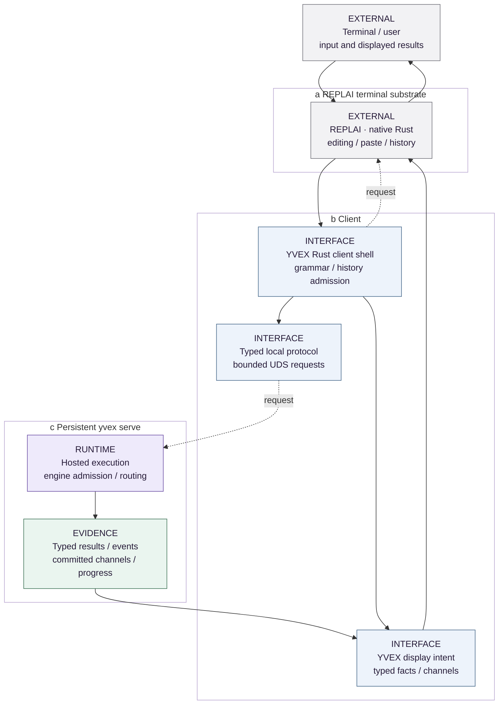

<!-- docs:metadata
title: Interfaces and Protocols
id: yvex.architecture.interfaces-protocols
document: architecture-plane
status: mixed
owner: interfaces
audience: [engineer, agent, evaluator]
publication: {html: true, pdf: true, index: true}
plane: interfaces-protocols
related: [yvex.architecture.runtime-lifecycle, yvex.architecture.advanced-generation]
-->

# Interfaces and Protocols

**Clients project typed system behavior without acquiring execution ownership.**

[Up](README.md)

One `yvex` executable exposes the operator product. The C surface, private local
protocol, OpenAI compatibility adapter and restricted remote-management bootstrap
have different trust and compatibility boundaries.

The canonical product shell is Rust; [ADR 0009](../decisions/0009-rust-product-shell.md)
owns that split. Generated registry metadata drives parsing/help/discovery and
completion. Private compiler-derived FFI adapts C-owned typed operations;
runtime clients consume the existing C transport, never a second wire parser.
C/CUDA remains the independently buildable computational library.

## Integration map

| Consumer | Supported seam | Boundary |
| --- | --- | --- |
| Local operator | CLI and generated operation registry | Human output is not a machine API |
| Embedded integrator | [C API](../contracts/c-api.md) | Installed vs internal ABI tiers remain explicit |
| Same-user client | [Local protocol](../contracts/local-protocol.md) | Exact version and generation checks |
| Application provider | [OpenAI adapter](../contracts/openai-compatibility.md) | Bounded compatibility, not universal API parity |
| Remote operator | [Remote management](../contracts/remote-management.md) | Read-only enrolled identity/status bootstrap |

The public platform SDK in
[`yailabs/yai-sdk`](https://github.com/yailabs/yai-sdk) now has a separate
`yvex-sdk` Rust client domain for those two remote-management reads. The SDK
does not own source/model/runtime truth. YVEX's canonical operator registry
exports the exact read-only remote operation set, and producer-vs-client parity
is checked without exposing the private local Unix wire. YAI may consume
producer facts through its bounded provider adapter; Studio may inspect
YVEX-owned operator facts directly. Case-affecting actions still cross YAI
admission. There is no remote model/lifecycle mutation contract in this slice.

## Native operator facts

Operator projections consume the native identity-verification result and typed
materialization outcome, not human output or failure-injection environment
variables. A private diagnostic boundary retains failed-work phase, byte counts
and observed backend-accounting cleanup after resource retirement. It does not
change the installed C API, promote weights-only materialization into execution,
or transfer artifact/backend admission semantics to a renderer.

The Rust shell shares one typed human event projection between foreground host
output and retained/live `host logs`: short producer UTC time, exact request
identity and compact colored activity/messages. Full severity/date/sequence and
diagnostic populations remain available under `--verbose` and in JSONL.
REPLAI owns semantic styling and responsive geometry; human
noise/cadence filtering never changes retained events or the JSONL contract.

## YAI boundary

YAI owns Case meaning, memory, workflow, authority and effects. YVEX owns source,
model, compiled representation and computational execution. A YAI consumer may
use a qualified public seam; it must not infer producer capability from private
structs, a model name or a research target. The finite local producer does not
establish a YAI ABI, and future W → E state ingress remains unimplemented.

## Provider progress

The OpenAI transport forwards real session prefill/committed-decode observations.
Its bounded frame timeout measures inactivity. Independent connection admission
keeps discovery responsive and refuses saturation; external total deadlines
remain external. Telemetry-ring retention cannot erase a direct progress fact.
This correction does not qualify long-request latency or complete YAI workloads.
## Interactive terminal path

<!-- docs:diagram interactive_boundary -->

[Static figure](../assets/diagrams/interactive_boundary.svg) · [Editable source](../assets/diagrams/interactive_boundary.json)
<!-- /docs:diagram -->

*Figure 5 — Interactive ownership. Submission returns UTF-8 after editor
restoration; the YVEX adapter constructs typed content and request semantics.
Panels (a) and (b) live in the same chat process: REPLAI is a statically linked
dependency, not another process or model runtime.
The figure shows the continuing path, not a concurrent editor during generation.*
[Editable source](../assets/diagrams/interactive_boundary.json).

[ADR 0007](../decisions/0007-external-terminal-editor.md) owns the editor split
and [`config/replai.json`](../../config/replai.json) owns its exact pin. YVEX
retains prompt facts, history admission, candidate meaning, reconnect,
attachments, exact channel interpretation and presentation intent. REPLAI owns
cell geometry, responsive documents, semantic styles, menus and quiet feedback
through its native Rust surface, without an editor lifetime for ordinary
commands. Its independent C ABI 1/P1 remains a producer feature, not the current
YVEX consumer seam. JSON remains a sibling serializer of typed facts. Ctrl-C while editing is a generic REPLAI
event; during generation it enters YVEX cancellation and quiet-output handling.
EOF, exit and transport failure follow their distinct close/recovery paths.
Historical `repl_` helper names do not establish another editor.

`src/cli/rust/interaction.rs` adapts borrowed REPLAI input readiness, decoder
deadlines and process-scoped notifications. It joins its notification worker
before application context expires. Borrowed FDs and signals are mechanics,
not product semantic types. The old C terminal adapter is retired.
The client callback decides which generation to cancel; terminal capture never
owns engine/session meaning. Output-state admission and restoration failures
stop chat instead of continuing with uncertain terminal state.

An interrupt before `TURN_STARTED` retains pending intent. Once admitted, one
scoped cancellation worker uses the existing typed C client while the response
reader continues draining progress. The reader never synchronously waits on
that second connection: bounded Unix-socket backpressure must not deadlock the
two streams. The worker is joined before another prompt/turn can begin, and
unconfirmed cancellation is not presented as an admitted outcome.

This is an interface portability boundary, not automatic cross-platform
qualification. [Native qualification](../evaluation/macos-native.md#rust-product-shell-qualification-2026-10-03)
records actual macOS Rust/CPU/PTY execution separately from the historical
C-shell foundation and Linux hermetic evidence. Neither native interface
qualification nor CLI portability qualifies Metal or CUDA/model execution.
A signal or console event is not a request type.

[Real chat PTY tests](../../tests/repl_pty.sh), their
[consumer assertions](../../tests/replai_consumer.py), and the
[tiny runtime vertical](../../tests/integration/tiny_vertical.sh) qualify the
composition. The classical REPL decomposition is explained in the
[external guide](https://github.com/mothx9/replai/blob/master/docs/repl.md);
its default branch does not change the pinned dependency.

## Implementation and evidence

[src/server](../../src/server) · [Rust client](../../src/cli/rust/client.rs) · [include/yvex/server.h](../../include/yvex/server.h) · [config/operator/registry.json](../../config/operator/registry.json)

[QA selection](../evaluation/qa.md) · [Current state](../project-control/STATUS.md)

## Continue

[Engine and Session Runtime](runtime-lifecycle.md) · [Speculation and Finite Execution](advanced-generation.md)

## Product processes

`yvex` has three mechanically separated lanes:

- the runtime-client lane uses the private local protocol for chat,
  runtime administration, sessions, live model inspection,
  cancellation, and the single human/JSON log surface;
- the foreground `serve` lane owns the persistent multi-engine host and its
  independently loaded engine generations;
- the finite offline-engine lane calls admitted library owners for compilation,
  artifact operations, inspection, direct component execution, profiling, and
  system facts.

The runtime-client lane cannot open an artifact, initialize CUDA, execute a
Transformer, or host a model. The offline lane closes all resources before the
process exits and never owns persistent sessions. The server lane is explicit
in the invocation and never shells out to or executes a hidden binary.

The foreground server lane owns one private Unix listener, one loopback
OpenAI-compatible listener, one telemetry authority, and a bounded set of
engine generations. Each loaded engine owns its immutable runtime model,
scheduler, sessions, state, and resources. HTTP and native clients bind work to
an exact alias and generation rather than a process-global model pointer.

The [restricted remote-management bootstrap](../contracts/remote-management.md)
is a separate, optionally supervised OpenSSH listener on any supported host.
Its forced `yvex management protocol` process is finite and can answer exact
device identity and local host status while the inference host is stopped.
It authenticates enrolled client keys through OpenSSH and reads host facts
through the existing private local protocol; it neither exposes that socket
remotely nor creates a second host lifecycle. Mutating remote control and a
production deployment qualification are not yet implemented.
