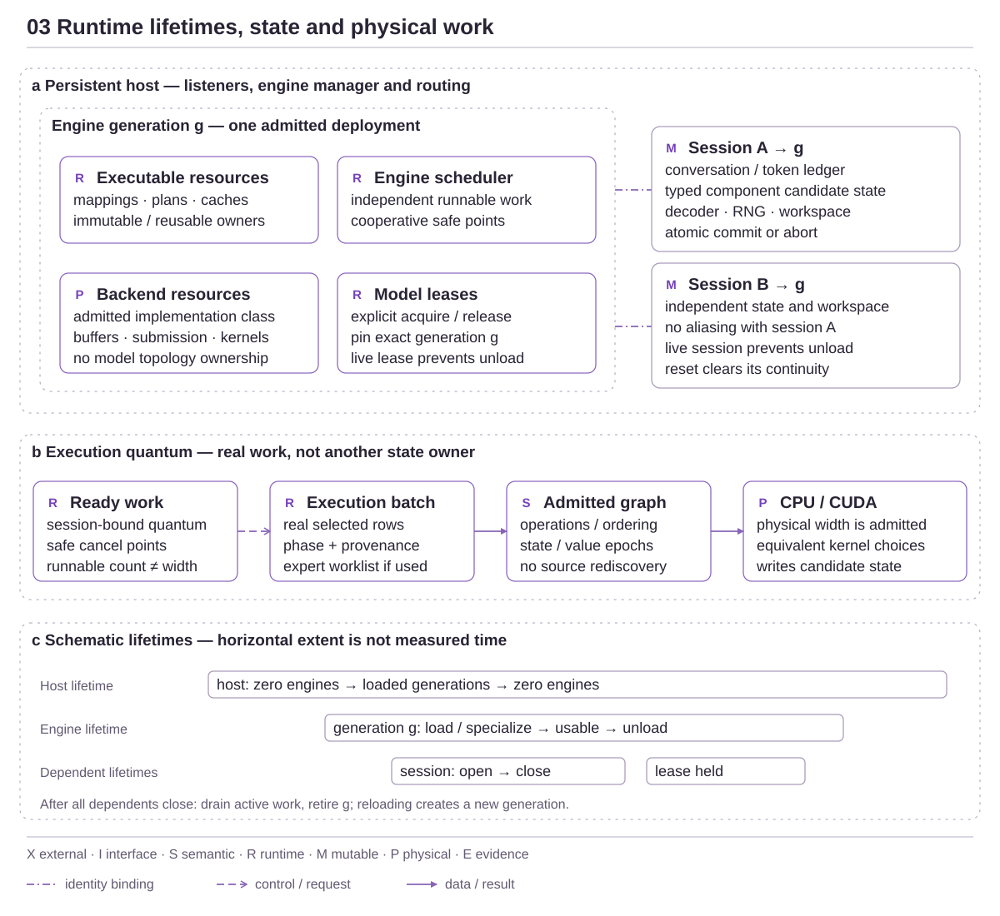

<!-- docs:metadata
title: Engine and Session Runtime
id: yvex.architecture.runtime-lifecycle
document: architecture-plane
status: mixed
owner: runtime
audience: [engineer, agent, evaluator]
publication: {html: true, pdf: true, index: true}
plane: runtime-lifecycle
related: [yvex.architecture.computational-state, yvex.architecture.scheduling-resources]
-->

# Engine and Session Runtime

**A host retains engines; each session owns independent mutable execution.**

[Up](README.md)

The host may run with zero engines. Loading admits a new engine generation;
opening a session borrows that generation and creates isolated state. A client
connection is not a session, and a disconnected client does not own the host.

<!-- docs:diagram runtime_lifetimes -->

[Full-size diagram](../assets/diagrams/runtime_lifetimes.svg) · [Editable source](../assets/diagrams/runtime_lifetimes.json)
<!-- /docs:diagram -->

[Editable lifetime source](../assets/diagrams/runtime_lifetimes.json).

## Lifetime map

Host → engine generation → session → transaction → borrowed result.
Unload/drain, reset, cancellation and result expiry act at different levels.
The [runtime contract](../contracts/runtime.md) specifies refusal and cleanup;
the [state plane](computational-state.md) explains transactional contents.

## Authority map

*Figure 3 — Runtime lifetimes and physical work. Panels distinguish containment,
generation binding and execution flow; timeline widths are schematic, not
measurements. Sessions own mutable state, and sessions/leases prevent premature
unload. Runnable concurrency is not physical width or continuous batching.*
[Editable source](../assets/diagrams/runtime_lifetimes.json).

Full identities authenticate cold package and transactional boundaries. An
engine generation is a process-local stale-reference guard and is never
persisted or hashed into package meaning. Transient execution structures carry
the generation and compact engine-owned lineage instead of copying the complete
package ancestry through every call.

## Persistent host and engine lifecycle

`yvex serve` starts one foreground host with its Unix listener, optional
loopback OpenAI listener, telemetry, bounded external request capacity, and an
empty engine manager. Host readiness does not require a loaded model.

Porcelain `model load` resolves one logical model and selected representation
to an exact local registry profile and creates a new engine generation. A TTY
can select model and variant from linear tables; automation supplies `MODEL`
and `--variant` when needed. Advanced `engine load PROFILE` retains the exact
plumbing operation for qualification. A text profile opens one authenticated
artifact and runtime binding; a composite MiniMax profile opens its component
set under one logical engine. A `tensor-program` profile opens an authenticated
tensor binding and its exact source as a finite-decision engine, with
`not-applicable` generation strategy. The current source provider admits CPU
only: an exact CUDA request refuses, never falls back. Its bounded physical
stage uses the canonical live host/cgroup capacity observation minus the
existing system reserve; unavailable capacity or insufficient workspace refuses
before publishing an engine. This is admission, not a memory reservation.
The engine becomes routable only after package admission,
specialization, required resources, scheduler, tokenizer/component objects, and
execution capability are ready.

`model unload MODEL` resolves the resident generation and moves it to draining;
advanced `engine unload ENGINE` addresses the generation directly. Unload
refuses while any session or model lease owns the generation. Once ownership is
zero it refuses new leases, requests cancellation of active work, waits for its
bounded work count, closes model resources, and leaves the host and other
engines alive. Reloading the same deployment creates another generation. A
session or response state from the old generation cannot attach to the
replacement.

The host can own several engines when their admitted resources fit. Current
large-family operation may admit only one at a time on GB10; that is a resource
result, not a server-topology restriction. The CPU tiny vertical proves two
simultaneously loaded engines, explicit routing, ambiguous-routing refusal,
unload/reload, and host survival.

An explicit provider ensure-active request reuses this engine manager and the
configured model loader. It acquires an identity-bound lease on the resulting
generation without changing any conversational model or session. Multiple
leases may coexist; unload refuses while a session or lease still owns the
generation. Release addresses the exact lease. YVEX does not infer that an
auxiliary model is needed and does not evict another engine implicitly.

An implementation safety ceiling bounds allocation, the `--max-engines`
deployment option selects the host's visible slot capacity, and live resource
admission remains a third independent decision.

`model active` is the human and JSON projection of loaded, draining, or
unloading engine summaries. The summary owns generation, backend/device,
execution strategy, activity/work, attached sessions/clients, lease count,
directional content capabilities, and the existing H12 resource placement. It
does not infer residency from an allocator zero.

## Model engine

`yvex_model_engine` is one opened executable generation of one package. It
owns:

- authenticated artifact and runtime binding handles;
- imported family-neutral descriptors and compiled operator/model plans;
- PEIR v5 package decisions;
- backend/device specializations cached by admitted backend;
- canonical package mapping and current model-residency resources;
- tokenizer, target, draft, component, and output plans required by that model;
- engine-wide executable caches and compatible-work scheduler;
- sessions attached to this exact generation.

The canonical package mapping in this list is the artifact-owned
materialization session: it authenticates tensor bindings and bounded package
access used by PEIR and the binding. Backend/model weight materialization is a
separate engine-resource lifecycle that prepares executable host/device
resources from those admitted bindings. Neither mechanism changes the other's
identity or silently publishes a new package representation.

### Compiled work and prepared resources

Token-forward execution consumes compiled physical SSA rather than reconstructing
decoder topology. The engine retains immutable work and prepared parameter
resources; the execution context owns reusable intermediate storage. State
operations stage through session providers. Recurrent geometry comes from the
admitted program, and an unnormalized decoder refuses instead of constructing a
competing state plan.

Prepared programs may coexist for one fixed request. Session leases retain used
entries and prevent incompatible request replacement or premature close. Catalog
growth preserves handles, dependencies and borrows. Full diagnostic execution,
retained preparations and metadata share one session budget. Outputs remain
staged until execution, identity and cleanup succeed.

The [compiler consumer map](compiler-ir.md#current-consumer-cutover) owns which
Qwen, DeepSeek and MiniMax programs execute. The [component contract](../contracts/component-programs.md)
owns exact preparation, step and physical-schema mechanics. SSA values, provider
state versions and publication generations remain distinct lifetimes here.

Component-program execution stages host results until computation, identity,
cancellation and checked cleanup succeed. Internal component execution v2
provides a session-owned stage slot: failed cleanup remains reachable and blocks
another invocation. Executable resource owners retain immutable physical program
truth independently of the importing caller. This does not retain borrowed
weight storage, a backend, mutable state or device-result publication generations.
Internal conditioning request v3 requires a compiled text program; the old
procedural text backend entrypoints are absent. Public ABI, protocol and OpenAI
capacity/preflight semantics are unchanged by this internal cutover.

Media conditioning storage and result validation use the admitted component's
output width, projected at cold profile construction and frozen in the engine
contract. The runtime does not assume MiniMax's 5120-wide result. It rejects
missing, overflowing or over-budget geometry before opening components, and
rejects changed engine geometry or incompatible component results before latent
execution/publication. Internal media execution recipe v2 and generation request
v3 require this explicit boundary; older transient layouts are refused, not
filled from a family default. This removes a runtime geometry authority;
complete iterative/component qualification remains distinct. No public wire version changes.

Compilation, source acquisition, model catalogs, server transport, and
application request parsing are outside the engine. Family callbacks are absent
from model open. Family semantics have already become pointer-free package
records and generic graph recipes.

An engine specialization combines PEIR package decisions with a real backend
and device. Its small implementation catalog binds each terminal decision to an
admitted implementation class, activation representation, legal real widths,
fallback-equivalence class, and hardware crossover. The specialization is
identity-bearing because these choices can change deployed numerical or
capability behavior. Backend-local equivalent warp, tile, grid, and stream
choices are not package or specialization identity.

## Failure and recovery

The public status surface remains compact. Internally, a failure records two
orthogonal facts:

- origin: external request, integrity, capability, resource, backend, sequence,
  engine, or internal invariant;
- recovery: refuse request, abort transaction, retry an admitted equivalent,
  prepare/evict then retry, invalidate sequence, drain engine, refuse engine
  open, or signal an internal invariant.

Artifact or identity corruption always fails closed. An explicit exact request
does not silently degrade. Resource pressure can produce an adaptive action only
when policy already admits an equivalent specialization and transaction state
has not become visible.

## Current limits

Public management has separately authenticated HTTPS/local/SSH transports under
[its network contract](../contracts/network-management.md). This does not widen
the computational Host's loopback inference listener into an authenticated remote
inference service, and management authorization does not grant inference access.

YVEX currently does not claim full ready-sequence continuous batching, a
retained optimized selective DeepSeek layout or automatic resource-eviction
policy, restart-persistent engine instances, distributed serving, complete
accelerator residency, load-aware DSpark
confidence scheduling, model evaluation, a release benchmark, or release
qualification. Warm DeepSeek performance remains explicit optimization debt;
the 20--24 token/s class is an initial engineering floor, not an optimization
destination.

## Implementation and evidence

[src/server](../../src/server) · [src/runtime](../../src/runtime) · [include/yvex/internal/runtime.h](../../include/yvex/internal/runtime.h)

[QA selection](../evaluation/qa.md) · [Current state](../project-control/STATUS.md)

## Continue

[Computational State](computational-state.md) · [Scheduling and Resources](scheduling-resources.md)
