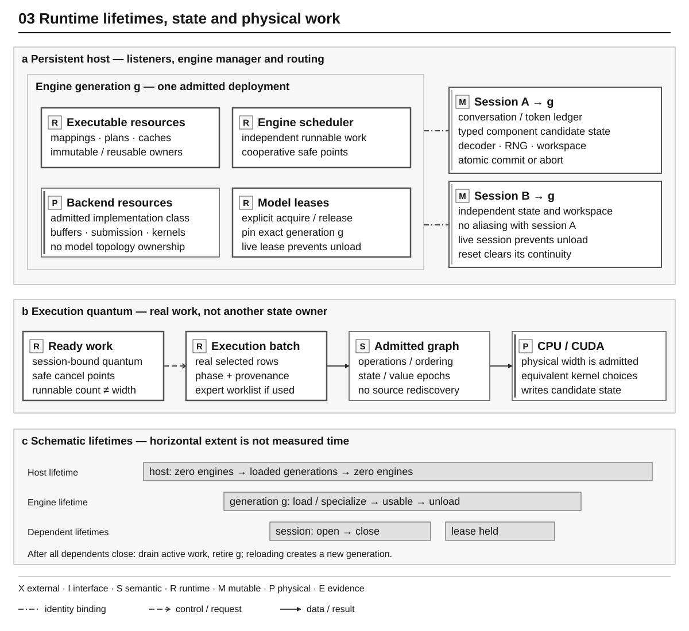

# Runtime and Execution Architecture

Status: current implemented architecture

This document explains the implemented deployment, engine, execution, state,
resource, and scheduling boundaries. Normative behavior belongs to the
[Runtime Contract](../contracts/runtime.md),
[Local Protocol](../contracts/local-protocol.md), and
[Events Contract](../contracts/events-telemetry.md).

## Authority map



*Figure 3 — Runtime lifetimes and physical work. Panels distinguish containment,
generation binding and execution flow; timeline widths are schematic, not
measurements. Sessions own mutable state, and sessions/leases prevent premature
unload. Runnable concurrency is not physical width or continuous batching.*
[Editable source](../diagrams/runtime_lifetimes.json).

Full identities authenticate cold package and transactional boundaries. An
engine generation is a process-local stale-reference guard and is never
persisted or hashed into package meaning. Transient execution structures carry
the generation and compact engine-owned lineage instead of copying the complete
package ancestry through every call.

## Persistent host and engine lifecycle

`yvex serve` starts one foreground host with its Unix listener, optional
loopback OpenAI listener, telemetry, bounded external request capacity, and an
empty engine manager. Host readiness does not require a loaded model.

Porcelain `model load` resolves one logical model and selected representation
to an exact local registry profile and creates a new engine generation. A TTY
can select model and variant from linear tables; automation supplies `MODEL`
and `--variant` when needed. Advanced `engine load PROFILE` retains the exact
plumbing operation for qualification. A text profile opens one authenticated
artifact and runtime binding; a composite MiniMax profile opens its component
set under one logical engine. The engine becomes routable only after package admission,
specialization, required resources, scheduler, tokenizer/component objects, and
execution capability are ready.

`model unload MODEL` resolves the resident generation and moves it to draining;
advanced `engine unload ENGINE` addresses the generation directly. Unload
refuses while any session or model lease owns the generation. Once ownership is
zero it refuses new leases, requests cancellation of active work, waits for its
bounded work count, closes model resources, and leaves the host and other
engines alive. Reloading the same deployment creates another generation. A
session or response state from the old generation cannot attach to the
replacement.

The host can own several engines when their admitted resources fit. Current
large-family operation may admit only one at a time on GB10; that is a resource
result, not a server-topology restriction. The CPU tiny vertical proves two
simultaneously loaded engines, explicit routing, ambiguous-routing refusal,
unload/reload, and host survival.

An explicit provider ensure-active request reuses this engine manager and the
configured model loader. It acquires an identity-bound lease on the resulting
generation without changing any conversational model or session. Multiple
leases may coexist; unload refuses while a session or lease still owns the
generation. Release addresses the exact lease. YVEX does not infer that an
auxiliary model is needed and does not evict another engine implicitly.

An implementation safety ceiling bounds allocation, the `--max-engines`
deployment option selects the host's visible slot capacity, and live resource
admission remains a third independent decision.

`model active` is the human and JSON projection of loaded, draining, or
unloading engine summaries. The summary owns generation, backend/device,
execution strategy, activity/work, attached sessions/clients, lease count,
directional content capabilities, and the existing H12 resource placement. It
does not infer residency from an allocator zero.

## Model engine

`yvex_model_engine` is one opened executable generation of one package. It
owns:

- authenticated artifact and runtime binding handles;
- imported family-neutral descriptors and compiled operator/model plans;
- PEIR v5 package decisions;
- backend/device specializations cached by admitted backend;
- canonical package mapping and current model-residency resources;
- tokenizer, target, draft, component, and output plans required by that model;
- engine-wide executable caches and compatible-work scheduler;
- sessions attached to this exact generation.

Compilation, source acquisition, model catalogs, server transport, and
application request parsing are outside the engine. Family callbacks are absent
from model open. Family semantics have already become pointer-free package
records and generic graph recipes.

An engine specialization combines PEIR package decisions with a real backend
and device. Its small implementation catalog binds each terminal decision to an
admitted implementation class, activation representation, legal real widths,
fallback-equivalence class, and hardware crossover. The specialization is
identity-bearing because these choices can change deployed numerical or
capability behavior. Backend-local equivalent warp, tile, grid, and stream
choices are not package or specialization identity.

## Sessions and transactional state

Each execution session borrows one engine and owns mutable state: attention
providers, backend state residency, workspace, committed position, cancellation
state, and a unique batch-source lineage. Server sessions add token ledger,
conversation transcript, incremental decoder, RNG/sampling state, and turn
publication state. Sessions sharing an engine never share mutable sequence
state or workspace.

Different attention classes keep their own geometry and representation. Their
lifecycle converges on the generic provider protocol: begin candidate, stage,
prepare commit, publish commit, abort, reset, invalidate, capture, attach, and
close. Transaction coordination uses a bounded participant collection; target
state, draft state, token ledger, decoder, RNG, and publication remain distinct
participants rather than one homogeneous KV object.

A conversation turn is an ordered collection of typed content parts, not one
attachment and not one session. Parts distinguish text, image, audio, video,
file, and tensor kinds; each has a content digest and may link a derived form to
its original with `derived_from_content_identity`. Modality changes do not
replace the session. Capability admission compares the exact part kinds with
the loaded specialization before numerical work. The current reference CLI
stages multiple local attachments for the next turn and appends text on submit;
future architecture verticals may consume the same contract without adding a
modality-specific session type.

Speculative candidate rows are never publication authority. Target verification
selects one prefix-addressable checkpoint; all participants either prepare and
publish that exact accepted prefix or abort. Rejected suffix state is discarded
and accepted target rows are not replayed. Cancellation after an atomic commit
reports the committed prefix instead of pretending to rewind it.

## Generation vocabulary

Prefill, ordinary decode, DSpark draft, target verification, and correction are
phase-specific work over one model schedule. They are not parallel model
implementations.

```text
rendered prompt -> exact tokenizer IDs -> prefix admission -> suffix prefill
  -> target/draft/verify work -> normalized hidden -> output head -> selection
  -> state and decoder transaction -> committed channel fragment
```

Target-only remains the semantic reference. DSpark consumes source-authored
feature taps, proposes a bounded block, and asks the complete target to verify
it. Greedy DSpark commits the same target sequence as target-only from the same
state. Source-authored reasoning and final channels remain tokenizer-owned;
neither runtime nor backend infers a channel from prose.

Production CUDA may retain device values through Transformer, output head,
greedy/stochastic selection, and admitted speculative acceptance/correction.
The common sampling owner supplies transactional RNG, validates bounded result
publication, and commits RNG only with the surrounding state transaction.
Tokenizer and protocol remain host-owned; this is not all-on-device generation.
Transient hidden/logit publications have one producer-owned borrow generation;
workspace reuse expires old views before downstream selection. This replaces
passive producer counters with checked lifetime authority, without copying full
rows or adding a persisted identity. The [runtime contract](../contracts/runtime.md#cancellation-and-draining)
defines serialization and retirement limits.
Audit and forensic profiles may request bounded host evidence
or full reference intermediates. Those adapters are explicit and are not
reachable as a silent production fallback.

## Scheduling and executable work

Scheduling has two scopes:

- the server routes external requests to an engine and serializes operations
  that name the same session;
- the engine scheduler admits ready sequence progress and forms compatible
  physical batches from real active rows.

Generation exposes `begin`, bounded `advance`, and `finish`; one advance
performs one target step or one speculative cycle. Each prefill, decode, draft,
verify, correction, or publication transition enters one generation-bound
ready-work lease. The scheduler selects which non-conflicting sequence lease
advances, while active contexts rendezvous separately for compatible
Transformer steps, routed MoE, and output-head work. A compatibility key binds
engine generation, phase, operation, backend, scope, execution class, geometry,
and admitted width.

The canonical execution batch records selected real sources, rows, phase, and
provenance. The expert worklist deterministically projects routed pairs into
expert-major buckets. Scheduler, batch, and worklist are therefore separate:
the scheduler selects compatible work, the batch describes it, and the
worklist orders real expert populations. No owner may duplicate one activation
to manufacture semantic width.

The engine scheduler retains independent runnable work and advances it
cooperatively at transaction-safe execution quanta. Runnable work capacity,
resident-session capacity, and physical sequence width are independent facts.
Compatible operations from active workers may rendezvous and execute together,
but ready sequences cannot dynamically join or leave physical decode batches.
`continuous_batching_ready` therefore remains false. Multiple workers or a
multi-row kernel do not promote that claim.

## Resources and residency

The engine's resource summary distinguishes:

- immutable mapped package bytes;
- copied or prepared model bytes;
- explicit host and device allocations and device-addressable bytes;
- typed attention, recurrent, convolution, candidate, and physical session state;
- activation arenas, reusable workspace, and transient allocations;
- current and peak process RSS and logical movement.

Residency schema v7 separates storage backing from backend execution resources.
Artifact-mapped placement borrows the authenticated mapping and may register it
once for CUDA-addressable access without making an anonymous model-sized copy.
Copied host/locked/managed placement owns its prepared bytes. Engine and server
summaries report every class with explicit availability and placement. On
unified-memory hardware a mapped artifact may be device-addressable without
YVEX knowing physical page residency. Explicit CUDA allocation, process RSS,
and physical GPU working set are not substituted for one another. Overlapping
spans, state subsets, and peak classes are never presented as an additive total.

## Measurement plane

One execution-measurement schema qualifies work with scope, clock, composition,
unit, duration, and explicit rate denominators. Cumulative decode covers the
complete committed decode interval; rolling decode uses its own recent work and
duration, currently up to 32 token intervals. Host and device measurements may
overlap and retain that fact rather than being forced into a synthetic sum.
The stage projection subtracts only disjoint host spans from total generation
wall and publishes the remaining wall as `unattributed`; overlapping
attention, component, and synchronization spans remain excluded from that sum.
An ordinary decode span owns only its model step, so its output, sampling,
state, detokenization, and publication children remain separately additive. A
speculative decode span instead encloses one complete draft/verify/commit
iteration; those child facts remain visible but are not added to the enclosing
span a second time. This composition difference is typed rather than inferred
from a family name.
MiniMax evaluation/frame/sample work uses the same generic record without
introducing media semantics into scheduler or telemetry ownership.

Admission checks configured limits, cgroup capacity, live system availability,
and backend memory facts before creating large resources. Live availability is
not part of model/package identity. Failure closes acquired resources and never
publishes a partially ready engine.

One engine-owned resource catalog records canonical mappings, component
resources, prepared tensor/group/layout views, backend handles, executable
caches, sequence state, workspace, and temporaries as separate typed entries.
Entries bind engine generation, package provenance, specialization and
admission identities when applicable, numerical class, byte classes,
dependencies, borrows, readiness, and release policy. A prepared entry may be
published or evicted independently; eviction invalidates its handle without
changing the canonical mapping or package identity.

The current text residency owner still selects one primary backing for the
complete admitted tensor population. The catalog makes selective preparation
and independent release legal and is exercised with a bounded synthetic
prepared layout, but no rejected DeepSeek cache or optimized selective weight
layout is retained. `prepared_bytes` alone therefore remains no performance or
residency claim.

## Backend boundary

Upstream supplies legal operations, package representation, numerical
obligations, specialization implementation class, real populations, and
publication provenance. CUDA owns equivalent implementation details: kernel
entrypoint inside the admitted class, tile/warp/grid geometry, shared-memory and
register strategy, stream/event mechanics, and graph capture/replay.

CUDA does not branch on a family name, recover expert compatibility, select a
numerically different activation representation, or reconstruct a missing
physical plan from dimensions. An explicit CUDA request refuses when no
admitted implementation exists. `auto` may retry only an already-admitted
numerically equivalent strategy.

Exact MiniMax output-linear requirements remain source/package numerical facts.
Runtime component specialization resolves them to exact generic linear
execution records; generic CUDA consumes those records without MiniMax switches
or magic shape recognition.

## Failure and recovery

The public status surface remains compact. Internally, a failure records two
orthogonal facts:

- origin: external request, integrity, capability, resource, backend, sequence,
  engine, or internal invariant;
- recovery: refuse request, abort transaction, retry an admitted equivalent,
  prepare/evict then retry, invalidate sequence, drain engine, refuse engine
  open, or signal an internal invariant.

Artifact or identity corruption always fails closed. An explicit exact request
does not silently degrade. Resource pressure can produce an adaptive action only
when policy already admits an equivalent specialization and transaction state
has not become visible.

## Evidence plane

Production execution publishes lightweight counters, typed events, physical
facts, and compact lineage handles. Audit, numerical conformance, profiling, and
benchmark owners assemble richer records outside the ordinary execution ABI.
Trace verbosity does not change numerical behavior, and production does not
materialize full hidden/logit/state rows merely to hash them.

Cold package identities and transactional state identities remain complete.
Within one authenticated engine generation, transient batches use generation,
source ordinal, and engine-owned handles. Retained evidence can join those
handles back to package, binding, specialization, session, and operation
lineage.

## Current limits

YVEX currently does not claim full ready-sequence continuous batching, a
retained optimized selective DeepSeek layout or automatic resource-eviction
policy, restart-persistent engine instances, distributed serving, public
authentication/TLS, complete accelerator residency, load-aware DSpark
confidence scheduling, model evaluation, a release benchmark, or release
qualification. Warm DeepSeek performance remains explicit optimization debt;
the 20--24 token/s class is an initial engineering floor, not an optimization
destination.
