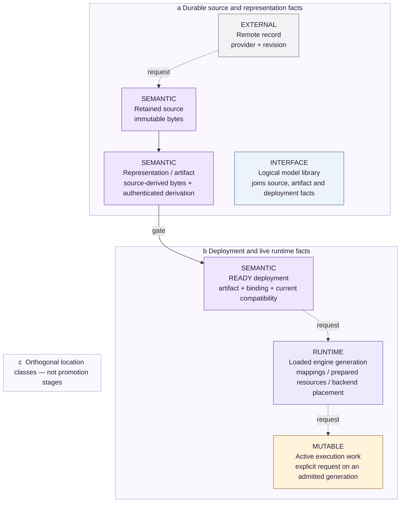

<!-- docs:metadata
title: Scheduling and Resources
id: yvex.architecture.scheduling-resources
document: architecture-plane
status: mixed
owner: runtime
audience: [engineer, agent, evaluator]
publication: {html: true, pdf: true, index: true}
plane: scheduling-resources
related: [yvex.architecture.backend-execution, yvex.architecture.computational-state]
-->

# Scheduling and Resources

**Schedule real ready work and account for resources without inventing physical width.**

[Up](README.md)

Request admission, ready-sequence progress and backend batching are separate
decisions. The host routes requests; the engine scheduler selects ready work;
execution batches describe the real selected rows; expert worklists arrange
their routed populations.

## The boundary that matters

Configured concurrency ≠ active sequences ≠ physical batch width.
Duplicating an activation to manufacture width is not batching. Cooperative
progress and rendezvous do not establish continuous join/leave batching.

## Resource interpretation

Mapped bytes, copied bytes, workspace, session state, process RSS and physical
device residency are different observations. On coherent unified memory,
device-addressable storage does not prove the physical GPU working set.

<!-- docs:diagram storage_residency -->

[Static figure](../assets/diagrams/storage_residency.svg) · [Editable source](../assets/diagrams/storage_residency.json)
<!-- /docs:diagram -->

[Editable storage source](../assets/diagrams/storage_residency.json).

## Scheduling and executable work

Scheduling has two scopes:

- the server routes external requests to an engine and serializes operations
  that name the same session;
- the engine scheduler admits ready sequence progress and forms compatible
  physical batches from real active rows.

Generation exposes `begin`, bounded `advance`, and `finish`; one advance
performs one target step or one speculative cycle. Each prefill, decode, draft,
verify, correction, or publication transition enters one generation-bound
ready-work lease. The scheduler selects which non-conflicting sequence lease
advances, while active contexts rendezvous separately for compatible
Transformer steps, routed MoE, and output-head work. A compatibility key binds
engine generation, phase, operation, backend, scope, execution class, geometry,
and admitted width.

The canonical execution batch records selected real sources, rows, phase, and
provenance. The expert worklist deterministically projects routed pairs into
expert-major buckets. Scheduler, batch, and worklist are therefore separate:
the scheduler selects compatible work, the batch describes it, and the
worklist orders real expert populations. No owner may duplicate one activation
to manufacture semantic width.

The engine scheduler retains independent runnable work and advances it
cooperatively at transaction-safe execution quanta. Runnable work capacity,
resident-session capacity, and physical sequence width are independent facts.
Compatible operations from active workers may rendezvous and execute together,
but ready sequences cannot dynamically join or leave physical decode batches.
`continuous_batching_ready` therefore remains false. Multiple workers or a
multi-row kernel do not promote that claim.

Transport connection capacity is also independent of execution width. The
OpenAI adapter has a bounded connection population separate from engine workers;
it does not serialize health/discovery behind a long model request. A session's
real prefill and committed decode observations travel on the same typed local
control-event channel for native and provider consumers. The adapter's bounded
read timeout measures inactivity, not the duration of an advancing computation.
Streaming projects these observations as SSE comments; buffered requests retain
one final result. No adapter heartbeat claims execution progress, and external
client deadlines remain external. Cancellation still routes to the exact
session/engine generation through the ordinary host lifecycle.
The telemetry owner seals the direct observation before bounded history
retention. Coalescing or replacing a retained event with a drop notice cannot
erase or relabel the execution fact delivered to the waiting request.

## Resources and residency

The engine's resource summary distinguishes:

- immutable mapped package bytes;
- copied or prepared model bytes;
- explicit host and device allocations and device-addressable bytes;
- typed attention, recurrent, convolution, candidate, and physical session state;
- activation arenas, reusable workspace, and transient allocations;
- current and peak process RSS and logical movement.

Residency schema v7 separates storage backing from backend execution resources.
Artifact-mapped placement borrows the authenticated mapping and may register it
once for CUDA-addressable access without making an anonymous model-sized copy.
Copied host/locked/managed placement owns its prepared bytes. Engine and server
summaries report every class with explicit availability and placement. On
unified-memory hardware a mapped artifact may be device-addressable without
YVEX knowing physical page residency. Explicit CUDA allocation, process RSS,
and physical GPU working set are not substituted for one another. Overlapping
spans, state subsets, and peak classes are never presented as an additive total.

## Implementation and evidence

[src/runtime/scheduler.c](../../src/runtime/scheduler.c) · [src/runtime/capacity.c](../../src/runtime/capacity.c) · [include/yvex/internal/engine_scheduler.h](../../include/yvex/internal/engine_scheduler.h) · [include/yvex/internal/engine_resource.h](../../include/yvex/internal/engine_resource.h)

[QA selection](../evaluation/qa.md) · [Current state](../project-control/STATUS.md)

## Continue

[Backend and Device Execution](backend-execution.md) · [Computational State](computational-state.md)
