<!-- docs:metadata
title: Evaluation
id: yvex.evaluation
document: evaluation
status: current
owner: evaluation
audience: [engineer, agent, evaluator]
publication: {html: true, pdf: true, index: true}
-->

# Evaluation

**What was demonstrated, how it was measured, and where the claim stops.**

[Documentation](../README.md)

Software correctness, independent numerical conformance, artifact integrity, runtime lifecycle, backend execution, model behavior and release qualification are distinct. Start with [QA](qa.md), [retained observations](retained-observations.md) or [benchmarks](benchmarks/README.md). Missing required evidence remains BLOCKED/SKIP, never PASS.

## Owners and reading paths

- [Compiler Evidence](compiler-evidence.md)
- [documentation-migration](documentation-migration.md)
- [Measurement and Observation](measurement.md)
- [Quality Assurance Architecture](qa.md)
- [External Reference-Engineering Baseline](reference-baseline.md)
- [Retained Execution Observations](retained-observations.md)
- [Remote finite-decision producer qualification](finite-decision-remote.md)

## macOS and Apple Silicon evidence

Start with the [main integration record](macos-main-integration.md) for the
combined Rust shell, native CPU and early Metal state now in main. Its component
records retain the original source identities and distinct claims:

| Question | Evidence owner | Scope |
| --- | --- | --- |
| Does the native product work on macOS? | [Native qualification](macos-native.md) | Platform, CPU/host and terminal lifecycle |
| What executes on the Apple GPU? | [Metal foundation](macos-metal.md) | Device/pipeline, shared buffers, F32 embedding and refusal/cleanup |
| Has a real model generated on the Mac? | [Small-model CPU qualification](macos-small-model.md) | Exact Qwen 0.8B artifact, two bounded upstream continuation matches and publication |
| Does the exact small Qwen checkpoint support normal chat? | [Small-Qwen conversation](qwen-small-conversation.md) | Authenticated source template, exact independent prompt/token references, raw regression and real same-session multi-turn CPU product chat |

The CPU model result does not qualify Metal inference. Full-model Metal,
performance and release evidence remain separate gates.

## Evidence promotion

```mermaid
%% yvex-figure: evidence_promotion
%%{init: {"themeVariables": {"background": "transparent"}}}%%
flowchart TB
  subgraph n_panel_0["a  Increasing claim strength — not a build schedule"]
    direction TB
  n_source["EVIDENCE<br/>01  Source evidence<br/>immutable provenance · inventory · authenticated bytes"]:::evidence
  n_architecture["EVIDENCE<br/>02  Architecture evidence<br/>roles · topology · state · tokenizer / output authority"]:::evidence
  n_component["EVIDENCE<br/>03  Component numerical evidence<br/>bounded independent oracle · declared tolerances"]:::evidence
  n_artifact["EVIDENCE<br/>04  Artifact / deployment evidence<br/>complete package · binding · admitted specialization"]:::evidence
  n_lifecycle["EVIDENCE<br/>05  Runtime lifecycle evidence<br/>isolation · cancellation · rollback · cleanup"]:::evidence
  n_whole["EVIDENCE<br/>06  Whole-model execution<br/>real input → retained state → typed terminal output"]:::evidence
  n_quality["EVIDENCE<br/>07  Behavior / quality evaluation<br/>declared cases and scorer on the admitted product path"]:::evidence
  n_benchmark["EVIDENCE<br/>08  Full-model benchmark<br/>controlled identities · repeated workload measurements"]:::evidence
  n_release["EVIDENCE<br/>09  Release qualification<br/>all required gates + package, claims and reproducibility"]:::evidence
  end
  subgraph n_panel_1["b  A successful lower gate never fills a later gap"]
    direction TB
  n_not_inventory["EVIDENCE<br/>Inventory ≠ executable model<br/>finding every tensor does not create"]:::evidence
  n_not_component["EVIDENCE<br/>Component ≠ whole model<br/>an oracle at one operator or layer cannot"]:::evidence
  n_not_load["EVIDENCE<br/>Load ≠ generation<br/>allocated resources do not prove prefill,"]:::evidence
  n_not_quality["EVIDENCE<br/>Generation ≠ quality<br/>plausible output and execution success"]:::evidence
  n_not_benchmark["EVIDENCE<br/>Characterization ≠ benchmark<br/>one timing, an estimate or component gain"]:::evidence
  n_not_release["EVIDENCE<br/>Benchmark ≠ release<br/>missing semantic, numerical or operational"]:::evidence
  n_not_inventory ~~~ n_not_component ~~~ n_not_load ~~~ n_not_quality ~~~ n_not_benchmark ~~~ n_not_release
  end
  n_source -->|gate| n_architecture
  n_architecture -->|gate| n_component
  n_component -->|gate| n_artifact
  n_artifact -->|gate| n_lifecycle
  n_lifecycle -->|gate| n_whole
  n_whole -->|gate| n_quality
  n_quality -->|gate| n_benchmark
  n_benchmark -->|gate| n_release
  n_panel_0 ~~~ n_panel_1
  classDef semantic fill:#efe5fc,stroke:#7541ba,color:#261b38
  classDef physical fill:#f4effb,stroke:#8054b2,color:#261b38
  classDef runtime fill:#eeeafb,stroke:#6a4ca3,color:#261b38
  classDef mutable fill:#fff3db,stroke:#8e6920,color:#261b38
  classDef interface fill:#edf3fb,stroke:#456789,color:#261b38
  classDef external fill:#f2f2f4,stroke:#707078,color:#261b38
  classDef evidence fill:#eaf5ef,stroke:#3d7255,color:#261b38
  style n_panel_0 fill:transparent,stroke:#b8a5d0
  style n_panel_1 fill:transparent,stroke:#b8a5d0
```

<!-- docs:diagram evidence_promotion -->

[Static figure](../assets/diagrams/evidence_promotion.svg) · [Editable source](../assets/diagrams/evidence_promotion.json)
<!-- /docs:diagram -->

[Editable source](../assets/diagrams/evidence_promotion.json). The figure explains distinct gates, not an automatic promotion ladder.
