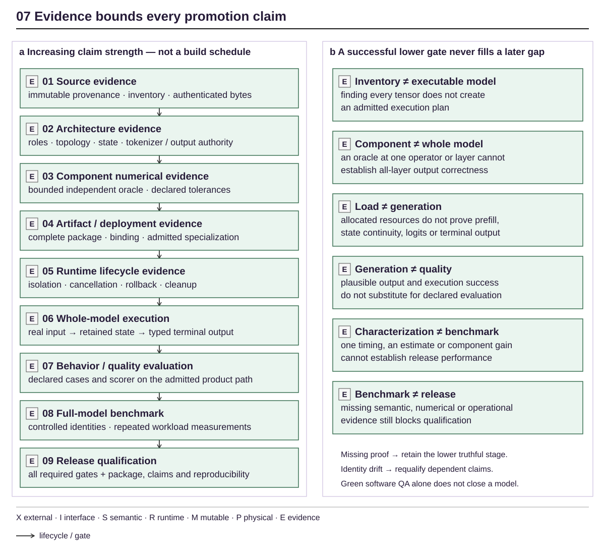

<!-- docs:metadata
title: Evaluation
id: yvex.evaluation
document: evaluation
status: current
owner: evaluation
audience: [engineer, agent, evaluator]
publication: {html: true, pdf: true, index: true}
-->

# Evaluation

**What was demonstrated, how it was measured, and where the claim stops.**

[Documentation](../README.md)

Tests, independent numerics, artifact integrity, runtime lifecycle, model
behavior and release qualification answer different questions. A successful
model load is not a quality result; a component speedup is not an end-to-end
benchmark. Missing required evidence remains BLOCKED/SKIP, never PASS.

## Owners and reading paths

| Question | Evidence route |
| --- | --- |
| How fast is an exact model configuration? | [Measured benchmark tables](benchmarks/README.md) |
| Which tests does this change require? | [QA ownership](qa.md) |
| What does an observation mean? | [Measurement](measurement.md) · [Reference engineering](reference-baseline.md) |
| What compilation claims are earned? | [Compiler evidence](compiler-evidence.md) |
| What happened in retained experiments? | [Execution observations](retained-observations.md) |
| Which integration paths were qualified? | [Finite producer](finite-decision-remote.md) · [Product management](product-management-control-plane.md) |
| How was documentation checked? | [Documentation evidence](documentation-migration.md) |

## macOS and Apple Silicon evidence

Start with the [main integration record](macos-main-integration.md) for the
combined Rust shell, native CPU and early Metal state now in main. Its component
records retain the original source identities and distinct claims:

| Question | Evidence owner | Scope |
| --- | --- | --- |
| Does the native product work on macOS? | [Native qualification](macos-native.md) | Platform, CPU/host and terminal lifecycle |
| What executes on the Apple GPU? | [Metal foundation](macos-metal.md) | Device/pipeline, shared buffers, F32 embedding and refusal/cleanup |
| Has a real model generated on the Mac? | [Small-model CPU qualification](macos-small-model.md) | Exact Qwen 0.8B artifact, two bounded upstream continuation matches and publication |

The CPU model result does not qualify Metal inference. Full-model Metal,
performance and release evidence remain separate gates.

## Evidence promotion

<!-- docs:diagram evidence_promotion -->

[Full-size diagram](../assets/diagrams/evidence_promotion.svg) · [Editable source](../assets/diagrams/evidence_promotion.json)
<!-- /docs:diagram -->

[Editable source](../assets/diagrams/evidence_promotion.json). The figure explains distinct gates, not an automatic promotion ladder.
