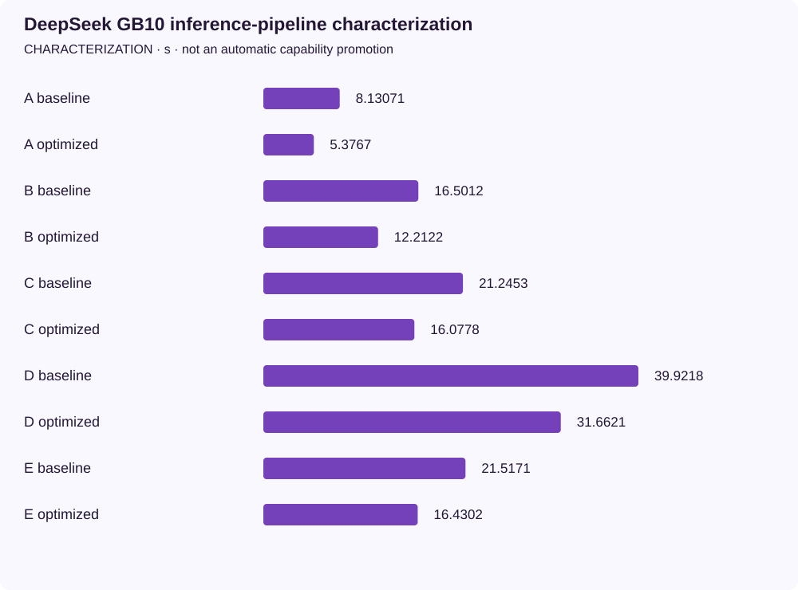

<!-- docs:metadata
title: DeepSeek GB10 inference-pipeline characterization
id: yvex.evaluation.observation.deepseek-gb10-inference-pipeline
document: evaluation
status: current
owner: evaluation
audience: [engineer, evaluator, agent]
publication: {html: true, pdf: true, index: true}
generated: true
source: ../data/deepseek-gb10-inference-pipeline.json
-->

# DeepSeek GB10 inference-pipeline characterization

**CHARACTERIZATION — one structured observation, with its original limits.**

[Benchmarks](../README.md) · [Source observation](../data/deepseek-gb10-inference-pipeline.json)

| Measurement | Value | Unit | Samples | Scope |
| --- | ---: | --- | ---: | --- |
| A baseline | 8.130705 | s | 1 | warm A, fresh ephemeral session, identical source-authored request bounds; unprofiled HTTP |
| A optimized | 5.376696 | s | 3 | warm A, fresh ephemeral session, identical source-authored request bounds; unprofiled HTTP |
| B baseline | 16.501209 | s | 1 | warm B, fresh ephemeral session, identical source-authored request bounds; unprofiled HTTP |
| B optimized | 12.21216 | s | 3 | warm B, fresh ephemeral session, identical source-authored request bounds; unprofiled HTTP |
| C baseline | 21.245256 | s | 1 | warm C, fresh ephemeral session, identical source-authored request bounds; unprofiled HTTP |
| C optimized | 16.077753 | s | 3 | warm C, fresh ephemeral session, identical source-authored request bounds; unprofiled HTTP |
| D baseline | 39.921825 | s | 1 | warm D, fresh ephemeral session, identical source-authored request bounds; unprofiled HTTP |
| D optimized | 31.662085 | s | 3 | warm D, fresh ephemeral session, identical source-authored request bounds; unprofiled HTTP |
| E baseline | 21.51714 | s | 1 | warm E, fresh ephemeral session, identical source-authored request bounds; unprofiled HTTP |
| E optimized | 16.430234 | s | 3 | warm E, fresh ephemeral session, identical source-authored request bounds; unprofiled HTTP |

## Context

Model: **deepseek4-v4-flash-dspark-deepseek-v4-flash-mixed-iq2xxs-q2k-mxfp4-v1-cuda**. Backend: **CUDA SM121**. Device: **NVIDIA GB10, GPU-7659fe74-b7c2-6e3e-bf99-f66c430366bc, driver 580.159.03**.
Source commit: `115884e6970676df66c587ad359563bf047773a2`. Source stability: **frozen**. Warm/cold: **warm**.

Evidence pointer: External raw receipts at /home/dgmothx/lab/models/evidence/yvex-gb10-pipeline-20260930.z5UwYo; SHA-256 and exact samples retained in runtime_configuration. See ../retained-observations.md#deepseek-gb10-inference-pipeline-2026-09-30.

## Limits

- Bounded warm characterization, not release performance, an SLA, whole-model upstream conformance or product-chain qualification.
- The fresh A–E baseline has one sample per lane; candidate and strategy comparisons have three. The preceding clean-build A confirmation separately has three stable samples.
- Exact source variants and executable identities differ; each measured run freezes its source. The reviewed build records complete compiler provenance including new authored Make inputs.
- High and maximum retain authored rendering, reasoning classification and natural </think>. Channel gaps are observable fragment publication, not an isolated kernel-transition latency.
- Full speculation diagnostic timing is instrumented and excluded from ordinary wall comparisons; commit includes correction forwards.
- Only up to 100 input tokens and 62 bounded output tokens measured here; no 17K/32K or sustained decode/reasoning throughput claim.
- Nsight Systems timings include GPU waits inside synchronization API calls: do not sum overlapping CPU wait and GPU work. Hardware counters unavailable (ERR_NVGPUCTRPERM).
- Mandatory legacy bootstrap-Q2 aggregate remains BLOCKED; qualified current mixed producer does not substitute for that different artifact.

The [methodology](../methodology.md) defines comparability. A document import does not rerun this experiment.
