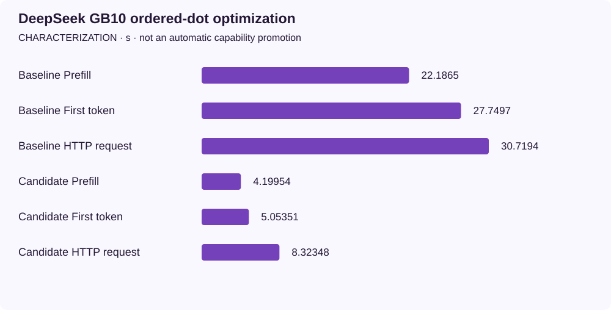

<!-- docs:metadata
title: DeepSeek GB10 ordered-dot optimization
id: yvex.evaluation.observation.deepseek-gb10-ordered-dots
document: evaluation
status: current
owner: evaluation
audience: [engineer, evaluator, agent]
publication: {html: true, pdf: true, index: true}
generated: true
source: ../data/deepseek-gb10-ordered-dots.json
-->

# DeepSeek GB10 ordered-dot optimization

**CHARACTERIZATION — one structured observation, with its original limits.**

[Benchmarks](../README.md) · [Source observation](../data/deepseek-gb10-ordered-dots.json)

| Measurement | Value | Unit | Samples | Scope |
| --- | ---: | --- | ---: | --- |
| Baseline Prefill | 22.18648933333333 | s | 3 | prefill complete; preparation remains included; 22 input / 3 output |
| Baseline First token | 27.749693233333332 | s | 3 | from generation turn start, not HTTP ingress; 22 input / 3 output |
| Baseline HTTP request | 30.71940709933794 | s | 3 | complete nonstreaming HTTP exchange; 22 input / 3 output |
| Candidate Prefill | 4.19954185 | s | 3 | prefill complete; preparation remains included; 22 input / 3 output |
| Candidate First token | 5.053513396666666 | s | 3 | from generation turn start, not HTTP ingress; 22 input / 3 output |
| Candidate HTTP request | 8.323483009667447 | s | 3 | complete nonstreaming HTTP exchange; 22 input / 3 output |

## Context

Model: **deepseek4-v4-flash-dspark-deepseek-v4-flash-mixed-iq2xxs-q2k-mxfp4-v1-cuda**. Backend: **CUDA SM121**. Device: **NVIDIA GB10, GPU-7659fe74-b7c2-6e3e-bf99-f66c430366bc, 580.159.03**.
Source commit: `a73c887e104d5427ecaf3e03104b365af8dc11fb`. Source stability: **frozen**. Warm/cold: **warm**.

Evidence pointer: [Retained observation](../../retained-observations.md#deepseek-gb10-optimization-2026-09-30)

## Limits

- Three equivalent warm fresh-session observations per variant, not a release benchmark or SLA.
- Each measured worktree fingerprint is frozen. The baseline executable was built from clean a73c887e; its measured worktree differs only by Task resumption documentation. The candidate executable binds the measured eight-path dirty delta, including the generic CUDA repair.
- The six scopes overlap and must not be summed. First-token clock starts at the turn, whereas HTTP includes request admission and retirement.
- Nsight graph-node diagnostic primers are excluded from these measurements; profiling was not collecting during the samples.
- No 17K/32K input qualification, arbitrary model-quality claim or cross-product Case qualification.
- The separately retained 32-output-token control characterizes five speculative cycles, not asymptotic sustained decode.
- No physical GPU residency or turn-peak workspace measurement is inferred from mapped bytes, process RSS or idle zero state.
- The mandatory legacy bootstrap-Q2 cuda.native aggregate remains BLOCKED; bounded component/live evidence is not a green aggregate.

The [methodology](../methodology.md) defines comparability. A document import does not rerun this experiment.
