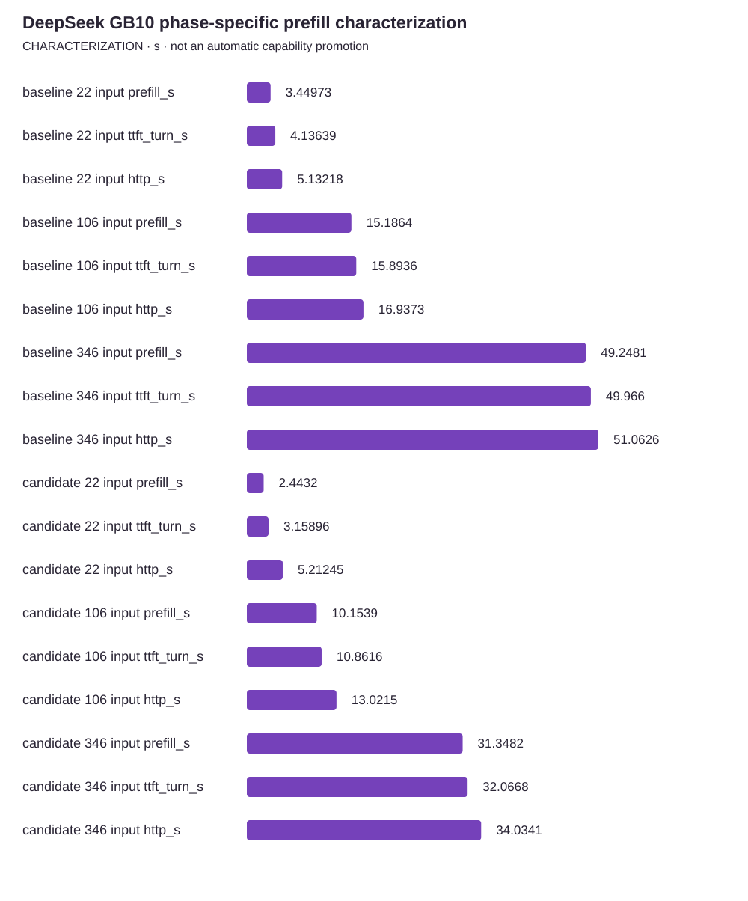

<!-- docs:metadata
title: DeepSeek GB10 phase-specific prefill characterization
id: yvex.evaluation.observation.deepseek-gb10-prefill-phase
document: evaluation
status: current
owner: evaluation
audience: [engineer, evaluator, agent]
publication: {html: true, pdf: true, index: true}
generated: true
source: ../data/deepseek-gb10-prefill-phase.json
-->

# DeepSeek GB10 phase-specific prefill characterization

**CHARACTERIZATION — one structured observation, with its original limits.**

[Benchmarks](../README.md) · [Source observation](../data/deepseek-gb10-prefill-phase.json)

| Measurement | Value | Unit | Samples | Scope |
| --- | ---: | --- | ---: | --- |
| baseline 22 input prefill_s | 3.4497284849999996 | s | 2 | completed prefill; 22 input / 3 output tokens |
| baseline 22 input ttft_turn_s | 4.13638746 | s | 2 | first committed token from turn start, not HTTP ingress; 22 input / 3 output tokens |
| baseline 22 input http_s | 5.132181845547166 | s | 2 | complete HTTP including admission and session cleanup; 22 input / 3 output tokens |
| baseline 106 input prefill_s | 15.18640245 | s | 2 | completed prefill; 106 input / 3 output tokens |
| baseline 106 input ttft_turn_s | 15.89362315 | s | 2 | first committed token from turn start, not HTTP ingress; 106 input / 3 output tokens |
| baseline 106 input http_s | 16.937282521044835 | s | 2 | complete HTTP including admission and session cleanup; 106 input / 3 output tokens |
| baseline 346 input prefill_s | 49.248078050000004 | s | 2 | completed prefill; 346 input / 3 output tokens |
| baseline 346 input ttft_turn_s | 49.96598865 | s | 2 | first committed token from turn start, not HTTP ingress; 346 input / 3 output tokens |
| baseline 346 input http_s | 51.062607959494926 | s | 2 | complete HTTP including admission and session cleanup; 346 input / 3 output tokens |
| candidate 22 input prefill_s | 2.44319839 | s | 2 | completed prefill; 22 input / 3 output tokens |
| candidate 22 input ttft_turn_s | 3.1589575649999997 | s | 2 | first committed token from turn start, not HTTP ingress; 22 input / 3 output tokens |
| candidate 22 input http_s | 5.212452927487902 | s | 2 | complete HTTP including admission and session cleanup; 22 input / 3 output tokens |
| candidate 106 input prefill_s | 10.153921799999999 | s | 2 | completed prefill; 106 input / 3 output tokens |
| candidate 106 input ttft_turn_s | 10.861625400000001 | s | 2 | first committed token from turn start, not HTTP ingress; 106 input / 3 output tokens |
| candidate 106 input http_s | 13.021533702500165 | s | 2 | complete HTTP including admission and session cleanup; 106 input / 3 output tokens |
| candidate 346 input prefill_s | 31.348183249999998 | s | 2 | completed prefill; 346 input / 3 output tokens |
| candidate 346 input ttft_turn_s | 32.06682875 | s | 2 | first committed token from turn start, not HTTP ingress; 346 input / 3 output tokens |
| candidate 346 input http_s | 34.03406705550151 | s | 2 | complete HTTP including admission and session cleanup; 346 input / 3 output tokens |

## Context

Model: **deepseek4-v4-flash-dspark-deepseek-v4-flash-mixed-iq2xxs-q2k-mxfp4-v1-cuda**. Backend: **CUDA SM121**. Device: **NVIDIA GB10, GPU-7659fe74-b7c2-6e3e-bf99-f66c430366bc, driver 580.159.03**.
Source commit: `67a7905ea9deb98b0704629a1f979634e19007fb`. Source stability: **frozen**. Warm/cold: **warm**.

Evidence pointer: Raw synthetic receipts and probe at /home/dgmothx/lab/models/evidence/yvex-prefill-phase-20261001.2qPmxM; complete per-variant samples/hashes above. See ../retained-observations.md#phase-specific-prompt-geometry-2026-10-01.

## Limits

- Bounded warm characterization, not release performance, an SLA, long-context qualification, sustained decode or upstream full-model conformance.
- Two wall samples per main control, plus separate smoke/resource confirmations. Resource/setup/cleanup spans have one sample each.
- Candidate source includes the staged C server-loader extraction and registry metadata, not the uninstalled Rust shell. Complete compiler provenance and exact source delta are retained.
- Wider physical rows increase session preparation and peak RSS. Short complete-HTTP samples do not establish a stable improvement; medium/longer controls do.
- Turn-first-token telemetry excludes pre-turn session preparation; HTTP measurements retain preparation and cleanup. Nested attention/component durations must not be summed.
- Verification population, source reasoning policy, artifact/binding identities and ordered numerical class are unchanged; engine specialization/capacity identity intentionally changes.
- Cancellation reached real prefill at 32 of 650 input tokens. Work and physical session state retire to zero; an independent subsequent request succeeds.
- Legacy bootstrap-Q2 cuda.native remains externally blocked; broader previously retained numerical gates are not qualified by these controls.

The [methodology](../methodology.md) defines comparability. A document import does not rerun this experiment.
