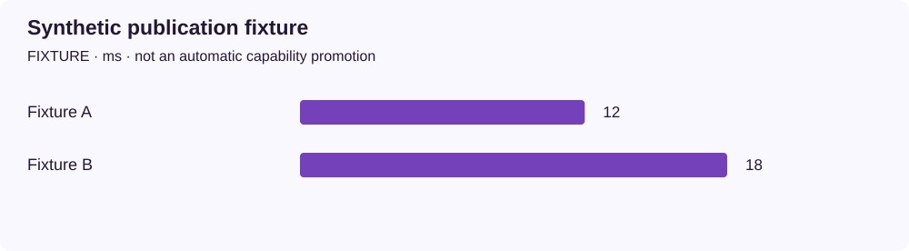

<!-- docs:metadata
title: Synthetic publication fixture
id: yvex.evaluation.observation.fixture-publication
document: evaluation
status: current
owner: evaluation
audience: [engineer, evaluator, agent]
publication: {html: true, pdf: true, index: true}
generated: true
source: ../data/fixture-publication.json
-->

# Synthetic publication fixture

**FIXTURE — one structured observation, with its original limits.**

[Benchmarks](../README.md) · [Source observation](../data/fixture-publication.json)

| Measurement | Value | Unit | Samples | Scope |
| --- | ---: | --- | ---: | --- |
| Fixture A | 12.0 | ms | 1 | synthetic configuration |
| Fixture B | 18.0 | ms | 1 | synthetic configuration |

## Context

Model: **fixture model**. Backend: **fixture**. Device: **unknown**.
Source commit: `not retained`. Source stability: **fixture**. Warm/cold: **fixture**.

Evidence pointer: Synthetic fixture owned by this observation; no runtime measurement.

## Limits

- Synthetic data validates publication only; it demonstrates no YVEX performance.

The [methodology](../methodology.md) defines comparability. A document import does not rerun this experiment.
