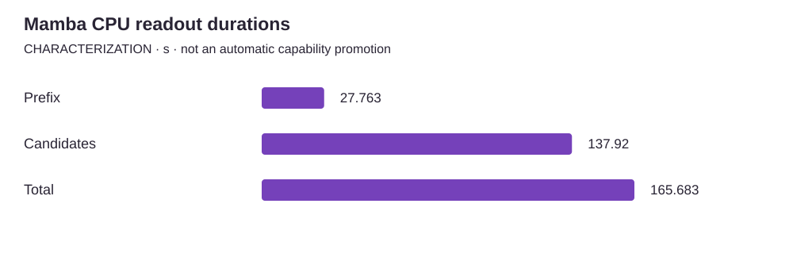

<!-- docs:metadata
title: Mamba CPU readout durations
id: yvex.evaluation.observation.mamba-readout-characterization
document: evaluation
status: current
owner: evaluation
audience: [engineer, evaluator, agent]
publication: {html: true, pdf: true, index: true}
generated: true
source: ../data/mamba-readout-characterization.json
-->

# Mamba CPU readout durations

**CHARACTERIZATION — one structured observation, with its original limits.**

[Benchmarks](../README.md) · [Source observation](../data/mamba-readout-characterization.json)

| Measurement | Value | Unit | Samples | Scope |
| --- | ---: | --- | ---: | --- |
| Prefix | 27.763 | s | 1 | one prefix forward |
| Candidates | 137.92 | s | 1 | five teacher-forced candidate steps |
| Total | 165.683 | s | 1 | complete bounded readout; includes prior phases |

## Context

Model: **Mamba-Codestral-7B-v0.1**. Backend: **cpu**. Device: **unknown**.
Source commit: `not retained`. Source stability: **unknown**. Warm/cold: **unknown**.

Evidence pointer: https://github.com/yailabs/yvex/blob/b5f632ef8d452f61bbbc8f91f9459a2fd26b7c83/ROADMAP.md#current-execution-sequence

## Limits

- Historical characterization, not a benchmark or performance advantage.
- Execution commit, date, exact device and warm/cold classification were not retained.
- One bounded observation; phase and total durations must not be summed.

The [methodology](../methodology.md) defines comparability. A document import does not rerun this experiment.
