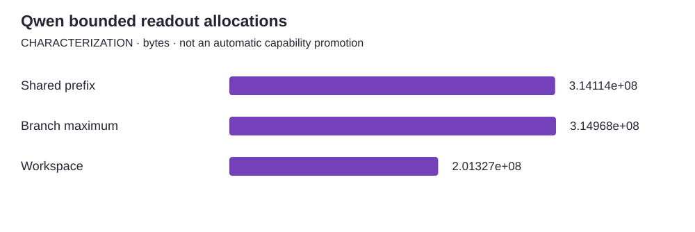

<!-- docs:metadata
title: Qwen bounded readout allocations
id: yvex.evaluation.observation.qwen-readout-state
document: evaluation
status: current
owner: evaluation
audience: [engineer, evaluator, agent]
publication: {html: true, pdf: true, index: true}
generated: true
source: ../data/qwen-readout-state.json
-->

# Qwen bounded readout allocations

**CHARACTERIZATION — one structured observation, with its original limits.**

[Benchmarks](../README.md) · [Source observation](../data/qwen-readout-state.json)

| Measurement | Value | Unit | Samples | Scope |
| --- | ---: | --- | ---: | --- |
| Shared prefix | 314114048 | bytes | 1 | immutable shared prefix |
| Branch maximum | 314967616 | bytes | 1 | observed at attach/committed-token boundaries |
| Workspace | 201326592 | bytes | 1 | session workspace |

## Context

Model: **Qwen3.8-27B text BF16**. Backend: **cuda**. Device: **unknown**.
Source commit: `not retained`. Source stability: **unknown**. Warm/cold: **unknown**.

Evidence pointer: https://github.com/yailabs/yvex/blob/b5f632ef8d452f61bbbc8f91f9459a2fd26b7c83/ROADMAP.md#current-execution-sequence

## Limits

- Bounded allocation observations, not continuous process/device peaks.
- Categories have different ownership; the chart does not assert an additive total.
- Execution commit, date and exact device were not retained in the source paragraph.

The [methodology](../methodology.md) defines comparability. A document import does not rerun this experiment.
