<!-- docs:metadata
title: Agentic Engineering Method
id: yvex.guides.agentic-engineering
document: guide
status: current
owner: yvex
audience: [engineer, agent, evaluator]
publication: {html: true, pdf: true, index: true}
-->

# Agentic Engineering Method

**Frame a selected Task, investigate ownership, qualify the exact claim, and close its documents.**

[Up](README.md)

The unit of agent-assisted engineering is a property to establish or falsify,
not a prescribed edit sequence. This method frames deliveries and reviews
claims; [AGENTS](../../AGENTS.md) owns mandatory repository invariants.

## Authorities

| Owner | Responsibility |
| --- | --- |
| [AGENTS](../../AGENTS.md) | Safety, source and execution boundaries, evidence honesty |
| [Tasks](../project-control/TASKS.md) | Selected delivery and earned exits |
| [Status](../project-control/STATUS.md) | Current bounded maturity |
| [ROADMAP](../../ROADMAP.md) | Long-horizon planning only |
| Code, schemas and tests | Implemented behavior and executable contracts |
| [QA](../evaluation/qa.md) | Test identities, change mapping, prerequisites and result states |
| Issues and pull requests | Bounded problem, delivery diff and evidence |
| ADRs and Git history | Durable decisions and retired chronology |

The [documentation map](../README.md) routes technical subjects to their
owners; it is not another status database.

## Frame the outcome

Prefer this order in a substantial task prompt:

1. **Outcome:** the observable after-state and the problem it resolves.
2. **Authority:** current code/evidence, consumer and selected Task.
3. **Freedom:** the implementation choices and safe local iteration delegated
   to the engineer.
4. **Invariants:** compatibility, ownership, safety and explicit non-goals.
5. **Completion:** falsifiers, verification surface, blocked stop condition and
   required handoff.

State the finish line without scripting every inspection, patch or test. A
capable engineer should discover the actual owner and proportional evidence.
For long-horizon work, say to continue through implementation, failed checks,
repair and revalidation until the defined result is earned or a real blocker
remains. A first working version is not the finish line. A thread-scoped Codex
Goal can preserve such an objective when explicitly requested; it does not
replace Tasks or grant broader authority.

## Investigate and implement

Reconcile live code and concurrent work before relying on a prompt's baseline.
Trace producer, consumer and mutable lifetime; a historical plan or report is
a lead to verify, not current architecture. Choose the smallest owner that
resolves the demonstrated property. A new registry, loader, runtime or policy
needs a real consumer, not a hypothetical future family.

Model/provider work uses immutable source and representation identity.
Qualification pressure should be real where the claim is real, and bounded
fixtures should discriminate failure modes. Use an independent numerical or
behavioral oracle when claiming conformance. Treat resource and hardware facts
as observations of the admitted deployment, not configured capacity.

## Classify evidence

```mermaid
%% yvex-figure: evidence_promotion
flowchart TB
  subgraph n_panel_0["a  Increasing claim strength — not a build schedule"]
    direction TB
  n_source["EVIDENCE<br/>01  Source evidence<br/>immutable provenance · inventory · authenticated bytes"]:::evidence
  n_architecture["EVIDENCE<br/>02  Architecture evidence<br/>roles · topology · state · tokenizer / output authority"]:::evidence
  n_component["EVIDENCE<br/>03  Component numerical evidence<br/>bounded independent oracle · declared tolerances"]:::evidence
  n_artifact["EVIDENCE<br/>04  Artifact / deployment evidence<br/>complete package · binding · admitted specialization"]:::evidence
  n_lifecycle["EVIDENCE<br/>05  Runtime lifecycle evidence<br/>isolation · cancellation · rollback · cleanup"]:::evidence
  n_whole["EVIDENCE<br/>06  Whole-model execution<br/>real input → retained state → typed terminal output"]:::evidence
  n_quality["EVIDENCE<br/>07  Behavior / quality evaluation<br/>declared cases and scorer on the admitted product path"]:::evidence
  n_benchmark["EVIDENCE<br/>08  Full-model benchmark<br/>controlled identities · repeated workload measurements"]:::evidence
  n_release["EVIDENCE<br/>09  Release qualification<br/>all required gates + package, claims and reproducibility"]:::evidence
  end
  subgraph n_panel_1["b  A successful lower gate never fills a later gap"]
    direction TB
  n_not_inventory["EVIDENCE<br/>Inventory ≠ executable model<br/>finding every tensor does not create"]:::evidence
  n_not_component["EVIDENCE<br/>Component ≠ whole model<br/>an oracle at one operator or layer cannot"]:::evidence
  n_not_load["EVIDENCE<br/>Load ≠ generation<br/>allocated resources do not prove prefill,"]:::evidence
  n_not_quality["EVIDENCE<br/>Generation ≠ quality<br/>plausible output and execution success"]:::evidence
  n_not_benchmark["EVIDENCE<br/>Characterization ≠ benchmark<br/>one timing, an estimate or component gain"]:::evidence
  n_not_release["EVIDENCE<br/>Benchmark ≠ release<br/>missing semantic, numerical or operational"]:::evidence
  n_not_inventory ~~~ n_not_component ~~~ n_not_load ~~~ n_not_quality ~~~ n_not_benchmark ~~~ n_not_release
  end
  n_source -->|gate| n_architecture
  n_architecture -->|gate| n_component
  n_component -->|gate| n_artifact
  n_artifact -->|gate| n_lifecycle
  n_lifecycle -->|gate| n_whole
  n_whole -->|gate| n_quality
  n_quality -->|gate| n_benchmark
  n_benchmark -->|gate| n_release
  n_panel_0 ~~~ n_panel_1
  classDef semantic fill:#efe5fc,stroke:#7541ba,color:#261b38
  classDef physical fill:#f4effb,stroke:#8054b2,color:#261b38
  classDef runtime fill:#eeeafb,stroke:#6a4ca3,color:#261b38
  classDef mutable fill:#fff3db,stroke:#8e6920,color:#261b38
  classDef interface fill:#edf3fb,stroke:#456789,color:#261b38
  classDef external fill:#f2f2f4,stroke:#707078,color:#261b38
  classDef evidence fill:#eaf5ef,stroke:#3d7255,color:#261b38
  style n_panel_0 fill:#faf8fe,stroke:#b8a5d0,color:#261b38
  style n_panel_1 fill:#faf8fe,stroke:#b8a5d0,color:#261b38
```

<!-- docs:diagram evidence_promotion -->

[Static figure](../assets/diagrams/evidence_promotion.svg) · [Editable source](../assets/diagrams/evidence_promotion.json)
<!-- /docs:diagram -->

*Figure 7 — Each stronger claim needs its own evidence; this is not a test
schedule. Software QA cannot replace an independent numerical, behavior or
release gate.* [Editable source](../assets/diagrams/evidence_promotion.json).

Before promoting a claim, ask what observation could disprove it. For
transactional work this often includes stale identity, cancellation,
rollback, cleanup and state isolation; for numerical work, independent
disagreement and non-finite inputs. Report the lowest claim supported by the
actual result. Missing backing stays missing, not an optimistic PASS.

## Verify the delivery

Review the final tree and evidence, not only the author report: changed owner,
affected consumers, refusal paths, registered test definitions, exact
artifact/binding or fixture, source stability and documentation. A push does
not itself verify remote identity; compare local and remote explicitly when
publication is claimed. Local runtime evidence may be recorded by identity
and pointer without implying that a remote reviewer reproduced it.

Use [QA ownership](../evaluation/qa.md) for the current mapped commands and prerequisites.
Run tests proportionate to the changed contract; repair failures caused by
the delivery and rerun against the final source state. Do not spend live-model
or GPU resources on a docs-only change.

## Decide progression

| Decision | Meaning |
| --- | --- |
| `proceed` | The implemented boundary is consumer-safe at its qualified scope |
| `repair_same_boundary` | A demonstrated semantic or implementation gap remains |
| `complete_evidence` | Implementation exists but required qualification is missing |
| `blocked_external` | A real external prerequisite prevents truthful closure |

`downstream_safe` describes only the exact earned consumer scope. Finishing a
prompt, passing a build, or selecting a roadmap row does not automatically
promote capability or start a successor. Reconcile any next pressure with selected Tasks. Independent outcomes receive
Task identities; local implementation steps do not become a new planning layer.

## Documentation lifecycle

Begin substantial delivery with a selected Task or temporary Task Pack. Resolve
outcome, affected plane, invariants, ABI, family/hardware lane, evidence and
documentation impact. An independent newly authorized outcome becomes a Task;
an implementation step remains inside its owner. Historical Wave identifiers
remain valid references; no new persistent Wave layer is introduced.

Update architecture with executable truth, Contracts with ABI/protocol truth,
family records and Status with changed support evidence, and Evaluation with
new observations. Reconcile Task exits, blockers and dependencies at closure.
Structural choices use ADRs; Memory retains only useful derived traps. Roadmap
changes only when a macro horizon changes. “Documentation impact: none” must
explain why no canonical owner changed.

Completion requires code, owning docs, evidence and project control to agree.
Missing required evidence blocks the claim. Do not start the next Task merely
because this one completed. See [AGENTS](../../AGENTS.md) for the closure schema.
