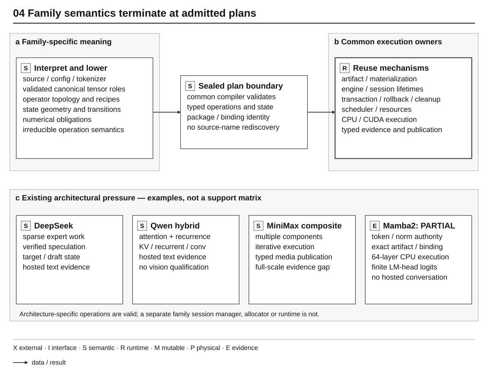

# Model-Family Integration Contract

Status: normative family-integration architecture

This document owns the common contract by which a model family enters YVEX.
Family-specific facts live in separate records. Current release scope and gate
state remain in [`ROADMAP.md`](../../ROADMAP.md).

## Family and target

A **model family** is a repeated architecture pattern: topology, tensor naming
and roles, tokenizer behavior, sequence-mixer and state semantics, FFN or MoE
composition, and output policy.

A **model target** is one concrete source instance in that family. It binds a
repository or local source, revision, configuration, tokenizer, parameter
class, license posture, and intended artifact class. Backend or machine names
do not belong in target identity.

Family classification is not family support. A target becomes executable only
after exact roles are admitted in an artifact, materialized, lowered, executed,
and consumed by its admitted typed product path. Text generation, embeddings,
and media publication have different terminal semantics.

## Promotion path



*Figure 4 — Family integration boundary. Families supply irreducible semantics;
common owners validate, seal and execute admitted plans without another family
runtime. The lower panel identifies existing architectural pressure, not equal
support: Mamba2 has exact artifact-backed pure-SSM CPU execution but no hosted
conversation or independent whole-model oracle, and MiniMax retains its
full-scale numerical/quality gap.* [Editable source](../diagrams/family_boundary.json).

The [compilation figure](../architecture/compilation.md#pipeline) owns the
source-to-engine sequence; the [evidence ladder](../development/agentic-engineering.md#classify-evidence)
separates terminal execution from evaluation, benchmark and release.

No stage inherits a later claim from a name, report, fixture, external engine,
or structurally valid container.

## Architecture signature

Before role mapping, a target must provide an identity-bound architecture
signature containing as applicable:

- family and target identity;
- source, configuration, tokenizer, and license facts;
- decoder and dense/sparse/hybrid class;
- layer, hidden, intermediate, and vocabulary geometry;
- sequence-mixer and position policy;
- head counts, dimensions, context policy, and persistent-state semantics;
- normalization and residual policy;
- dense FFN or MoE topology;
- expert count, active experts, shared experts, and routing policy;
- output-head and tokenizer relationship;
- auxiliary proposal topology, target feature dependencies, verification, and
  accepted-prefix rules when speculative execution is present;
- source dtype/qtype constraints;
- backend requirements and explicit blockers.

The signature is derived from exact source facts. A family name or lexical
tensor pattern is insufficient.

## Source inventory and canonical roles

The source tensor inventory records native names, shapes, dtypes, shards,
layer/expert coordinates, tied-weight facts, and byte ranges. Candidate tensor
collections are promoted only after family rules validate their membership and
geometry.

The common role space includes embedding, attention norms and projections,
position metadata, feed-forward norms and projections, final norm, output head,
and tokenizer facts. Sparse families add router, correction, routed-expert,
shared-expert, indexing, weighting, and accumulation roles. State-space roles
retain their convolution, time-step, transition, and gated-normalization
meaning; equal matrix shapes do not make them attention or FFN roles.

Coverage is bidirectional: each required role has exactly its source operands,
and every admitted source tensor is consumed or explicitly classified as
non-execution metadata. Configuration disagreement is resolved by an explicit
authority rule or refused, never by whichever file is parsed first.

A canonical role map preserves source derivation, scope, shape, dtype, layer,
expert, shard, axis, tied-weight, and companion-tensor semantics. Runtime code
does not recover these facts from strings.

## Family adapter

One typed family adapter projects irreducible family facts into common
compilation and execution contracts. A family may have up to three admitted
source projections when each owns a genuinely different dependency boundary:

- `src/model/families/<family>.c` interprets source, coverage, canonical roles,
  logical lowering and family metadata;
- `src/graph/families/<family>.c` composes only the irreducible semantic and
  executable graph recipe;
- `src/backend/<backend>/families/<family>.*` implements only a genuinely fused
  family lowering that generic backend operations cannot express.

The repeated family basename is intentional namespace continuity, not
duplicate ownership. The directory and `config/source_owners.tsv` identify the
level. A family-specific runtime source or directory is forbidden: the common
runtime consumes the sealed compiled plan and common graph capability. Family
adapter callbacks terminate at compilation and are not resolved again by
model-open or generation.

The model-family projection may contribute the sealed Semantic Model IR
aggregate and its source-to-terminal Transformation IR recipe; the graph-family
projection may contribute a native typed `yvex_ir_module` or another admitted
canonical schedule. Those products are distinct even when one aggregate retains
the typed module. Generic compilation owns execution lowering, parameter join,
PEIR validation and physical program construction. A family does not own GGUF,
artifact materialization, deployment specialization or a parallel runtime.

Across those projections the family may own:

- architecture class and layer schedule;
- native-to-canonical role lowering;
- sequence-mixer, position, and state policy;
- dense or MoE composition and routing semantics;
- output-head and tokenizer constraints;
- accepted physical combinations and required backend operations;
- family-specific graph recipes and numerical policy selection.

It does not own artifact I/O, generic allocation, session lifecycle,
persistent-state storage, workspace, backend memory, common numerical
primitives, telemetry, or claim promotion. YVEX has one common runtime, not a
runtime per family.

For a speculative family, the adapter additionally projects irreducible draft
geometry, feature taps, proposal composition, and family-specific acceptance
policy. The common runtime owns proposal, full-target verification,
accepted-prefix transaction, cancellation, committed accounting, and
publication. It never recovers draft semantics from family names or tensor
strings.

## Artifact prerequisites

A family artifact contract identifies every required global, per-layer, and
per-expert role; metadata and tokenizer fields; qtype/layout constraints;
shape and count expectations; output-head policy; integrity rules; and
derivation identities.

A tensor proof artifact proves only a bounded property. A complete artifact
contains every required role. Executable admission additionally requires a
complete binding and backend path; evaluation, benchmarking, and release are
separate later claims.

## Runtime prerequisites

The runtime descriptor and binding must project the exact admitted artifact
and Physical Execution IR into family-neutral tensor locations, execution
descriptors, state geometry, workspace requirements, and capability
prerequisites. The compiled execution profile binds those facts to hardware,
context, workload, evidence depth and execution class. The family adapter may
select an irreducible schedule but may not create another immutable model,
session hierarchy, KV owner, worker, or telemetry authority.

When one target has a draft assistant, a single immutable runtime model owns
both plans and their shared resources. A binding that advertises speculative
execution must admit every draft and verification requirement; a target-only
binding cannot be promoted by a runtime flag.

Runtime support requires the same typed path used by the product. For an
autoregressive text model that path is:

```text
tokenizer -> prefill -> persistent state -> decode -> logits
          -> sampling -> stop -> detokenization -> text
```

Direct component execution, attention-local prefill/decode phases, or
teacher-forced token execution do not by themselves establish generation.

Speculative generation adds a bounded transaction:

```text
committed target state
  -> proposal workspace
  -> complete-target candidate verification
  -> exact accepted prefix
  -> atomic target/token/decoder/RNG commit
  -> committed text publication
```

Proposal tokens are neither generated output nor persistent target state.
Target verification returns a prefix-addressable candidate transaction;
promotion transfers the exact accepted checkpoint without replaying accepted
target rows. Confidence is scheduling input, not correctness authority. A
rejected suffix is discarded before publication, and usage counts only
target-verified committed tokens.

## Backend prerequisites

Backends consume typed operations and physical operands. They own capability,
allocation, transfer, launch, synchronization, numerical execution, and
cleanup. They do not classify the family or reconstruct topology.

Family pressure may expose requirements for qtypes, tensor layouts, memory,
expert placement, attention state, or launch geometry. Pressure is planning
input, not backend support. An explicit backend request either runs the
admitted operation or refuses.

## Dense and sparse composition

A dense FFN, where present, uses fixed projections for every token. Pure SSM
must not acquire a fictitious FFN simply to fit a decoder template. A sparse/MoE decoder
adds routing, top-k selection, selected expert dispatch, shared-expert policy,
weighted accumulation, and conditional parameter access.

Sparse records distinguish total, active, shared, routed, resident, moved, and
executed parameters. Total parameter size is not token compute; active
parameters are not residency; residency is not observed movement.

## Persistent-state contract

The family defines state meaning, geometry, position rules, prefill writes,
decode reads, continuity, and invalidation. The common state provider owns
allocation, committed/candidate views, begin/stage/commit/abort, reset, and
cleanup. Persistent state and workspace never share semantic ownership.

KV, recurrent, and convolution state have distinct typed geometry. Common
transactional committed/candidate banks do not require retained causal KV.
Prefill must produce the state consumed by subsequent decode; reset, isolation,
abort, and cleanup require independent proof. Portable selective-SSD component
execution proves this mechanism, not a complete SSM-only compiled decoder.

## Evidence stages

Family records use the lowest true stage:

```text
not studied
-> source profiled
-> tensor inventoried
-> family classified
-> role mapped
-> artifact contracted
-> complete artifact admitted
-> materialized and bound
-> component execution proven
-> prefill/state/decode proven
-> complete generation proven
-> evaluated
-> benchmarked
-> release qualified
```

Each transition requires an owning implementation, positive and refusal tests,
an executable consumer, lifecycle/cleanup evidence, and exact identities.

## Failure classification

Missing configuration or tokenizer blocks source interpretation. Ambiguous
roles block mapping. Missing qtype/layout support blocks artifact or backend
admission. Missing placement blocks materialization. Missing graph consumers
block execution. Missing real state writes/reads block decode. Missing output
head, sampling, tokenizer stop, or detokenization blocks the complete text
path. Evaluation and benchmark remain unavailable until generation uses the
same hosted path exposed to the operator.

## Current family boundaries

| Family/target | Accepted boundary | Evidence limit |
| --- | --- | --- |
| [DeepSeek-V4-Flash-DSpark](deepseek-v4-flash.md) | Source-to-hosted text; target-verified speculation | No release quality/performance promotion |
| Qwen3.8-27B | Exact published BF16 text specialization, current binding v17, target-only CUDA hybrid recurrent/full-attention forward, complete logits and common prefix capture/attach | No Decision Readout breadth, vision, upstream whole-model conformance, behavior, benchmark or release claim |
| [MiniMax-H3 FL2VA](minimax-h3.md) | Four component artifacts, composite iterative execution, synchronized-media publication | Bounded component conformance is not full-scale numerical/behavioral correctness |
| [Mamba2](mamba2.md) | Exact acquired source, deterministic artifact/binding, 64-layer pure-SSM CPU execution, finite LM-head output and common transactional state | Partial; independent all-layer/whole-model oracle and hosted conversation remain unavailable |
| Gemma | Source/header and candidate-role observations | Not an executable family |

Qwen's current text target is `Qwen/Qwen3.8-27B`, revision
`1d4bf0f2ff6012fd82039f2fa52739d0dd7c60c0`, interpreted by the
[`qwen3_5` model owner](../../src/model/families/qwen3_5.c) and
[graph recipe](../../src/graph/families/qwen3_5.c). The 64 text layers compose
48 recurrent sequence mixers and 16 full-attention layers. Text roles consume
851 of 1,199 source tensors; 333 vision and 15 MTP tensors do not enter the
admitted text artifact. Source presence does not publish input capability.
[Adapter tests](../../tests/unit/qwen_adapter.c) and
[architecture tests](../../tests/unit/qwen3_5_architecture.c) guard that boundary.

The unchanged 53,815,809,152-byte BF16 GGUF artifact
`1fce07008eaa78e04eedd1a031144f48eb6af617f2b5c508811ba91dca7e00f1`
is associated with immutable published release
`yailabs/Qwen3.8-27B-Text-GGUF@066eb288bffd5a07c0d5ca584114a1f3fcfd13a8`
and a fresh authenticated binding v17. Ordinary target-only CUDA execution
consumes the 1,732-step compiler-owned forward and two-step output programs,
produces 248,320 finite logits, and captures/attaches common prefix schema v2
with all 16 attention and 48 recurrent layers represented. Malformed retained
v16 canonical records remain refused. This qualifies the ordinary Qwen
execution prerequisite only: no Qwen Decision Readout ran, and no upstream
whole-model conformance claim follows.

These are current evidence summaries, not a universal family compatibility
matrix. Runtime capability comes from the exact admitted specialization.
No future architecture candidate advances merely because a common primitive
has become reusable.
